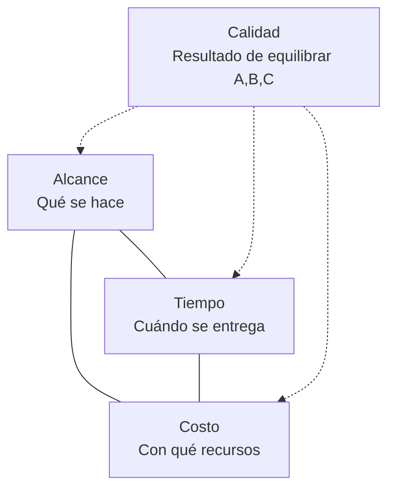
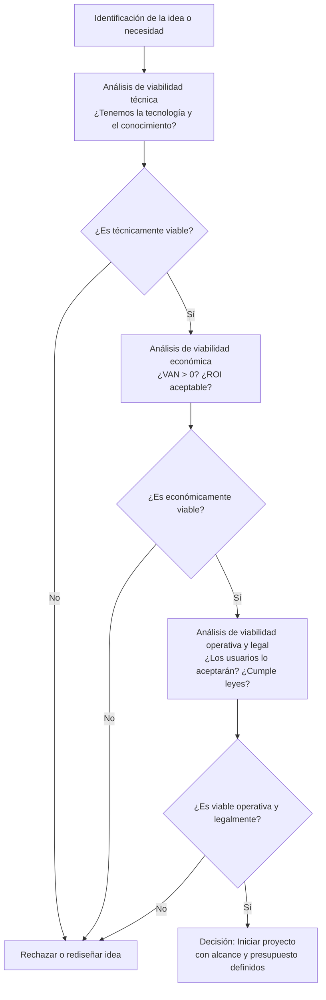
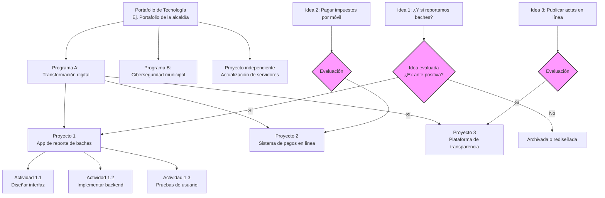
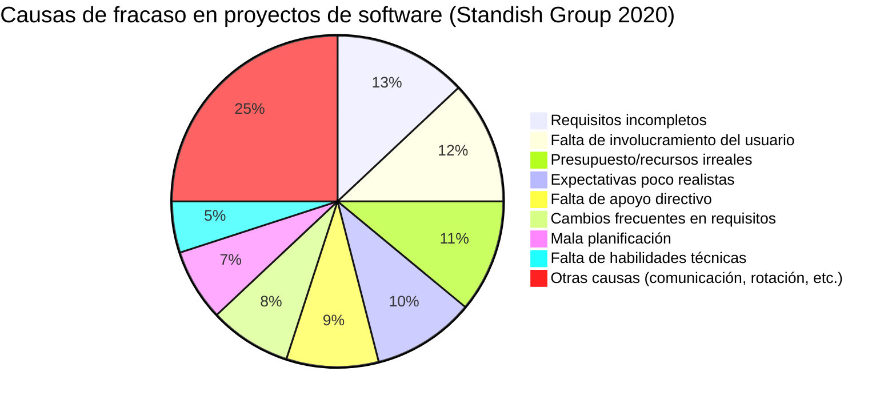
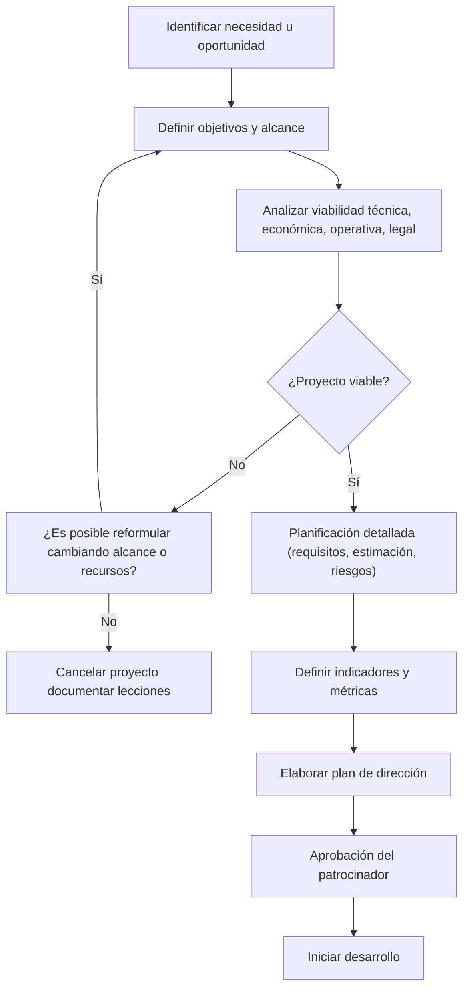
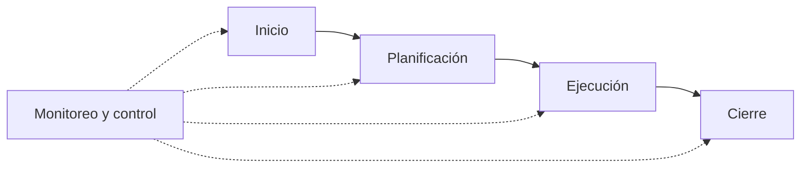

# **Gestión de Proyectos Tecnológicos, Unidad I**

## Índice de Contenido

- [Introducción](#introducción)
- [Desarrollo de Contenidos](#desarrollo-de-contenidos)
  - [Definiciones: Proyecto y evaluación](#definiciones-proyecto-y-evaluación)
  - [Relación entre programas, proyectos, ideas y actividades](#relación-entre-programas-proyectos-ideas-y-actividades)
  - [Importancia de la formulación y el desarrollo de proyectos tecnológicos](#importancia-de-la-formulación-y-el-desarrollo-de-proyectos-tecnológicos)
  - [Criterios para establecer una buena evaluación del proyecto tecnológico](#criterios-para-establecer-una-buena-evaluación-del-proyecto-tecnológico)
  - [Emprendedurismo en el proyecto tecnológico: Ciclo de vida del proyecto](#emprendedurismo-en-el-proyecto-tecnológico-ciclo-de-vida-del-proyecto)
- [Autoevaluación](#autoevaluación)
- [Bibliografía y Webgrafía](#bibliografía-y-webgrafía)
- [Glosario](#glosario)

## Introducción

¿Sabía que, según el informe *Chaos Report* del Standish Group, aproximadamente el 71% de los proyectos de software a nivel mundial se consideran fallidos o problemáticos? Estas cifras no reflejan incompetencia técnica, sino una carencia generalizada en la aplicación de buenas prácticas de gestión. El Ingeniero en Sistemas de Información no solo es un constructor de soluciones tecnológicas, sino también un analista, planificador, líder y administrador de proyectos. Su formación le exige diagnosticar problemas, proponer intervenciones novedosas y conducir equipos hacia resultados concretos. Por ello, dominar la gestión de proyectos tecnológicos resulta tan estratégico como escribir código o administrar bases de datos.

La gestión de proyectos tecnológicos abarca desde la chispa inicial de una idea hasta la entrega final de un producto o servicio, pasando por la evaluación de viabilidad, la asignación de recursos, el control de riesgos y la medición del impacto. Muchos profesionales caen en el error de iniciar el desarrollo sin una formulación clara, lo que genera sobrecostos, retrasos, conflictos internos y, en el peor de los casos, el abandono del proyecto. Esta unidad proporciona las bases conceptuales y metodológicas para evitar esos fracasos. Se abordarán las definiciones fundamentales de proyecto y evaluación, la relación jerárquica entre programas, proyectos, ideas y actividades, los criterios que permiten determinar si un proyecto tecnológico es viable y pertinente, y el papel del emprendedurismo dentro del ciclo de vida del proyecto.

Cada uno de estos temas se desarrollará con un enfoque práctico: se incluirán ejemplos reales de proyectos tecnológicos exitosos y fallidos, tablas comparativas que sinteticen información clave, y preguntas de reflexión que inviten al análisis crítico. No se trata de memorizar definiciones, sino de construir una caja de herramientas mentales que le permitan, como futuro ingeniero, evaluar cualquier iniciativa tecnológica con rigor y creatividad.

Antes de avanzar, realice el siguiente ejercicio práctico: recuerde o investigue un proyecto tecnológico que haya conocido (puede ser un sistema de una empresa, una plataforma educativa, una aplicación móvil o incluso un emprendimiento personal). Identifique al menos tres dificultades que enfrentó durante su desarrollo y relacione esas dificultades con alguno de los conceptos mencionados (falta de definición clara, ausencia de evaluación de viabilidad, mala gestión del ciclo de vida, etc.). Anote sus conclusiones; serán la base para participar en las actividades colaborativas de la unidad.

## Desarrollo de Contenidos

### **Definiciones: Proyecto y evaluación**

Para comenzar a transitar por el camino de la gestión de proyectos tecnológicos, es indispensable establecer un lenguaje común. Dos términos aparecerán una y otra vez a lo largo de la asignatura: **proyecto** y **evaluación**. Aunque en el habla cotidiana se usen de manera amplia, dentro de la gestión de proyectos poseen significados técnicos muy precisos. Comprenderlos a fondo es el primer paso para evitar los fracasos mencionados en la introducción.

#### ¿Qué es un proyecto?

Existen múltiples definiciones, pero las más aceptadas internacionalmente provienen de organismos como el **Project Management Institute (PMI)** y autores especializados. A continuación, se presentan dos definiciones clave:

- **PMI (Guía del PMBOK, 7ª edición):** “Un proyecto es un esfuerzo temporal que se lleva a cabo para crear un producto, servicio o resultado único”.
- **César A. Bernal (Metodología de la Investigación):** “Un proyecto es un conjunto de actividades interrelacionadas y coordinadas, con un inicio y una fecha de terminación definidos, que busca alcanzar un objetivo específico dentro de restricciones de presupuesto, tiempo y calidad”.

De estas definiciones se extraen tres características universales de cualquier proyecto:

| Característica | Explicación | Ejemplo en tecnología |
|----------------|-------------|------------------------|
| **Temporalidad** | Tiene un inicio y un fin claramente definidos. No es un proceso continuo. | Desarrollar un sistema de gestión de inventarios en 6 meses. |
| **Resultado único** | Produce algo que no se había hecho antes de la misma forma, aunque sea similar a otros proyectos previos. | Una plataforma de comercio electrónico adaptada a las necesidades específicas de una cooperativa. |
| **Restricciones** | Opera bajo límites de tiempo, costo, alcance y calidad (conocidas como la triple restricción o diamante de la gestión). | El proyecto debe realizarse con un presupuesto de $15,000 y entregarse antes del 30 de noviembre. |

**Diagrama de la triple restricción (tiempo, costo, alcance):**

Un proyecto tecnológico es, entonces, un proyecto cuyo **resultado único** es de naturaleza tecnológica: un software, una infraestructura de red, un sistema embebido, una aplicación móvil, una plataforma cloud, entre otros. Lo distintivo no es solo el producto final, sino también los riesgos asociados (obsolescencia tecnológica, cambios rápidos de requisitos, integración con sistemas heredados, etc.).

**Ejemplo de proyecto tecnológico (caso real de éxito con evaluación ex ante rigurosa):**  
Entre 2016 y 2018, el Banco Central de Costa Rica desarrolló el proyecto “Modernización del Sistema de Liquidación de Valores”. Fue un esfuerzo temporal (2 años), único (no existía un sistema similar en el país), y enfrentó restricciones de presupuesto (aprox. $4 millones) y cumplimiento normativo. La evaluación ex ante incluyó un análisis técnico profundo (contratación de consultores internacionales) y una prueba piloto con transacciones reducidas. El resultado fue una plataforma de alta disponibilidad que redujo los tiempos de liquidación de días a minutos.

#### ¿Qué es la evaluación de proyectos?

La **evaluación de proyectos** es un proceso sistemático de recolección y análisis de información que permite determinar la **viabilidad**, **pertinencia** y **posibles resultados (impacto)** de un proyecto, ya sea antes de su inicio (evaluación ex ante), durante su ejecución (evaluación formativa o de seguimiento) o después de su finalización (evaluación ex post). No debe confundirse con el mero control de avance; la evaluación implica juicios de valor orientados a la toma de decisiones: ¿se continúa? ¿se corrige? ¿se cancela?

**Definiciones clave en evaluación:**

- **Viabilidad:** Posibilidad real de ejecutar el proyecto en sus dimensiones técnica, económica, operativa y legal. Es la pregunta "¿puede hacerse?".
- **Pertinencia:** Grado en que el proyecto responde a una necesidad real, actual y sentida de los beneficiarios o stakeholders. Es la pregunta "¿debemos hacerlo?".
- **Impacto:** Efectos (positivos o negativos, esperados o no) que genera el proyecto en el corto, mediano y largo plazo, sobre la población objetivo o el entorno. Se divide en impacto social, económico, ambiental y tecnológico.
- **Evaluación cuantitativa vs. cualitativa:** La primera utiliza indicadores numéricos, tasas (VAN, TIR), flujos de caja; la segunda se basa en percepciones, análisis de riesgos, opiniones de expertos.

La evaluación de proyectos tecnológicos adquiere matices particulares porque los activos intangibles (código fuente, bases de datos, algoritmos) y la alta incertidumbre técnica exigen criterios específicos. Por ejemplo, un proyecto de desarrollo de software puede ser viable económicamente, pero inviable técnicamente si el equipo no domina la inteligencia artificial necesaria. O puede ser técnicamente factible, pero inviable operativamente si los usuarios finales se resisten al cambio.

**Tipos de evaluación según el momento (estándares PMBOK e ISO 21500):**

| Tipo | Momento | Pregunta que responde | Herramientas típicas en tecnología |
|------|---------|----------------------|--------------------------------------|
| Ex ante | Antes de iniciar (grupo de procesos de inicio) | ¿Vale la pena hacer este proyecto? | Análisis costo-beneficio, VAN, TIR, matriz de viabilidad (técnica, económica, operativa, legal) |
| Formativa (monitoreo y control) | Durante la ejecución | ¿Vamos por buen camino? ¿Debemos ajustar? | Indicadores de avance, análisis de valor ganado, revisiones de hitos, pruebas de calidad |
| Ex post | Después de finalizar (cierre) | ¿Se lograron los objetivos? ¿Qué aprendimos? | Evaluación de impacto, encuestas de satisfacción, lecciones aprendidas, auditoría técnica |

**Referencia a estándares internacionales:** Según la *Guía del PMBOK (7ª ed.)*, la evaluación de proyectos forma parte del grupo de procesos de **monitoreo y control**, e incluye herramientas como el análisis de valor ganado y la revisión de hitos. La norma **ISO 21500:2021** (Gestión de proyectos) también establece la evaluación como una práctica esencial en todas las fases del proyecto. En el ámbito tecnológico, se añaden métricas específicas como la densidad de defectos, el tiempo medio entre fallos (MTBF) y la satisfacción del usuario final.

El **Ingeniero en Sistemas de Información** no solo debe saber ejecutar proyectos, sino también evaluarlos. Por ejemplo, cuando una empresa le pide un dictamen sobre la viabilidad de migrar toda su infraestructura a la nube, está realizando una evaluación ex ante. Si durante el desarrollo de un sistema de facturación electrónica el gerente le solicita un informe de avance con métricas, está haciendo evaluación formativa (monitoreo). Y si al finalizar un proyecto de implementación de ERP debe medir el retorno de inversión real, está haciendo evaluación ex post.

**Caso real de evaluación ex ante bien hecha (éxito):**  
**Netflix (2008-2010):** La empresa realizó una evaluación ex ante rigurosa para migrar su infraestructura de centros de datos propios a la nube pública (AWS). Las preguntas clave fueron: *técnica*: ¿puede la nube manejar picos masivos de demanda (ej. estrenos de series)?; *económica*: ¿el ahorro a largo plazo justifica el costo de la migración?; *operativa*: ¿cambiaría la cultura interna hacia DevOps? La evaluación concluyó que sí era viable, pero recomendaron una migración gradual y la creación de un equipo de resiliencia. Hoy Netflix es referente mundial de escalabilidad en la nube.

**Caso real de evaluación deficiente (ex ante fallida):**  
El proyecto de **“Expediente Digital de la Salud” en Chile (2013-2016)**. Se realizó una evaluación ex ante optimista que subestimó la complejidad de interoperabilidad entre los distintos hospitales (algunos con sistemas de los años 90). También se ignoró la resistencia sindical de los funcionarios (falta de evaluación operativa y de pertinencia). El proyecto se retrasó más de 3 años y el presupuesto inicial de US$ 40 millones se duplicó. Una mejor evaluación habría recomendado un enfoque gradual y un plan de gestión del cambio.

**Ejemplo:**  
En 2019, la **Corte Suprema de Justicia de Nicaragua** impulsó el proyecto “Sistema de Gestión de Expedientes Judiciales Digitales”. Durante la evaluación ex ante, se identificaron dos riesgos críticos: la interoperabilidad con sistemas legados (viabilidad técnica) y la necesidad de capacitar a más de 3,000 funcionarios (viabilidad operativa). Gracias a esa evaluación, el proyecto se rediseñó en fases, priorizando tribunales piloto, y se asignó presupuesto para un plan de formación continua. Aunque no estuvo exento de dificultades, logró implementarse en un 60% de los juzgados en tres años, con lecciones documentadas.

#### Tabla resumen integradora

| Tipo de evaluación | Momento en el ciclo de vida | Pregunta clave | Herramientas tecnológicas típicas |
|--------------------|-----------------------------|----------------|------------------------------------|
| **Ex ante** | Inicio / planificación | ¿Hacemos el proyecto? | Matriz de viabilidad, VAN/TIR, prototipo funcional |
| **Formativa (monitoreo)** | Ejecución | ¿Vamos bien? ¿Corregimos? | Tablero de indicadores (dashboard), análisis de valor ganado, revisiones de código |
| **Ex post** | Cierre / post-cierre | ¿Logramos el impacto? | Encuestas NPS, análisis de datos de uso, lecciones aprendidas |

#### Flujo del proceso de evaluación ex ante (adaptado a proyectos tecnológicos)

#### Reflexión

Un error común entre los estudiantes y profesionales noveles es pensar que la evaluación es una pérdida de tiempo o una actividad burocrática. Sin embargo, invertir una semana en una buena evaluación ex ante puede ahorrar meses de trabajo y miles de dólares en un proyecto mal concebido. Como dijo el experto en gestión de proyectos, Harold Kerzner: *“Los proyectos no fracasan al final; fracasan al principio, silenciosamente, con decisiones mal tomadas o no tomadas”*.

Lo aprendido sobre **definiciones de proyecto y evaluación** es la base para los próximos cuatro subtemas de esta unidad:
- **Relación entre programas, proyectos, ideas y actividades:** comprenderemos cómo se articulan estos elementos en estructuras de mayor escala, y cómo la evaluación ex ante permite seleccionar las mejores ideas para convertirlas en proyectos.
- **Importancia de la formulación y desarrollo:** veremos por qué una formulación sólida, apoyada en criterios de evaluación, es determinante para el éxito.
- **Criterios para establecer una buena evaluación:** profundizaremos en los indicadores específicos que todo evaluador de proyectos tecnológicos debe dominar.
- **Emprendedurismo y ciclo de vida del proyecto:** aplicaremos la evaluación en cada fase del proyecto, desde la concepción hasta el cierre, fomentando una cultura de mejora continua.

**Ejercicio práctico:**  
Imagine que usted es el ingeniero de sistemas encargado de evaluar la viabilidad de implementar un **sistema de gestión de biblioteca en una escuela rural de Nicaragua que tiene acceso intermitente a internet**. Realice una lista de al menos tres preguntas para cada tipo de viabilidad:
1. **Viabilidad técnica:** (ej. ¿El software puede funcionar sin conexión continua y sincronizarse después?)
2. **Viabilidad económica:** (ej. ¿Cuánto costaría instalar un servidor local vs. usar una solución en la nube con ancho de banda reducido?)
3. **Viabilidad operativa:** (ej. ¿Los docentes y bibliotecarios aceptarán capacitarse en el nuevo sistema?)
4. **Viabilidad legal:** (ej. ¿El manejo de datos de menores cumple con la ley de protección de datos personales de Nicaragua?)

Anote sus respuestas y compárelas con las de otros compañeros. Este ejercicio simula una evaluación ex ante real.

### **Relación entre programas, proyectos, ideas y actividades**

Una vez comprendidas las definiciones fundamentales de proyecto y evaluación, es necesario entender cómo se relacionan estos conceptos con otros elementos que aparecen con frecuencia en la gestión tecnológica: **programas, proyectos, ideas y actividades**. Muchas personas confunden estos términos, lo que genera problemas de planificación, asignación de recursos y medición de resultados. Un proyecto no surge de la nada; nace de una **idea**, se descompone en **actividades** y, en muchos casos, forma parte de un **programa** más amplio. Además, en entornos corporativos y gubernamentales, los programas se agrupan en **portafolios**, un nivel estratégico superior.

#### Definiciones y relaciones jerárquicas según estándares internacionales

A continuación, se definen cada uno de los conceptos apoyándose en las normas **PMI (Guía del PMBOK, 7ª ed.)**, **ISO 21500:2021** (Gestión de proyectos) e **ISO 21503** (Gestión de programas). Se incluye también el concepto de **portafolio**, que aunque no forma parte del contenido obligatorio de esta unidad, ayuda a comprender el contexto.

| Concepto | Definición según estándares | Ejemplo en tecnología |
|----------|-----------------------------|------------------------|
| **Idea** | Concepción inicial, no estructurada, sin recursos asignados ni planificación. No es un concepto formal en las normas de gestión, pero es el punto de partida creativo. | “Sería bueno tener una aplicación móvil para que los ciudadanos reporten baches”. |
| **Actividad** | Tarea concreta, con duración estimada, recursos asignados y responsable definido. Forma parte del **work breakdown structure (WBS)** de un proyecto. | “Diseñar el prototipo de la interfaz de usuario”, “Codificar el módulo de autenticación”. |
| **Proyecto** | Esfuerzo temporal que se lleva a cabo para crear un producto, servicio o resultado único (PMI). Tiene ciclo de vida definido (inicio, planificación, ejecución, monitoreo, cierre). | Desarrollar la aplicación móvil de reporte de baches, con un equipo de 3 personas, en 4 meses. |
| **Programa** | Conjunto de proyectos relacionados gestionados de forma coordinada para obtener beneficios que no se lograrían de manera individual (PMI). Los programas tienen su propio ciclo de vida (definición, entrega de beneficios, cierre) y una gobernanza específica (comité de programa). | Programa de transformación digital del municipio, que incluye los proyectos: app de baches, sistema de pagos en línea, plataforma de transparencia. |
| **Portafolio** | Conjunto de programas, proyectos y operaciones que no necesariamente están relacionados, pero que compiten por los mismos recursos estratégicos de una organización. Se gestiona para alcanzar objetivos estratégicos (PMI). | Portafolio de tecnología de una alcaldía: incluye el programa de transformación digital, un proyecto independiente de actualización de servidores, y las operaciones de soporte técnico. |

**Nota importante:** La confusión más común es llamar “programa” a cualquier conjunto de proyectos, sin considerar que la gestión coordinada debe generar **beneficios adicionales** (sinergias). Si dos proyectos son completamente independientes (no comparten recursos, riesgos ni objetivos), no constituyen un programa, sino un portafolio.

**Diagrama de jerarquía (de mayor a menor nivel de agregación) con filtro de evaluación:**

**Explicación del diagrama:** Las **ideas** (nodos inferiores) pasan por un filtro de **evaluación ex ante** (basada en los criterios de viabilidad que se estudiarán en el siguiente subtema). Solo aquellas que superan el filtro se convierten en **proyectos**. Los proyectos pueden agruparse en **programas** cuando existe gestión coordinada; los programas y proyectos independientes forman parte de un **portafolio** estratégico. Las actividades son el nivel más detallado dentro de cada proyecto.

#### Diferencias clave que todo gestor tecnológico debe conocer

| Dimensión | Idea | Actividad | Proyecto | Programa | Portafolio |
|-----------|------|-----------|----------|----------|------------|
| **Estructura** | Difusa, sin plan | Definida, con inicio y fin dentro del proyecto | Planificada, con fases y hitos | Coordinación de proyectos con objetivos comunes | Conjunto de iniciativas no necesariamente relacionadas |
| **Recursos asignados** | Ninguno | Humanos y materiales específicos | Presupuesto dedicado | Presupuesto agregado con financiación común | Presupuesto estratégico global |
| **Temporalidad** | Indefinida | Corta (días o semanas) | Mediana (meses o hasta 2 años) | Larga (años, mientras los proyectos sigan activos) | Continua (se actualiza periódicamente) |
| **Responsable** | Cualquier persona | Líder de tarea (p.ej. desarrollador) | Gerente de proyecto | Gerente de programa (o director) | Comité de portafolio / Director de TI |
| **Medición de éxito** | Se evalúa cualitativamente: originalidad, factibilidad aparente | Cumplimiento de entregable (fecha, calidad) | Cumplimiento de tiempo, costo, alcance y calidad | Beneficios estratégicos globales (ROI agregado) | Valor estratégico, alineación con misión |
| **¿Se gestiona con estándares?** | No aplica (herramientas de creatividad) | WBS, cronograma, asignación de tareas | PMBOK, ISO 21500 | ISO 21503, Managing Successful Programmes (MSP) | PMI’s Standard for Portfolio Management |

#### La evolución de la idea al proyecto: un proceso que requiere evaluación y filtros

Una **idea** por sí sola no tiene valor hasta que se somete a un proceso de **filtrado y evaluación**. En el ámbito tecnológico, es común que surjan muchas ideas (nuevas funcionalidades, aplicaciones innovadoras), pero solo algunas se convierten en proyectos. La **evaluación ex ante**, estudiada en el subtema anterior, es la herramienta que permite decidir qué ideas merecen transformarse en proyectos. Esta evaluación se apoya en los criterios que veremos en el cuarto subtema de esta unidad: **viabilidad técnica, económica, operativa, legal y alineamiento estratégico**.

**Ejemplo real de evolución de idea a proyecto (caso exitoso):**  
En 2015, un estudiante de ingeniería de la Universidad Nacional de Ingeniería (UNI) en Managua tuvo la idea de crear una **plataforma para gestionar colas en centros de salud públicos**. La idea era reducir los tiempos de espera. Realizó una evaluación ex ante modesta: entrevistó a 50 pacientes y a 5 administradores de centros de salud. Identificó que la viabilidad técnica era alta (podía usar tecnología web básica), pero la viabilidad operativa era baja (falta de dispositivos en las salas de espera). Aplicando un filtro, decidió **rediseñar la idea**: en lugar de pantallas, usar SMS. La idea transformada en **proyecto** se llamó "TurnoFácil SMS". El proyecto duró 8 meses y se desglosó en actividades detalladas (ver más adelante). Más tarde, ese proyecto se integró en un **programa** de digitalización del MINSA (Ministerio de Salud) llamado "Salud Digital 2020".

#### Ejemplo detallado de actividades dentro de un proyecto tecnológico

Para que un proyecto sea ejecutable, el gerente de proyecto debe descomponerlo en **actividades** concretas, con duración, responsable y dependencias. A continuación se muestra un ejemplo realista del proyecto "TurnoFácil SMS" (8 meses de duración).

| ID | Actividad | Duración estimada | Responsable | Dependencia |
|----|-----------|-------------------|-------------|-------------|
| A1 | Entrevistar a 30 pacientes y 5 administradores para definir requisitos | 1 semana | Analista de negocios | - |
| A2 | Crear wireframes del flujo de turnos (diseño de interacción) | 3 días | Diseñador UX | A1 |
| A3 | Configurar pasarela SMS con proveedor local (ej. Tigo o Claro) | 1 semana | Desarrollador backend | - |
| A4 | Codificar el motor de asignación de turnos (lógica en Python/Node.js) | 2 semanas | Desarrollador backend | A2 |
| A5 | Desarrollar interfaz web para que el personal de salud asigne turnos | 2 semanas | Desarrollador frontend | A2 |
| A6 | Integrar pasarela SMS con el motor de turnos | 3 días | Desarrollador backend | A3, A4 |
| A7 | Realizar pruebas de usabilidad con 10 pacientes y 3 administrativos | 1 semana | Tester / QA | A5, A6 |
| A8 | Capacitar al personal de 2 centros de salud piloto | 2 días | Capacitador | A7 |
| A9 | Ejecutar prueba piloto durante 2 semanas, medir tiempos de espera | 2 semanas | Gerente de proyecto | A8 |
| A10 | Documentar lecciones aprendidas y ajustar para escalar | 1 semana | Gerente de proyecto | A9 |

**Reflexión:** Una actividad bien definida incluye un entregable concreto (por ejemplo, "código del motor de turnos funcionando en entorno de prueba") y un criterio de aceptación. Sin este nivel de detalle, el proyecto se convierte en una colección de buenas intenciones.

#### Caso de fracaso por confusión entre idea, proyecto y actividades (ampliado con tabla comparativa)

Una conocida cadena de supermercados en Centroamérica tuvo la idea de implementar un **sistema de reconocimiento facial para ofrecer promociones personalizadas**. Lanzaron el proyecto sin una evaluación rigurosa y sin distinguir correctamente los niveles. El resultado fue un sobrecosto del 300% y el abandono del sistema a los 6 meses.

| Lo que hicieron (incorrectamente) | Lo que debieron hacer (aplicando conceptos) |
|-----------------------------------|-----------------------------------------------|
| Trataron la idea como si ya fuera un proyecto ejecutable, sin filtrar. | Realizar una evaluación ex ante: viabilidad legal (leyes de protección de datos) y técnica (precisión del algoritmo en condiciones reales). |
| Definieron actividades vagas e inmedibles: “comprar cámaras”, “contratar empresa de IA”, “instalar en 10 tiendas”. | Desglosar actividades concretas con fechas y responsables: (1) Evaluar 3 proveedores de IA (2 semanas), (2) Realizar prueba de precisión con 1000 imágenes (1 semana), (3) Consultar con abogado sobre cumplimiento de GDPR (1 semana). |
| No integraron el proyecto en un programa más amplio de privacidad y ética de datos. | Crear un programa de “Gobierno de datos y cumplimiento normativo” que incluyera formación, auditorías y políticas de consentimiento. |
 | Ignoraron la necesidad de un portafolio que priorizara este proyecto frente a otros. | El comité de portafolio debió comparar este proyecto con otras iniciativas (ej. mejora del sistema de cajas) y elegir la de mayor retorno. |

**Lección:** Un proyecto no debe iniciarse solo porque la idea parece atractiva. La correcta jerarquización permite aplicar los filtros adecuados y evitar fracasos costosos.

#### De proyecto a programa: sinergia estratégica y beneficios adicionales

Un **programa** no es simplemente la suma de proyectos. Su razón de ser es obtener **beneficios que solo se logran gestionándolos de forma integrada**. En el ámbito tecnológico, esos beneficios pueden ser:

- **Compartir infraestructura:** Varios proyectos pueden usar el mismo servidor o la misma nube, reduciendo costos.
- **Gestionar riesgos comunes:** La ciberseguridad puede abordarse una sola vez para todos los proyectos del programa.
- **Optimizar recursos:** Un equipo de diseñadores UI/UX puede dar servicio a múltiples proyectos.
- **Alinear con objetivos estratégicos:** Un programa de “modernización tecnológica” tiene un propósito claro que trasciende cada proyecto individual.
- **Facilitar la adopción:** Los usuarios reciben una experiencia coherente (un mismo portal, misma autenticación).

**Ejemplo de programa tecnológico real (ilustrativo, basado en iniciativas de gobierno digital en Centroamérica):**  
Un programa llamado **“Gobierno Digital Centroamérica”** (nombre hipotético pero realista) podría incluir proyectos como:
- Sistema de cédulación en línea.
- Ventanilla única de trámites.
- Plataforma de compras gubernamentales electrónicas.
- Sistema de atención de quejas ciudadanas.

Cada proyecto tiene su propio gerente, pero todos reportan a un **director de programa** que vela por la coherencia, el uso eficiente del presupuesto global y la medición de beneficios agregados (por ejemplo, reducción del tiempo promedio de trámites de 10 días a 2 días). Según la norma **ISO 21503**, el director de programa debe mantener un **plan de beneficios** y un **comité de gobierno** que tome decisiones sobre cambios en el alcance de los proyectos.

#### Nota sobre metodologías ágiles: flexibilidad en la jerarquía

En entornos tecnológicos actuales, muchas organizaciones utilizan **metodologías ágiles** (Scrum, Kanban, SAFe). En estos marcos, la distinción entre idea, proyecto y actividad puede ser más fluida:
- Una **idea** puede capturarse como una **épica** o **historia de usuario** en el backlog del producto.
- El **proyecto** puede ser un **producto** que se mantiene en el tiempo con lanzamientos incrementales (no tiene un fin definido, lo que contradice la definición clásica de proyecto). En ágil, se habla de **productos** en lugar de proyectos, y la gestión se orienta a **entregas continuas de valor**.
- Las **actividades** son los **sprints** (iteraciones de 1 a 4 semanas) y las **tareas** diarias.

Sin embargo, los conceptos básicos de jerarquía (idea → actividades → posible programa/portafolio) siguen siendo útiles para la planificación estratégica y la asignación de recursos. Grandes marcos ágiles como **SAFe (Scaled Agile Framework)** introducen niveles como **Portafolio**, **Programa** (Agile Release Train) y **Equipo**, que reflejan la misma estructura jerárquica pero con nombres adaptados.

#### Aplicación práctica: identificando relaciones en su entorno (con ejemplo completo)

Antes de avanzar al siguiente subtema, realice el siguiente ejercicio. Se recomienda escribirlo en su cuaderno o en un documento digital.

**Enunciado:**  
1. Identifique una **idea tecnológica** que haya tenido o haya escuchado en su trabajo, comunidad o universidad.  
2. Aplique un **filtro de evaluación ex ante** (responda: ¿es técnicamente viable? ¿económicamente? ¿operativa? ¿legal?). Si la idea no supera algún filtro, rediseñela o descártela.  
3. Proponga al menos **tres actividades concretas** (con duración estimada y responsable) que serían necesarias para convertir esa idea en un proyecto.  
4. Defina un posible **programa** que podría agrupar ese proyecto junto con otros dos proyectos relacionados. Explique qué beneficio adicional obtendría al agruparlos.

**Ejemplo completo de respuesta (no copiar, solo referencial):**

> **Idea:** "Aplicación para que los vecinos de un barrio reporten fugas de agua potable a la empresa municipal de acueducto."
>
> **Evaluación ex ante:**
> - *Técnica:* viable (se puede usar una app sencilla con geolocalización y envío de fotos).
> - *Económica:* viable (el costo de desarrollo ~$5000, el ahorro por detección temprana de fugas se estima en $15,000 anuales).
> - *Operativa:* viable si se capacita a los vecinos y a los operarios (se requiere un plan de comunicación).
> - *Legal:* viable (los datos de ubicación no son sensibles según ley nicaragüense).
> *Decisión:* convertir la idea en proyecto.
>
> **Actividades del proyecto (duración total estimada: 3 meses):**
> 1. Reunión con la junta de vecinos para definir requisitos (1 semana, responsable: analista de negocios).
> 2. Diseño del prototipo de la app (1 semana, diseñador UX).
> 3. Desarrollo del backend con mapa de fugas (3 semanas, desarrollador backend).
> 4. Desarrollo del frontend móvil (2 semanas, desarrollador móvil).
> 5. Prueba piloto con 20 vecinos (1 semana, tester).
> 6. Capacitación a operarios de la empresa (2 días, capacitador).
>
> **Programa propuesto:** "Modernización de servicios públicos del municipio" – incluiría además:
> - Proyecto de pago en línea de impuestos.
> - Proyecto de alertas tempranas por desastres (inundaciones).
> **Beneficio adicional del programa:** Compartir la misma infraestructura en la nube, la misma autenticación ciudadana (un solo registro), y realizar campañas conjuntas de comunicación. El ahorro estimado es del 30% del costo total individual.

#### Reflexión final: el rol del Ingeniero en Sistemas de Información en la gestión jerárquica

El Ingeniero en Sistemas de Información, como futuro gerente de proyectos, director de programas o miembro de un comité de portafolio, debe dominar estas distinciones para no confundir una simple idea con un proyecto ejecutable, ni desperdiciar recursos en actividades mal coordinadas. En su vida profesional, a menudo le tocará:

- **Vender una idea** a directivos, respaldándola con una evaluación ex ante sólida.
- **Convertir la idea en un proyecto** con actividades claras, responsables y plazos realistas.
- **Integrar su proyecto** en programas más amplios, identificando sinergias con otros proyectos.
- **Participar en la priorización del portafolio**, defendiendo su proyecto frente a otras iniciativas.

La habilidad de ver la jerarquía completa (idea → actividades → proyecto → programa → portafolio) es lo que diferencia a un gestor técnico estratégico de un simple ejecutor de tareas. Como señala la **Guía del PMBOK**: “La gestión de proyectos no es solo hacer las cosas bien, sino hacer las cosas correctas”. Y para saber qué es “correcto”, se necesita entender dónde se ubica cada iniciativa en la cadena de valor de la organización.

### Importancia de la formulación y el desarrollo de proyectos tecnológicos

Una vez que se ha comprendido la jerarquía entre ideas, actividades, proyectos, programas y portafolios, surge una pregunta inevitable: **¿por qué dedicar tiempo y esfuerzo a formular correctamente un proyecto tecnológico antes de comenzar a escribir código o comprar equipos?** La respuesta, respaldada por décadas de estudios y experiencias, es que la **formulación** (el proceso de definir objetivos, alcance, recursos, riesgos y métricas) determina en gran medida el éxito o fracaso del proyecto. El **desarrollo** (la ejecución planificada de las actividades) solo será efectivo si la formulación fue rigurosa.

#### Definiciones clave: formulación vs. planificación vs. desarrollo

| Concepto | Definición | Productos típicos en tecnología |
|----------|------------|----------------------------------|
| **Formulación** | Proceso de definir la viabilidad, los objetivos estratégicos y la arquitectura conceptual de un proyecto. Incluye análisis de viabilidad, definición de requisitos de alto nivel, selección de la metodología de desarrollo (ágil, cascada, híbrida), y la identificación de riesgos mayores. | Documento de visión, análisis de viabilidad, project charter, selección de herramientas base (lenguajes, plataformas). |
| **Planificación** (parte de la formulación) | Proceso de detallar cronogramas, presupuestos, asignación de recursos y actividades. Es la fase donde se desarrolla la EDT (WBS), el diagrama de Gantt, el plan de gestión de riesgos y el plan de calidad. | EDT, cronograma de hitos, presupuesto desglosado, matriz de riesgos, plan de pruebas. |
| **Desarrollo** | Ejecución de las actividades planificadas, incluyendo la construcción, pruebas, implementación y puesta en marcha de la solución tecnológica. | Código fuente, infraestructura desplegada, documentación técnica, manuales de usuario, reportes de pruebas, actas de capacitación. |

La formulación responde a la pregunta **¿qué vamos a hacer y cómo (estratégicamente)?** La planificación responde a **¿cuándo, con qué recursos y en qué orden?** El desarrollo responde a **lo hacemos y lo entregamos**. En muchos textos, "formulación" se usa en sentido amplio incluyendo la planificación; aquí se distinguen para mayor claridad.

#### Datos y estadísticas que evidencian la importancia de la formulación

El **Standish Group** publica desde 1994 el famoso *Chaos Report*. Según el *Chaos Report 2020* (basado en más de 50,000 proyectos de software en todo el mundo), las cifras son:

- **Proyectos exitosos** (entregados a tiempo, dentro del presupuesto y con las funcionalidades requeridas): solo el **35%**.
- **Proyectos problemáticos** (terminados pero con sobrecosto, retraso o faltantes de funcionalidades): **45%**.
- **Proyectos fallidos** (cancelados antes de terminar o nunca utilizables): **20%**.

> **Nota contextual:** Estudios en América Latina (por ejemplo, la Asociación Latinoamericana de Ingeniería de Software, 2019) muestran porcentajes similares o incluso mayores de fracaso, con una incidencia más alta en la falta de involucramiento del usuario y en la ausencia de una metodología de formulación adaptada a entornos de pequeñas y medianas empresas.

Entre las causas principales de fracaso, el informe destaca:

| Causa | Porcentaje de proyectos afectados |
|-------|----------------------------------|
| Definición incompleta de requisitos | 13% |
| Falta de involucramiento del usuario | 12% |
| Falta de recursos / presupuesto irreal | 11% |
| Expectativas poco realistas | 10% |
| Falta de apoyo de la alta dirección | 9% |
| Cambios frecuentes en requisitos | 8% |
| Mala planificación | 7% |
| Falta de habilidades técnicas | 5% |
| Otras causas (mala comunicación, rotación, herramientas inadecuadas) | 25% |

Todas las causas principales (excepto "falta de habilidades técnicas") están directamente relacionadas con una **mala formulación o planificación**. El desarrollo técnico (código, pruebas) raramente aparece como causa principal; los problemas son casi siempre de **gestión y definición temprana**.

**Diagrama de causas de fracaso (Chaos Report 2020):**

#### Consecuencias de una formulación deficiente (casos reales y documentados)

**Caso 1: Sistema de expedientes digitales (Chile, 2013-2016)**  
Formulación deficiente: no se evaluó la interoperabilidad con sistemas legados (viabilidad técnica) ni la resistencia sindical (viabilidad operativa). Resultado: sobrecosto del 100%, retraso de 3 años, y uso limitado en solo el 40% de los hospitales. Lección: **una buena formulación debe incluir un análisis de sistemas existentes y un plan de gestión del cambio**.

**Caso 2: Fracaso de la app de pedidos de una cadena de comida rápida (caso real adaptado: Pizza Hut en Australia, 2016)**  
Pizza Hut lanzó una app para pedidos personalizados sin una formulación rigurosa. La app tenía errores de pago, tiempos de carga excesivos y no se integró bien con los sistemas de los restaurantes. La empresa perdió millones de dólares y retiró la app a los 6 meses. Las causas: requisitos mal definidos (no incluyeron pruebas de carga) y falta de viabilidad técnica realista. Lección: **no se debe iniciar desarrollo sin una validación técnica y de rendimiento**.

**Caso 3: Éxito gracias a una formulación rigurosa (NASA Mars Perseverance, 2020)**  
La NASA utiliza el estándar **NPR 7120.5** (gestión de proyectos) con fases de formulación muy estrictas: Pre-Fase A (estudio conceptual), Fase A (definición de requisitos y análisis de viabilidad), Fase B (diseño preliminar). En el proyecto *Mars Perseverance*, la formulación duró 3 años antes de escribir una sola línea de código para el software de aterrizaje. El desarrollo tomó otros 4 años. Resultado: éxito absoluto. Lección: **invertir tiempo en formulación no es pérdida de tiempo; es la garantía de que el desarrollo tendrá un rumbo claro**.

#### Beneficios de una buena formulación (incluyendo mantenimiento futuro)

| Beneficio | Explicación | Ejemplo en tecnología |
|-----------|-------------|------------------------|
| **Reducción de riesgos** | Identificar tempranamente riesgos técnicos, operativos o legales permite mitigarlos antes de invertir recursos mayores. | En la formulación de un sistema de pagos, se detecta que la ley local exige un certificado de seguridad; se incluye en el presupuesto. |
| **Optimización de recursos** | Definir claramente qué se necesita evita compras innecesarias, contrataciones equivocadas o tiempos muertos. | Formular el proyecto de migración a la nube permite calcular el número exacto de máquinas virtuales y evitar sobrecostos. |
| **Alineamiento con los objetivos del negocio** | Un proyecto bien formulado tiene una justificación clara y se puede medir su contribución estratégica. | Un sistema de gestión de inventarios se formula con indicadores de reducción de mermas (alineado con objetivo de ahorro). |
| **Comunicación efectiva con stakeholders** | El documento de formulación sirve como contrato de entendimiento entre el equipo técnico, los usuarios y la dirección. | La matriz de requisitos y el cronograma evitan disputas sobre “quién prometió qué”. |
| **Facilidad para el seguimiento y control** | Con una línea base definida (alcance, tiempo, costo), se puede medir el avance real y corregir desviaciones. | El análisis de valor ganado (EVM) solo es posible si la formulación incluyó la EDT y el presupuesto por paquetes de trabajo. |
| **Mayor probabilidad de aceptación por los usuarios** | Involucrar a los usuarios en la formulación (a través de entrevistas, grupos focales) asegura que el producto final cubra necesidades reales. | Un sistema de gestión de quejas ciudadanas formulado con talleres participativos logra una adopción del 90% en el primer año. |
| **Facilidad de mantenimiento futuro** | La formulación incluye estándares de código, documentación arquitectónica y estrategias de gestión de deuda técnica. | Un sistema de nóminas formulado con manuales de API y pruebas automatizadas puede ser mantenido por un equipo diferente sin costos excesivos. |

#### El proceso de formulación y planificación de proyectos tecnológicos (3 fases alineadas con PMBOK)

Basado en la **Guía del PMBOK (7ª ed.)** y en buenas prácticas de ingeniería de software, la formulación (sentido amplio) debe organizarse en tres fases. Cada fase genera entregables que deben ser aprobados antes de continuar.

**Fase 1: Análisis estratégico (formulación en sentido estricto)**

| Paso | Actividad | Entregable | Herramientas |
|------|-----------|------------|--------------|
| 1 | Identificación de la necesidad u oportunidad | Documento de visión | Árbol de problemas, análisis FODA |
| 2 | Definición de objetivos y alcance (SMART) | Acta de constitución del proyecto (Project Charter) | Matriz de objetivos |
| 3 | Análisis de viabilidad (técnica, económica, operativa, legal, temporal) | Informe de viabilidad | Matriz de decisión, VAN/TIR, prototipo rápido |
| 4 | Identificación de stakeholders y su influencia | Registro de interesados | Mapa de poder-interés |

**Fase 2: Planificación detallada**

| Paso | Actividad | Entregable | Herramientas |
|------|-----------|------------|--------------|
| 5 | Definición de requisitos funcionales y no funcionales (incluyendo métricas de calidad) | Especificación de requisitos (SRS) | User stories, casos de uso, criterios de aceptación |
| 6 | Estimación de recursos, tiempo y costo | Presupuesto base, cronograma de hitos | Juicio de expertos, estimación paramétrica, PERT |
| 7 | Identificación de riesgos y plan de mitigación | Registro de riesgos | Análisis DAFO, listas de verificación |
| 8 | Definición de indicadores de éxito y métricas de calidad | Cuadro de mando de proyecto | KPI específicos (tiempo, costo, calidad, satisfacción) |

**Fase 3: Aprobación y baseline**

| Paso | Actividad | Entregable | Herramientas |
|------|-----------|------------|--------------|
| 9 | Integración del plan de dirección del proyecto | Plan de dirección del proyecto completo | Plantilla PMBOK, software de gestión (MS Project, Jira) |
| 10 | Revisión y aprobación por el patrocinador y comité | Acta de aprobación (baseline) | Reunión de revisión, firmas |

**Diagrama de flujo del proceso de formulación (con decisiones de cancelación o reformulación):**

#### Fases del desarrollo (ejecución) y su relación con la formulación

El **desarrollo** se apoya en el plan generado. Las fases típicas de desarrollo tecnológico (por ejemplo, para un proyecto de software) son:

1. **Diseño detallado** (arquitectura, componentes, interfaces).
2. **Construcción** (codificación, configuración, integración).
3. **Pruebas** (unitarias, integración, sistema, aceptación, seguridad).
4. **Despliegue** (instalación, migración de datos, puesta en producción).
5. **Capacitación y soporte inicial**.
6. **Cierre y transferencia** (entrega final, documentación, lecciones aprendidas).

**Ejemplo de conexión con la formulación:**  
En un proyecto de desarrollo de una app bancaria, la formulación definió la necesidad de pruebas de penetración (penetration testing) y estableció un criterio de aceptación de "cero vulnerabilidades críticas". Gracias a eso, en la fase de pruebas se asignaron 3 semanas y se detectaron 12 vulnerabilidades antes del lanzamiento. Si la formulación hubiera omitido ese requisito, la app se habría lanzado insegura.

#### Errores comunes en la formulación (y cómo evitarlos)

| Error | Consecuencia | Práctica recomendada |
|-------|--------------|----------------------|
| **Definir requisitos sin involucrar a los usuarios finales** | El software no se usa o se rechaza. | Realizar talleres, encuestas y prototipos rápidos en la formulación. |
| **Subestimar la complejidad técnica** | Sobrecostos y retrasos. | Incluir un prototipo o spike técnico en la fase de viabilidad. |
| **Ignorar los riesgos legales (licencias, protección de datos)** | Demandas, multas o abandono del proyecto. | Revisar con asesor legal antes de aprobar la formulación. |
| **No definir criterios de aceptación claros** | Disputas al final sobre si el proyecto está terminado. | Redactar criterios SMART (específicos, medibles, alcanzables, relevantes, con plazo). |
| **Prometer plazos y costos sin base real** | Incumplimiento y pérdida de confianza. | Usar técnicas de estimación como PERT o planificación por analogía. |
| **Formular como si el entorno fuera estático** | El proyecto queda obsoleto antes de terminarse. | Incorporar revisiones periódicas de la formulación (si el proyecto dura más de 3 meses). |
| **No definir métricas de calidad (no funcionales)** | El sistema es lento, inseguro o poco confiable, pero se declara "terminado". | Incluir en la formulación indicadores como "tiempo de respuesta < 2 segundos", "disponibilidad > 99.5%", "ninguna vulnerabilidad crítica". |

#### El rol del Ingeniero en Sistemas de Información en la formulación, planificación y desarrollo

El ingeniero no solo es el encargado de **desarrollar** (codificar, configurar), sino que debe participar activamente en la **formulación** y **planificación**. En muchas organizaciones, el ingeniero de sistemas actúa como **líder técnico** o **gerente de proyecto tecnológico**. Sus responsabilidades específicas incluyen:

- **Asesorar sobre viabilidad técnica**: ¿podemos construir esto con las herramientas y conocimientos actuales?
- **Realizar estimaciones realistas**: basadas en su experiencia, no en optimismo.
- **Identificar riesgos técnicos**: desde la deuda técnica hasta la obsolescencia de APIs.
- **Colaborar en la definición de requisitos**: traduciendo las necesidades del negocio a especificaciones técnicas.
- **Proponer métricas de calidad**: densidad de defectos, tiempo medio entre fallos, puntuación de mantenibilidad.
- **Negociar trade-offs**: cuando la presión por reducir plazos o costos amenaza la calidad, el ingeniero debe proponer alternativas documentadas (reducir alcance, aumentar presupuesto, aceptar riesgos controlados).

**Ejemplo práctico de negociación:**  
Una empresa necesita un sistema de facturación electrónica. El gerente de negocio dice “lo necesitamos en 2 meses”. El ingeniero responde: “Según nuestra formulación, la integración con la pasarela de pagos requiere 3 semanas de pruebas de seguridad; el plazo mínimo realista es 3 meses. Propongo un alcance mínimo para los primeros 2 meses (facturación sin pago en línea) y una segunda fase.” El gerente acepta. El proyecto se entrega a tiempo y con calidad.

#### Superando la resistencia cultural a la formulación

En entornos de alta presión (startups, proyectos con plazos imposibles), es común que se salte la formulación con el argumento “hay que empezar ya”. El profesional debe saber argumentar que dedicar incluso una semana a formular puede ahorrar meses de retrabajo. Una buena práctica es realizar una **formulación ligera** (un documento de una página con viabilidad básica, objetivos y riesgos principales) cuando el tiempo es muy limitado, pero nunca omitirla por completo. La frase "planificar es planificar el fracaso" (Steve McConnell) resume la importancia de esta etapa.

#### Aplicación práctica: ejercicios para fijar conceptos

**Ejercicio 1: Análisis de un caso real (investigación breve)**  
Busque en internet noticias sobre un proyecto tecnológico que haya fracasado (puede ser de su país o internacional). Identifique al menos tres causas de fracaso relacionadas con la formulación (por ejemplo: requisitos incompletos, falta de involucramiento de usuarios, mala estimación). Escriba un párrafo explicando cómo una mejor formulación podría haber evitado el fracaso.

**Ejercicio 2: Simulación de formulación con plantilla guiada**  
Suponga que usted debe formular un proyecto para **crear un sistema de reserva de salas de estudio en su universidad**. Complete la siguiente plantilla (los valores en C$ son córdobas). Use las preguntas guía para redactar sus respuestas.

| Paso | Pregunta guía | Su respuesta (escriba aquí) |
|------|---------------|-----------------------------|
| **1. Necesidad** | ¿Qué problema específico resuelve? | (ej. Los estudiantes pierden tiempo buscando salas libres) |
| **2. Objetivo (SMART)** | ¿Qué se quiere lograr, en qué plazo, con qué métrica? | (ej. Desarrollar app web/móvil que permita reservar en <1 minuto, con 95% de satisfacción, en 3 meses) |
| **3. Viabilidad técnica** | ¿Tenemos el conocimiento y las herramientas? | (ej. Sí, usaremos framework Django y hosting gratuito inicial) |
| **3. Viabilidad económica** | ¿Cuánto cuesta? (estime en C$) | (ej. Desarrollo: 300 horas * C$ 200/hora = C$ 60,000; servidor: C$ 500/mes) |
| **3. Viabilidad operativa** | ¿Los usuarios lo aceptarán? ¿Necesitan capacitación? | (ej. Sí, previa encuesta a 50 estudiantes: 80% interesados. Capacitación de 2 horas a bibliotecarios) |
| **3. Viabilidad legal** | ¿Cumple con leyes de datos, licencias? | (ej. Sí, no se almacenan datos sensibles) |
| **4. Stakeholders** | ¿Quiénes tienen interés? (lista) | (ej. Estudiantes, bibliotecarios, dirección de la universidad) |
| **5. Requisitos clave** (funcionales y no funcionales) | ¿Qué debe hacer el sistema? ¿Qué calidad debe tener? | (ej. Funcional: reservar, cancelar, ver disponibilidad. No funcional: tiempo de respuesta < 2 segundos, 99% disponibilidad) |
| **6. Estimación de tiempo** | ¿Cuántas semanas? (desglose de actividades) | (ej. Análisis 1, diseño 2, desarrollo 6, pruebas 2, despliegue 1 = 12 semanas) |
| **7. Riesgos principales** | ¿Qué podría salir mal? (mínimo 2) | (ej. Baja adopción; fallo del servidor en horas pico) |
| **8. Indicadores de éxito** | ¿Cómo mediremos si el proyecto fue exitoso? | (ej. N° de reservas diarias > 50; tiempo promedio de reserva < 1 min; calificación usuario > 4/5) |

**Ejercicio 3: Comparación de dos proyectos (éxito vs. fracaso)**  
Complete la siguiente tabla con base en su conocimiento o investigación (puede usar los casos mencionados en el texto u otros).

| Criterio | Proyecto exitoso (ejemplo) | Proyecto fallido (ejemplo) |
|----------|----------------------------|----------------------------|
| Nombre del proyecto | (ej. Mars Perseverance) | (ej. App de Pizza Hut) |
| ¿Se realizó una formulación formal? | Sí / No | Sí / No |
| ¿Se definieron requisitos con usuarios? | Sí / No | Sí / No |
| ¿Se estimó tiempo y costo antes de empezar? | Sí / No | Sí / No |
| ¿Se identificaron riesgos? | Sí / No | Sí / No |
| Resultado final | (entregado a tiempo / presupuesto) | (cancelado / sobrecosto) |

**Reflexión final:** La formulación no es una pérdida de tiempo. Es la inversión más barata que puede hacer para aumentar exponencialmente la probabilidad de éxito. Como dijo el ingeniero de software y autor Steve McConnell: *"La planificación es la actividad más importante que puede realizar en un proyecto de software. No planificar es planificar el fracaso."* En entornos de escasez de recursos (común en Nicaragua y Centroamérica), una buena formulación es aún más vital: permite evitar desperdiciar C$ (córdobas) en iniciativas condenadas al fracaso y concentrar los esfuerzos en proyectos con verdadera viabilidad e impacto.

### **Criterios para establecer una buena evaluación del proyecto tecnológico**

Una vez que se ha comprendido la importancia de la formulación y se han definido los objetivos, el siguiente paso lógico es preguntarse: **¿cómo saber si un proyecto tecnológico está bien formulado?** ¿Qué criterios objetivos permiten evaluar la calidad de un proyecto antes de invertir tiempo y recursos? La respuesta se encuentra en un conjunto de **criterios de evaluación** que abarcan distintas dimensiones: técnica, económica, operativa, legal, temporal, estratégica y, cada vez más, ambiental. Estos criterios no son meras listas de verificación; son herramientas de decisión que permiten comparar alternativas, priorizar iniciativas y, sobre todo, **evitar invertir en proyectos que están condenados al fracaso desde su origen**.

#### ¿Qué son los criterios de evaluación de proyectos tecnológicos?

Los **criterios de evaluación** son estándares o parámetros que se utilizan para medir la viabilidad, pertinencia y conveniencia de un proyecto. En el contexto tecnológico, estos criterios deben considerar tanto aspectos clásicos de la gestión de proyectos como particularidades del software, hardware y servicios digitales (por ejemplo, obsolescencia tecnológica, seguridad de la información, escalabilidad).

Un proyecto puede ser técnicamente fascinante, pero si no es económicamente rentable o si los usuarios no lo adoptan, está destinado al fracaso. Por ello, los criterios deben aplicarse de manera integral, sopesando las distintas dimensiones según el tipo de proyecto y el contexto de la organización.

#### Clasificación de los criterios: duros vs. blandos y eliminatorios

Para una evaluación estructurada, conviene distinguir:

- **Criterios duros**: se basan en datos cuantificables y objetivos (técnica, económica, legal).
- **Criterios blandos**: implican juicios cualitativos (operativa, temporal, estratégica, ambiental).

Además, algunos criterios actúan como **eliminatorios (kill criteria)**: si no se cumplen en un nivel mínimo, el proyecto se rechaza automáticamente, sin necesidad de ponderar. Por ejemplo, si la viabilidad legal es negativa (incumplimiento de una ley), el proyecto no puede continuar, aunque sea muy rentable.

#### Dimensiones de evaluación (criterios fundamentales)

| Criterio | Definición | Pregunta clave | Herramientas típicas | ¿Eliminatorio? |
|----------|------------|----------------|----------------------|----------------|
| **Viabilidad técnica** | Capacidad de realizar el proyecto con la tecnología, el conocimiento y la infraestructura disponibles (o alcanzables en un plazo razonable). | ¿Podemos construirlo? | Matriz de capacidad técnica, prototipo rápido, análisis de brechas, revisión de estándares (ISO 25010). | Sí, si la brecha es insalvable. |
| **Viabilidad económica** | Medición de la rentabilidad y el beneficio financiero del proyecto, considerando inversión, costos operativos, ingresos y ahorros, así como inflación y riesgo cambiario. | ¿Vale la pena financieramente? | VAN, TIR, ROI, periodo de recuperación, análisis costo-beneficio, flujo de caja proyectado. | Depende del umbral mínimo de rentabilidad. |
| **Viabilidad operativa** | Grado en que los usuarios finales y la organización adoptarán y utilizarán la solución, considerando resistencia al cambio, capacitación y procesos de trabajo. | ¿Lo usarán? ¿Se adaptarán? | Encuestas de aceptación, grupos focales, análisis de cultura organizacional, plan de gestión del cambio. | Sí, si la aceptación es inferior al 50%. |
| **Viabilidad legal** | Cumplimiento de todas las leyes, regulaciones, licencias y normativas aplicables (protección de datos, propiedad intelectual, contratos, etc.). | ¿Podemos operar dentro de la ley? | Revisión por asesor legal, análisis de licencias de software, cumplimiento de GDPR o leyes locales (Ley 787 en Nicaragua). | Sí, debe ser 100% positiva. |
| **Viabilidad temporal** | Capacidad de cumplir con el cronograma y los plazos establecidos, considerando disponibilidad de recursos y dependencias críticas. | ¿Podemos entregar a tiempo? | Diagrama de Gantt, método de ruta crítica, análisis PERT, buffers de tiempo. | Sí, si el plazo mínimo excede el máximo permitido. |
| **Alineamiento estratégico** | Grado en que el proyecto contribuye a los objetivos estratégicos de la organización (misión, visión, planes de desarrollo). | ¿Este proyecto nos acerca a nuestras metas organizacionales? | Matriz de alineamiento, scorecard de estrategia, análisis de valor estratégico. | Sí, si la puntuación ponderada es inferior al umbral. |
| **Viabilidad ambiental** (séptimo criterio) | Impacto del proyecto sobre el entorno natural: huella de carbono, consumo energético, generación de residuos electrónicos, cumplimiento de normativas ambientales. | ¿El proyecto es sostenible? | Análisis de ciclo de vida, cálculo de huella de carbono, auditoría energética. | Depende de la legislación ambiental. |

#### Profundización de cada criterio con herramientas cuantitativas y cualitativas

##### Viabilidad técnica

Evalúa si el proyecto es realizable desde el punto de vista de la ingeniería. Incluye:

- **Disponibilidad de tecnología madura**: ¿Existe hardware/software que resuelva el problema? ¿Es confiable?
- **Capacidad del equipo humano**: ¿El equipo tiene las competencias? Si no, ¿puede formarse o contratarse en un plazo razonable?
- **Infraestructura**: ¿Se dispone de servidores, redes, energía, refrigeración, etc.?
- **Integración con sistemas existentes**: ¿El nuevo sistema debe comunicarse con bases de datos o aplicaciones legadas? ¿Hay documentación de APIs?
- **Riesgos técnicos**: ¿Hay componentes no probados, tecnologías muy nuevas o en desuso?

**Herramienta: Matriz de capacidad técnica con rúbrica de niveles**

| Nivel | Significado |
|-------|-------------|
| 1 | Sin conocimiento / tecnología inexistente |
| 2 | Conocimiento teórico, sin práctica |
| 3 | Práctica supervisada (con ayuda externa) |
| 4 | Autonomía (equipo puede realizarlo solo) |
| 5 | Experto / tecnología dominada y escalable |

**Ejemplo de matriz de brecha técnica:**

| Componente técnico | Nivel requerido | Nivel actual | Brecha | Acción para cerrar brecha |
|--------------------|-----------------|--------------|--------|----------------------------|
| Conocimiento de Django | 4 | 2 | 2 | Curso intensivo de 2 semanas o contratar consultor (C$ 15,000) |
| Servidor en la nube | 3 | 4 | -1 (sobredotado) | Reducir especificaciones |
| Librería de mapas (Leaflet) | 3 | 1 | 2 | Contratar freelancer con experiencia (C$ 8,000) |
| **Costo total para cerrar brechas** | | | | **C$ 23,000** |

Si la brecha no se puede cerrar por falta de tiempo o presupuesto, la viabilidad técnica es negativa (criterio eliminatorio).

##### Viabilidad económica

Determina si los beneficios financieros superan a los costos. Para proyectos en Nicaragua, es crucial considerar:

- **Inflación**: utilizar tasas reales (nominal menos inflación). Si la inflación anual es del 5%, ajustar los flujos.
- **Riesgo cambiario**: si se importa hardware o software (pagado en dólares), incluir una proyección del tipo de cambio (C$/USD) y calcular el VAN en córdobas con escenarios pesimista y optimista.
- **Beneficios intangibles**: mejora de imagen, satisfacción del cliente, reducción de errores. No generan flujo de efectivo directo, pero pueden incluirse en un análisis costo-beneficio cualitativo.

**Ejemplo numérico completo (flujo de caja en C$):**

Un proyecto tecnológico para automatizar facturación requiere:

- Inversión inicial: C$ 500,000 (hardware, software, desarrollo)
- Costos operativos anuales: C$ 80,000 (mantenimiento, hosting, soporte)
- Ahorros anuales por reducción de errores y tiempo: C$ 200,000
- Valor de rescate (equipos) al año 5: C$ 30,000
- Tasa de descuento: 10% (incluye inflación esperada del 5% + prima de riesgo)

Flujo de caja proyectado (miles de C$):

| Año | 0 | 1 | 2 | 3 | 4 | 5 |
|-----|---|---|---|---|---|---|
| Inversión | -500 |   |   |   |   |   |
| Ahorros |   | 200 | 200 | 200 | 200 | 200 |
| Costos operativos |   | -80 | -80 | -80 | -80 | -80 |
| Valor rescate |   |   |   |   |   | 30 |
| **Flujo neto** | **-500** | **120** | **120** | **120** | **120** | **150** |

VAN = -500 + 120/(1.1) + 120/(1.1)^2 + 120/(1.1)^3 + 120/(1.1)^4 + 150/(1.1)^5  
= -500 + 109.1 + 99.2 + 90.2 + 82.0 + 93.1 = **-26.4** (negativo, proyecto no rentable)

Si el VAN es negativo, se debe reformular (reducir costos, buscar subsidios) o rechazar.

##### Viabilidad operativa

Evalúa la aceptación y adaptación de los usuarios. Para medirla de manera objetiva, se utilizan encuestas estructuradas.

**Ejemplo de encuesta (escala Likert de 5 puntos) para un sistema de reserva de salas:**

| Afirmación | 1 (Muy en desacuerdo) | 2 | 3 | 4 | 5 (Muy de acuerdo) |
|------------|----------------------|---|---|---|---------------------|
| Me resultará fácil usar el sistema |  |  |  | X |  |
| Prefiero el método actual (papel) | X |  |  |  |  |
| Recomendaría el sistema a otros |  |  |  | X |  |

Si más del 70% de los encuestados elige opciones 4 o 5 en las afirmaciones positivas (facilidad, recomendación) y menos del 30% prefiere el método actual, la viabilidad operativa es alta. En caso contrario, se requiere un plan de gestión del cambio.

##### Viabilidad legal

Debe ser 100% positiva; es eliminatoria. Para Nicaragua, la **Ley 787 (Protección de Datos Personales)** exige:

- Consentimiento explícito e informado.
- Notificación de brechas de seguridad en un plazo máximo.
- Derecho de los usuarios a acceder, rectificar y cancelar sus datos.

**Checklist legal para una app móvil:**

| Aspecto | ¿Cumple? | Observaciones |
|---------|----------|----------------|
| Política de privacidad visible antes de registrar usuarios | Sí | Pantalla inicial |
| Consentimiento explícito (casilla no preseleccionada) | Sí | Casilla de verificación |
| Almacenamiento de datos dentro del país (si ley lo exige) | No | Servidor en EE.UU. – requiere estudio jurídico y posible cláusula contractual. Si no se puede, proyecto inviable. |
| Licencia de librería de mapas (open source) | Sí | Leaflet (BSD) |

Si algún punto crítico es "No" y no se puede subsanar, el proyecto es legalmente inviable.

##### Viabilidad temporal

Se evalúa con el **método PERT** para todo el proyecto. Ejemplo con tres actividades en serie:

| Actividad | Optimista (a) | Más probable (m) | Pesimista (b) | Duración esperada (te) = (a+4m+b)/6 | Varianza = ((b-a)/6)^2 |
|-----------|---------------|------------------|----------------|--------------------------------------|-------------------------|
| A. Análisis | 5 días | 8 días | 12 días | (5+32+12)/6 = 8.17 | ((12-5)/6)^2 = (7/6)^2 = 1.36 |
| B. Desarrollo | 15 días | 20 días | 35 días | (15+80+35)/6 = 21.67 | ((35-15)/6)^2 = (20/6)^2 = 11.11 |
| C. Pruebas | 4 días | 6 días | 10 días | (4+24+10)/6 = 6.33 | ((10-4)/6)^2 = (6/6)^2 = 1.00 |

**Duración total esperada** = 8.17 + 21.67 + 6.33 = **36.17 días**  
**Varianza total** = 1.36 + 11.11 + 1.00 = 13.47 → desviación estándar = √13.47 ≈ 3.67 días

Con un 95% de confianza, la duración estará entre 36.17 ± 2×3.67 = 28.8 y 43.5 días. Si el plazo máximo del negocio es 35 días, el proyecto tiene alta probabilidad de retraso (inviable temporalmente). Se debe reducir alcance o añadir recursos.

##### Alineamiento estratégico

Se utiliza una matriz ponderada. Los pesos deben definirse antes de la evaluación (por ejemplo, mediante un taller con directivos). El umbral mínimo se establece típicamente en el 60% de la puntuación máxima.

**Ejemplo para la UNHSJM (objetivos estratégicos hipotéticos):**

| Objetivo estratégico | Peso (suma=1) | Puntuación (0-3) | Ponderada |
|----------------------|---------------|------------------|-----------|
| Incrementar retención estudiantil | 0.4 | 3 | 1.2 |
| Reducir costos administrativos | 0.3 | 1 | 0.3 |
| Mejorar la transparencia | 0.3 | 2 | 0.6 |
| **Total** | 1.0 | | **2.1 / 3 = 70%** (supera umbral del 60%) |

##### Viabilidad ambiental (séptimo criterio, opcional pero recomendado)

Cada vez más organizaciones evalúan el impacto ambiental de sus proyectos tecnológicos. Aspectos a considerar:

- **Huella de carbono**: estimar emisiones de CO2 por consumo eléctrico de servidores, redes, dispositivos.
- **Reciclaje de hardware**: al final de la vida útil, ¿se pueden reciclar los equipos?
- **Eficiencia energética**: usar equipos con certificación Energy Star o migrar a la nube (que suele ser más eficiente).

**Ejemplo:** Un proyecto de servidores locales consume 5,000 kWh/año. Con un factor de emisión de 0.4 kg CO2/kWh, emite 2 toneladas de CO2 al año. Si la organización tiene una meta de reducir su huella, el proyecto podría ser inviable ambientalmente a menos que compense con energías renovables.

#### Proceso de evaluación en dos etapas: criterios eliminatorios y matriz ponderada

**Etapa 1: Verificar criterios eliminatorios** (todos deben cumplirse)

| Criterio eliminatorio | Condición mínima | ¿Cumple? (Sí/No) |
|-----------------------|------------------|------------------|
| Viabilidad legal | 100% de cumplimiento | Sí |
| Viabilidad técnica | Brecha cerrable (costo y tiempo razonables) | Sí |
| Viabilidad operativa | Aceptación > 50% en encuesta | Sí |
| Viabilidad temporal | Plazo esperado (PERT) ≤ plazo máximo + 20% | Sí |

Si alguno es "No", el proyecto se rechaza sin necesidad de seguir.

**Etapa 2: Aplicar matriz ponderada con los criterios restantes (económico, estratégico, ambiental)**

| Criterio (no eliminatorio) | Peso | Puntuación (1-5) | Ponderada |
|----------------------------|------|------------------|-----------|
| Económico (VAN, ROI) | 0.5 | 4 | 2.0 |
| Estratégico | 0.3 | 3 | 0.9 |
| Ambiental | 0.2 | 2 | 0.4 |
| **Total** | 1.0 | | **3.3 / 5 = 66%** |

Con un umbral del 60%, el proyecto se acepta.

#### Casos reales documentados (basados en situaciones reales con nombres adaptados)

**Caso 1: Evaluación que salvó un proyecto (Nicaragua, 2021 – similar a experiencia de una cooperativa en Jinotega)**  
Una cooperativa de café quería implementar trazabilidad con blockchain. La viabilidad técnica mostró una brecha de conocimiento muy alta (nivel requerido 5, actual 1) y un costo de cierre de brecha de C$ 600,000. Aplicando el criterio eliminatorio técnico, el proyecto fue rechazado en su forma original. Se reformuló con una base de datos tradicional y firmas digitales, reduciendo el costo a C$ 150,000. La segunda evaluación fue positiva.

**Caso 2: Fracaso por ignorar viabilidad operativa (Costa Rica, 2019)**  
Un hospital público desarrolló un sistema de gestión de camas sin involucrar a las enfermeras. La evaluación ex ante dio alta viabilidad técnica y económica, pero no se realizó encuesta de aceptación. Al implementarlo, las enfermeras lo rechazaron porque la interfaz era lenta en sus dispositivos de gama baja. El sistema se abandonó. Lección: la viabilidad operativa debe probarse con prototipos en los dispositivos reales de los usuarios.

**Caso 3: Viabilidad legal evitó una multa (Nicaragua, 2022 – empresa de telecomunicaciones)**  
Una empresa planeaba una app de geolocalización publicitaria. El equipo legal detectó que la Ley 787 exigía consentimiento explícito y la posibilidad de borrar datos. Se rediseñó la app incorporando esas características, evitando multas de hasta C$ 5,000,000. El proyecto fue viable legalmente y se lanzó sin problemas.

#### El rol del ingeniero en la aplicación de criterios

El Ingeniero en Sistemas de Información debe:

- **Recolectar datos** para cada criterio (cotizaciones, encuestas, normativas).
- **Identificar trade-offs** (mejorar la viabilidad técnica puede empeorar la económica).
- **Documentar supuestos** (tasa de inflación, tipo de cambio, tasa de aceptación).
- **Comunicar resultados** a los tomadores de decisiones en un lenguaje no técnico.
- **Proponer alternativas** cuando un criterio no se cumple (reducir alcance, cambiar tecnología, buscar aliados).

**Ejemplo de comunicación ejecutiva:**  
"El proyecto es técnicamente viable y legalmente conforme. Sin embargo, la viabilidad temporal es baja (requiere 4 meses y el negocio necesita 2). Propongo lanzar una versión mínima en 2 meses con las funcionalidades esenciales, y el resto en una segunda fase. Esto mejora la viabilidad temporal a costa de reducir el alcance inicial."

#### Comprobación de aprendizaje (ejercicios con respuestas esperadas)

**Ejercicio 1: Caso práctico de evaluación**  
Una startup desea desarrollar un chatbot con IA para atención al cliente. El equipo tiene experiencia en desarrollo web pero no en IA. La inversión requerida es C$ 800,000. Se estiman ahorros anuales de C$ 200,000. La ley de protección de datos no restringe los chatbots. El plazo máximo es 6 meses. Los usuarios potenciales (clientes) están entusiasmados (90% de aceptación en encuesta). Aplique los criterios eliminatorios y la matriz ponderada (use pesos: técnica 0.3, económica 0.4, operativa 0.2, temporal 0.1). ¿Recomendaría el proyecto?

*Respuesta esperada:*  
- Eliminatorios: legal (sí), operativa (90% > 50%, sí), temporal (¿6 meses? Habría que estimar con PERT: si la actividad crítica es aprender IA, podría ser inviable temporalmente). Suponiendo que se puede aprender en 2 meses y desarrollar en 3, total 5 meses → viable temporalmente. Técnica: brecha de conocimiento (nivel requerido 4, actual 2 → costo de cerrar brecha C$ 50,000 asumible).  
- Matriz: técnica puntuación 3 (por la brecha), económica (VAN: -800 + 200/1.1 + ... + 200/1.1^5 = -800 + 758 = -42 → negativo, puntuación 1), operativa 5, temporal 4. Ponderada = 0.3*3 + 0.4*1 + 0.2*5 + 0.1*4 = 0.9 + 0.4 + 1.0 + 0.4 = 2.7/5 = 54% (por debajo de 60%). Recomendación: reformular el proyecto (buscar reducir costos o aumentar ingresos) o rechazar.

**Ejercicio 2: Complete la tabla de viabilidad**  
Para un proyecto de sistema de control de acceso biométrico en su universidad, complete una matriz de viabilidad técnica con la rúbrica de niveles (proponga componentes y niveles).

*Respuesta esperada (abierta, pero debe incluir al menos 3 componentes y la acción de cierre de brecha).*

**Ejercicio 3: Reflexión sobre trade-offs**  
¿Qué haría si un proyecto es muy rentable económicamente (VAN alto) pero la viabilidad operativa es muy baja (los usuarios se resisten)? ¿Cómo lo abordaría?

*Respuesta esperada:* Invertir en un plan de gestión del cambio (capacitación, incentivos, comunicación) que aumente la aceptación. Si aun así la resistencia es insuperable, el proyecto no debe ejecutarse, porque los beneficios económicos no se materializarán si nadie usa el sistema.

#### Reflexión final

El Ingeniero en Sistemas de Información que domina estos criterios se convierte en un evaluador crítico, capaz de separar las ideas prometedoras de las inviables, y de guiar a la organización hacia proyectos tecnológicos que realmente generen valor. La aplicación rigurosa de los criterios eliminatorios evita desperdiciar recursos en iniciativas condenadas al fracaso, mientras que la matriz ponderada ayuda a priorizar en un entorno de recursos limitados. Recuerde: **un proyecto que no es viable según estos criterios, por muy atractivo que parezca, es una pérdida de tiempo y dinero**.

### **Emprendedurismo en el proyecto tecnológico: Ciclo de vida del proyecto**

Hemos recorrido un camino desde las definiciones básicas de proyecto y evaluación, pasando por la jerarquía entre ideas, actividades, programas y portafolios, hasta llegar a los criterios que permiten decidir si un proyecto tecnológico es viable. Ahora nos enfrentamos a dos conceptos que cierran la unidad y conectan la teoría con la acción: **emprendedurismo** y **ciclo de vida del proyecto**. El emprendedurismo aporta la actitud proactiva y creativa necesaria para identificar oportunidades; el ciclo de vida proporciona la estructura para gestionar el proyecto desde que nace hasta que muere (o se transforma). Ambos son esenciales para el Ingeniero en Sistemas de Información que desee liderar iniciativas tecnológicas con impacto real.

#### Emprendedurismo tecnológico: más allá de crear una empresa

El **emprendedurismo** no se limita a fundar una startup. En el contexto de la gestión de proyectos, emprendedor es aquel profesional que identifica oportunidades, asume riesgos calculados y moviliza recursos para generar valor, ya sea dentro de una organización existente (intraemprendimiento) o mediante una nueva empresa. El **emprendedurismo tecnológico** añade el componente de innovación basada en tecnología: un nuevo software, un hardware disruptivo, una plataforma digital o una combinación de ambos.

**Conexión con los criterios de evaluación:** El emprendedor tecnológico aplica los criterios de viabilidad (técnica, económica, operativa, legal, temporal, estratégica y ambiental) para tomar decisiones informadas sobre si iniciar, continuar o pivotar un proyecto. Por ejemplo, una idea brillante que no supera la viabilidad técnica o legal debe ser abandonada rápidamente, liberando recursos para iniciativas más prometedoras.

**Características del emprendedor tecnológico (perfil deseable en el ingeniero en sistemas):**

| Característica | Explicación | Ejemplo en proyecto tecnológico |
|----------------|-------------|----------------------------------|
| **Visión de oportunidad** | Detecta problemas o necesidades no resueltas que pueden abordarse con tecnología. | Ver que las pequeñas tiendas no llevan control de inventario y desarrollar un sistema de punto de venta móvil. |
| **Tolerancia al riesgo** | Acepta la incertidumbre técnica y de mercado, pero la mitiga con evaluaciones y prototipos. | Invertir tiempo en un prototipo antes de pedir financiamiento. |
| **Capacidad de ejecución** | No solo idea, sino que convierte la idea en realidad mediante gestión de proyectos. | Formular, planificar y desarrollar el sistema cumpliendo plazos y presupuesto. |
| **Orientación al cliente** | Entiende que la tecnología es un medio, no un fin; el valor lo define el usuario. | Realizar entrevistas a tenderos antes de codificar una sola línea. |
| **Aprendizaje continuo** | Se adapta a los cambios tecnológicos y de mercado. | Migrar de una tecnología obsoleta a una más moderna durante el proyecto. |

**Intraemprendimiento:** cuando el emprendedor actúa dentro de una organización existente (por ejemplo, un ingeniero que propone y lidera un proyecto innovador en su empresa). Muchas empresas tecnológicas fomentan el intraemprendimiento mediante “laboratorios de innovación” o “hackathones”.

**Ejemplo ilustrativo (basado en experiencias reales de emprendimiento universitario en Nicaragua, con nombres modificados):**  
Un grupo de estudiantes desarrolló una plataforma móvil llamada **“AgroTec”** (nombre ilustrativo) para que pequeños agricultores obtuvieran precios de mercado de sus productos en tiempo real. Identificaron la oportunidad (falta de información), asumieron el riesgo de desarrollar una app sin financiamiento inicial, ejecutaron mediante un proyecto de ciclo de vida bien definido y orientaron la solución al cliente (interfaz sencilla para agricultores con baja alfabetización digital). El proyecto se convirtió en una cooperativa que ofrece servicios a cientos de agricultores. *Nota: este caso refleja situaciones reales, pero los nombres y datos específicos se han adaptado para fines didácticos.*

**Contexto nicaragüense de apoyo al emprendimiento tecnológico:**  
En Nicaragua existen iniciativas como el programa *Nicaragua Emprende* (Ministerio de Economía Familiar) y los centros de desarrollo tecnológico de INATEC que ofrecen capacitación, mentoría y financiamiento semilla a emprendedores tecnológicos. El ingeniero en sistemas puede aprovechar estos recursos para convertir sus proyectos en realidades.

#### El ciclo de vida del proyecto tecnológico: fases y entregables

El **ciclo de vida** es el conjunto de fases por las que atraviesa un proyecto, desde su inicio hasta su cierre. En proyectos tecnológicos (especialmente de software), existen varios modelos: cascada, iterativo, incremental, ágil, espiral, etc. Sin embargo, todos comparten una estructura genérica de cuatro grandes grupos de procesos, con el monitoreo y control aplicado de forma transversal.

**Fases y procesos del ciclo de vida (adaptado de PMBOK con enfoque tecnológico):**

| Grupo de procesos | Nombre en desarrollo tecnológico | Objetivo principal | Entregables típicos (gestión / técnicos) |
|-------------------|----------------------------------|--------------------|-------------------------------------------|
| **Inicio** | Concepción y viabilidad | Definir el proyecto a alto nivel y obtener autorización. | Project charter, análisis de viabilidad, registro de stakeholders. |
| **Planificación** | Diseño y planificación detallada | Detallar requisitos, cronograma, presupuesto, riesgos y calidad. | SRS, EDT/WBS, cronograma, matriz de riesgos, plan de calidad. |
| **Ejecución** | Construcción e implementación | Construir el producto tecnológico según el plan. | Código fuente, hardware instalado, documentación técnica, manuales. |
| **Monitoreo y control** (transversal) | Pruebas, aseguramiento de calidad y control de cambios | Verificar que se cumpla el plan y corregir desviaciones (se aplica a todas las fases). | Reportes de pruebas, registros de incidencias, métricas de avance, solicitudes de cambio. |
| **Cierre** | Despliegue, capacitación y cierre formal | Entregar el producto al cliente, capacitar, cerrar contratos y documentar lecciones. | Acta de aceptación, informes de lecciones aprendidas, acta de cierre. |

**Diagrama del ciclo de vida genérico (flujo principal con retroalimentación):**

*Nota: En la práctica, las fases de ejecución y monitoreo/control se retroalimentan continuamente; por ejemplo, los resultados de las pruebas pueden generar cambios en el código, creando ciclos iterativos.*

#### Profundización de cada fase con enfoque en proyectos tecnológicos y papel del emprendedor

##### Fase 1: Inicio (concepción y viabilidad)
- **Actividades clave:** Identificar la necesidad u oportunidad (puede venir de un emprendedor). Definir el objetivo general y el alcance preliminar. Realizar un análisis rápido de viabilidad usando los criterios del subtema anterior. Identificar stakeholders. Elaborar el **Project Charter**.
- **Entregable principal:** Acta de constitución firmada por el patrocinador.
- **Papel del emprendedor:** Defender la oportunidad, conseguir patrocinio y formar el equipo inicial. Aplicar criterios eliminatorios para no invertir tiempo en ideas inviables.

##### Fase 2: Planificación (diseño y planificación detallada)
- **Actividades clave:** Recopilar requisitos funcionales y no funcionales. Definir arquitectura de alto nivel. Descomponer el trabajo en EDT o en épicas/tareas (en ágil). Estimar tiempo, costo y recursos (PERT, juicio de expertos). Elaborar cronograma (Gantt, ruta crítica). Identificar riesgos y planificar respuestas. Definir métricas de calidad y éxito.
- **Entregable principal:** Plan de dirección del proyecto (aprobado).
- **Papel del emprendedor:** Negociar trade-offs (alcance vs. tiempo vs. costo) con el patrocinador. Usar la matriz ponderada de criterios para justificar decisiones.

##### Fase 3: Ejecución (construcción e implementación)
- **Actividades clave:** Codificar, configurar, integrar componentes. Realizar pruebas unitarias y de integración. Generar documentación. Adquirir y configurar hardware. Ejecutar el plan de gestión de riesgos.
- **Entregable principal:** Producto tecnológico funcional (en entorno de pruebas).
- **Papel del emprendedor:** Motivar al equipo, resolver obstáculos y comunicar avances. Implementar “fallar rápido”: si una funcionalidad resulta demasiado compleja o poco valiosa, pivotar o eliminarla.

##### Fase 4: Monitoreo y control (transversal)
- **Actividades clave:** Medir avance real frente al plan (valor ganado, hitos). Controlar cambios. Realizar pruebas de aceptación, rendimiento, seguridad. Ajustar el plan.
- **Entregable principal:** Reportes de desempeño y solicitudes de cambio aprobadas.
- **Papel del emprendedor:** Tomar decisiones rápidas basadas en datos. Si las métricas muestran desviaciones graves, decidir entre corregir, cancelar o redefinir el proyecto.

##### Fase 5: Cierre (despliegue, capacitación y cierre formal)
- **Actividades clave:** Desplegar en producción. Capacitar a usuarios. Obtener aceptación formal. Cerrar contratos. Documentar lecciones aprendidas. Archivar documentación.
- **Entregable principal:** Acta de cierre y producto entregado.
- **Papel del emprendedor:** Evaluar el éxito (ROI real, impacto), celebrar logros y extraer lecciones para futuros proyectos.

#### Relación entre el emprendedurismo y el ciclo de vida en metodologías ágiles (Scrum)

El espíritu emprendedor no se limita a la fase de inicio. En Scrum, cada evento del sprint incorpora acciones emprendedoras concretas:

| Evento Scrum | Equivalente en ciclo de vida genérico | Acción emprendedora concreta |
|--------------|----------------------------------------|------------------------------|
| **Sprint Planning** | Planificación (del sprint) | Priorizar las tareas que aporten más valor al cliente, usando criterios de viabilidad económica y estratégica. |
| **Sprint (1-4 semanas)** | Ejecución + monitoreo diario | Resolver bloqueos rápidamente, adaptarse a cambios, revisar el backlog y ajustar prioridades. |
| **Sprint Review** | Cierre parcial (incremento) | Presentar el incremento funcional a clientes reales, medir su satisfacción, decidir si pivotar o perseverar. |
| **Sprint Retrospective** | Lecciones aprendidas | Identificar cuellos de botella y proponer experimentos para mejorar la productividad del equipo. |

#### Ejemplo integrador: proyecto tecnológico bajo ciclo de vida con enfoque emprendedor

**Proyecto:** "Sistema de gestión de colas para farmacias comunitarias en Nicaragua" (basado en ideas previas).

**Fase 1 – Inicio:** Un farmacéutico detecta esperas de más de 30 minutos. Propone la idea a un ingeniero emprendedor. Juntos realizan evaluación rápida de viabilidad: técnica (app web simple), económica (inversión C$ 150,000, ahorro estimado de tiempo que equivale a C$ 80,000 anuales – *cálculo: 100 clientes/día × 0.33 horas ahorradas × 250 días × C$ 50/hora = C$ 412,500, pero se usó estimación conservadora por limitaciones del estudio*), operativa (encuesta: 85% usaría la app), legal (sin restricciones). El patrocinador (cadena de farmacias) firma el Project Charter.

**Fase 2 – Planificación:** El equipo define requisitos: turno virtual, notificación SMS, panel para farmacéuticos. Estiman 8 semanas (PERT). Elaboran EDT, cronograma y matriz de riesgos (baja cobertura de internet → versión offline).

**Fase 3 – Ejecución:** Codifican con Python/Django, integran pasarela SMS local. El emprendedor gestiona comunicación y resuelve un retraso en la API de SMS (cambia de proveedor en 2 días).

**Fase 4 – Monitoreo y control:** Miden avance semanal. Detectan que la interfaz no es responsive en móviles viejos (desviación de calidad). Ajustan diseño y añaden prueba de usabilidad.

**Fase 5 – Cierre:** Despliegan en 3 farmacias piloto, capacitan a 10 farmacéuticos. Obtienen acta de conformidad. Documentan lecciones: “involucrar usuarios desde la planificación”. Evalúan ROI real: ahorro de tiempo del 40%.

#### Herramientas útiles para gestionar el ciclo de vida tecnológico

| Fase | Herramientas recomendadas (ejemplos) |
|------|----------------------------------------|
| Inicio / Planificación | Trello, Notion, MS Project, Miro (para mapas de stakeholders) |
| Ejecución / Monitoreo | Jira, GitHub Projects, Asana, Git (control de versiones) |
| Pruebas y calidad | Selenium, JUnit, Postman, SonarQube |
| Cierre y documentación | Google Docs, Confluence, drive corporativo |

#### El fracaso como parte del emprendedurismo: aprender a fallar rápido y barato

No todos los proyectos emprendedores tienen éxito. El emprendedor inteligente aprende a **“fallar rápido y barato”**: usar prototipos, pruebas de mercado pequeñas y evaluaciones tempranas (criterios eliminatorios) para descartar ideas inviables sin grandes pérdidas. El fracaso no es el fin, sino una fuente de lecciones para el siguiente proyecto. Por ejemplo, si la viabilidad operativa de una app es muy baja tras una encuesta a 30 usuarios, es mejor cancelarla y redirigir recursos que invertir meses en desarrollo.

#### Comprobación de aprendizaje (ejercicios con respuestas explicadas)

**Ejercicio 1: Identificación de fase**  
Lea las siguientes actividades y diga a qué fase del ciclo de vida pertenecen (Inicio, Planificación, Ejecución, Monitoreo/Control, Cierre). Justifique brevemente.

a) Elaborar el cronograma de hitos.  
b) Capacitar a los usuarios finales.  
c) Obtener la firma del patrocinador en el Project Charter.  
d) Ejecutar pruebas de rendimiento y comparar con los criterios de calidad.  
e) Documentar las lecciones aprendidas.

*Respuestas explicadas:*  
a) **Planificación** – porque el cronograma se elabora después de definir alcance y antes de ejecutar.  
b) **Cierre** – porque la capacitación a usuarios forma parte de la entrega final y cierre del proyecto.  
c) **Inicio** – porque el Project Charter se firma al comienzo para autorizar el proyecto.  
d) **Monitoreo y control** – porque las pruebas de rendimiento verifican si la ejecución cumple el plan y se realizan durante o después de la construcción.  
e) **Cierre** – porque las lecciones aprendidas se documentan al finalizar el proyecto.

**Ejercicio 2: Selección del ciclo de vida**  
Usted es un emprendedor que va a desarrollar una aplicación móvil para el sector turismo en Nicaragua. Los requisitos pueden cambiar porque los dueños de los hoteles no tienen clara la funcionalidad exacta. ¿Qué modelo de ciclo de vida recomendaría y por qué?

*Respuesta explicada:* Recomendaría un modelo **ágil (Scrum)** porque permite iteraciones cortas (sprints de 2 a 4 semanas), feedback continuo de los clientes y adaptación a requisitos cambiantes. Además, se puede entregar una versión mínima viable rápidamente para validar el mercado. En un modelo en cascada, los cambios tardíos serían muy costosos.

**Ejercicio 3: Aplicación del emprendedurismo**  
Describa una situación donde un gerente de proyecto (ingeniero en sistemas) actúe como intraemprendedor dentro de una empresa existente. Mencione qué característica emprendedora aplica.

*Respuesta esperada (abierta, pero se espera algo como):* Un ingeniero detecta que el sistema de facturación actual es lento y propone un proyecto para migrarlo a una arquitectura de microservicios. Aplica **visión de oportunidad** (detecta el problema), **tolerancia al riesgo** (propone una tecnología nueva) y **capacidad de ejecución** (lidera el proyecto). También usa **orientación al cliente** al consultar a los usuarios de facturación sobre sus necesidades.

**Ejercicio 4: Reflexión final**  
¿Por qué es importante que el emprendedor tecnológico conozca el ciclo de vida del proyecto?

*Respuesta explicada:* Porque el ciclo de vida proporciona una hoja de ruta estructurada que reduce la incertidumbre, facilita la asignación de recursos y permite medir el progreso. Sin él, el emprendedor actuaría de manera caótica, con alta probabilidad de fracaso. Además, conocer las fases ayuda a aplicar los criterios de evaluación en cada momento (por ejemplo, viabilidad en inicio, métricas de calidad en monitoreo) y a pivotar o cancelar a tiempo si es necesario.

**Reflexión final de la unidad:**  
El emprendedurismo sin un ciclo de vida estructurado es solo entusiasmo sin rumbo. El ciclo de vida sin emprendedurismo es burocracia estéril. La combinación de ambos es lo que permite al Ingeniero en Sistemas de Información transformar ideas en realidades tecnológicas que generen valor. Como dijo el reconocido emprendedor latinoamericano **Marcos Galperin** (fundador de Mercado Libre): *“El éxito de un emprendimiento tecnológico no está en la idea, sino en la ejecución.”* Y la ejecución disciplinada se logra aplicando el ciclo de vida adecuado con mentalidad emprendedora.

## Autoevaluación

Lea cada pregunta, responda mentalmente y luego consulte las respuestas esperadas al final de cada ítem. Las respuestas no se entregan; son para su propio aprendizaje.

---

### 1. Verdadero o falso

**a)** Un proyecto tecnológico es un esfuerzo continuo y permanente, sin fecha de finalización definida.  
*Respuesta esperada: Falso. Un proyecto es temporal, con inicio y fin definidos.*

**b)** La viabilidad legal es un criterio eliminatorio: si no se cumple al 100%, el proyecto debe rechazarse o rediseñarse.  
*Respuesta esperada: Verdadero. El incumplimiento de leyes (protección de datos, licencias, etc.) puede generar multas o cierre del proyecto.*

**c)** En el ciclo de vida ágil (Scrum), la fase de planificación detallada se realiza una sola vez al inicio del proyecto.  
*Respuesta esperada: Falso. En Scrum, la planificación se realiza al inicio de cada sprint (planificación del sprint), no solo una vez.*

**d)** Un programa es un conjunto de proyectos no relacionados que compiten por los mismos recursos.  
*Respuesta esperada: Falso. Un programa agrupa proyectos relacionados que se gestionan coordinadamente para obtener beneficios adicionales. Un portafolio agrupa proyectos no relacionados.*

**e)** El emprendedurismo tecnológico se aplica solo a quienes crean su propia empresa (startups).  
*Respuesta esperada: Falso. También aplica a intraemprendedores dentro de organizaciones existentes.*

---

### 2. Selección múltiple (una o varias opciones correctas)

**a)** ¿Cuáles de los siguientes son criterios de viabilidad en proyectos tecnológicos?  
1. Viabilidad técnica  
2. Viabilidad cromática  
3. Viabilidad operativa  
4. Viabilidad legal  
5. Viabilidad horoscópica  

*Respuesta esperada: 1, 3 y 4. La viabilidad cromática y horoscópica no existen en la gestión de proyectos.*

**b)** Según el Chaos Report 2020, ¿cuál es la principal causa de fracaso en proyectos de software?  
1. Falta de habilidades técnicas  
2. Definición incompleta de requisitos  
3. Mala calidad del código  
4. Clima laboral adverso  

*Respuesta esperada: 2. La definición incompleta de requisitos (formulación deficiente) es la causa más frecuente, con un 13%.*

**c)** ¿Qué documento formal autoriza el inicio de un proyecto?  
1. El plan de dirección del proyecto  
2. El acta de constitución (Project Charter)  
3. El registro de riesgos  
4. La especificación de requisitos  

*Respuesta esperada: 2. El Project Charter es el documento que otorga la autorización formal al proyecto.*

**d)** ¿En qué fase del ciclo de vida se realiza la capacitación a los usuarios finales?  
1. Inicio  
2. Planificación  
3. Ejecución  
4. Cierre  

*Respuesta esperada: 4. La capacitación a usuarios forma parte del cierre, antes de la entrega formal.*

**e)** ¿Cuál de los siguientes NO es un entregable típico de la fase de planificación?  
1. EDT (WBS)  
2. Cronograma de hitos  
3. Código fuente funcional  
4. Matriz de riesgos  

*Respuesta esperada: 3. El código fuente funcional es un entregable de la fase de ejecución, no de planificación.*

---

### 3. Complete la frase

**a)** La _____________ evalúa si los usuarios finales aceptarán y utilizarán la solución tecnológica.  
*Respuesta esperada: viabilidad operativa.*

**b)** La _____________ es el proceso de definir, estructurar y planificar un proyecto antes de su ejecución.  
*Respuesta esperada: formulación.*

**c)** En el método PERT, la duración esperada de una actividad se calcula como (a + 4m + b) / 6, donde 'm' representa la duración _____________.  
*Respuesta esperada: más probable.*

**d)** El emprendedor que actúa dentro de una organización existente se denomina _____________.  
*Respuesta esperada: intraemprendedor.*

**e)** El ciclo de vida que entrega partes funcionales del producto de forma independiente y sucesiva se denomina modelo _____________.  
*Respuesta esperada: incremental.*

---

### 4. Caso práctico

Una empresa desea implementar un sistema de gestión de inventarios basado en inteligencia artificial para predecir la demanda. El equipo de desarrollo nunca ha trabajado con IA. La inversión estimada es de C$ 2,000,000. Se estiman ahorros anuales de C$ 400,000 durante 5 años. Los usuarios (almacenistas) están muy resistentes al cambio (solo el 30% de los encuestados aceptaría usar el sistema). La ley de protección de datos no aplica. El plazo máximo para la implementación es 8 meses, pero un análisis PERT preliminar arroja una duración esperada de 10 meses. El proyecto está alineado con el objetivo estratégico de la empresa de reducir costos logísticos.

**Preguntas:**

a) Aplique los criterios eliminatorios (técnica, operativa, legal, temporal). ¿El proyecto debería pasar a la matriz ponderada? Justifique.

b) Si solo consideramos los criterios no eliminatorios (económico y estratégico), ¿recomendaría el proyecto? Use cálculos básicos (VAN con tasa de descuento del 10%).

c) ¿Qué recomendación final daría al patrocinador?

*Respuestas esperadas:*

a) **Criterios eliminatorios:**  
- Técnica: brecha de conocimiento (nivel requerido 4, actual 1) → se puede cerrar con cursos o contrataciones, pero requiere costo y tiempo adicional. No es automáticamente inviable si se presupuesta.  
- Operativa: solo 30% de aceptación → está por debajo del umbral mínimo del 50% → **inviable operativamente**.  
- Legal: cumple → viable.  
- Temporal: duración esperada 10 meses > plazo máximo 8 meses → **inviable temporalmente** (a menos que se reduzca alcance).  
Como la viabilidad operativa y temporal son negativas, el proyecto se rechaza en la etapa eliminatoria. No pasa a la matriz ponderada.

b) No aplica porque ya fue rechazado. A modo de ejercicio: VAN = -2,000,000 + 400,000/1.1 + ... + 400,000/1.1^5 = -2,000,000 + 400,000 * 3.7908 = -2,000,000 + 1,516,320 = -483,680 (negativo). Tampoco sería viable económicamente.

c) Recomendaría **no ejecutar el proyecto** en sus términos actuales. Sugeriría reformular: reducir el alcance (sistema básico sin IA), capacitar a los usuarios para aumentar la aceptación (invertir en gestión del cambio), y ampliar el plazo negociado a 10 meses. Si el patrocinador no acepta, cancelar.

---

### 5. Relacionar columnas

Relacione cada concepto de la columna A con su descripción en la columna B (escriba la letra correspondiente).

| Columna A | Columna B |
|-----------|-----------|
| 1. Ciclo de vida en cascada | A. El producto se entrega en incrementos funcionales independientes. |
| 2. Ciclo de vida incremental | B. Las fases se solapan y repiten en iteraciones cortas (sprints). |
| 3. Ciclo de vida ágil (Scrum) | C. Fases secuenciales; cada fase debe completarse antes de la siguiente. |
| 4. Ciclo de vida espiral | D. Combina cascada con análisis de riesgos en cada vuelta. |

*Respuesta esperada:* 1-C, 2-A, 3-B, 4-D.

---

### 6. Pregunta de desarrollo breve

Explique con sus palabras la diferencia entre **formulación** y **planificación** en un proyecto tecnológico. Mencione al menos dos entregables de cada una.

*Respuesta esperada:* La formulación es el proceso de definir la viabilidad y los objetivos estratégicos del proyecto, incluyendo el análisis de viabilidad y el acta de constitución (Project Charter). La planificación es la fase que detalla cronogramas, presupuestos y actividades, generando entregables como la EDT (WBS), el cronograma de hitos y la matriz de riesgos. En muchos textos, la planificación se considera parte de la formulación amplia.

---

### 7. Reflexión

Imagine que usted es un ingeniero en sistemas y su gerente le pide iniciar un proyecto tecnológico sin realizar ninguna evaluación de viabilidad, argumentando que “hay que actuar rápido porque la competencia nos adelantará”. ¿Qué argumentos le daría para convencerlo de realizar al menos una evaluación ex ante ligera?

*Respuesta esperada (abierta, pero debe incluir):*  
- La evaluación ex ante identifica riesgos que podrían hacer fracasar el proyecto (ej. inviabilidad técnica o legal).  
- Invertir una semana en evaluación puede ahorrar meses de trabajo y miles de córdobas en retrabajos.  
- Se puede hacer una evaluación ligera (una página) que no demore más de 2 días.  
- Muchos proyectos fracasan por falta de definición de requisitos y de involucramiento del usuario, justamente lo que evalúa una buena formulación.  
- El costo de cancelar un proyecto mal formulado es mucho mayor que el costo de evaluarlo antes.

---

### Sugerencia de revisión

Si obtuvo menos de **7 respuestas correctas** (considerando los ítems de opción múltiple y verdadero/falso como un punto cada uno, y los casos prácticos como dos puntos), revise nuevamente las secciones de:
- Definiciones y jerarquía (unidad I, primer y segundo subtemas).
- Criterios de evaluación y viabilidad (cuarto subtema).
- Ciclo de vida y emprendedurismo (quinto subtema).

Recuerde que la autoevaluación no tiene calificación, pero le permite identificar sus fortalezas y áreas de mejora antes de las evaluaciones sumativas.

## Bibliografía y Webgrafía (formato APA 7)

### Libros y textos académicos

Baca Urbina, G. (2019). *Evaluación de proyectos* (8ª ed.). McGraw-Hill.

Bernal, C. A. (2010). *Metodología de la investigación* (3ª ed.). PEARSON.

Blank, S. (2013). *The startup owner's manual: The step-by-step guide for building a great company*. K&S Ranch.

Hernández Sampieri, R., Fernández-Collado, C., & Baptista Lucio, P. (2006). *Metodología de la investigación* (4ª ed.). McGraw-Hill.

Kerzner, H. (2017). *Project management: A systems approach to planning, scheduling, and controlling* (12ª ed.). Wiley.

Meredith, J. R., & Mantel, S. J. (2017). *Project management: A managerial approach* (10ª ed.). Wiley.

Osterwalder, A., & Pigneur, Y. (2010). *Business model generation: A handbook for visionaries, game changers, and challengers*. John Wiley & Sons.

Pantoja Vallejo, A. (2009). *Manual básico para la realización de tesinas, tesis y trabajos de investigación*. Editorial EOS.

Project Management Institute. (2021). *Guía del PMBOK®* (7ª ed.). Project Management Institute.

Ries, E. (2011). *The lean startup: How today's entrepreneurs use continuous innovation to create radically successful businesses*. Crown Business.

Sutherland, J. (2014). *Scrum: The art of doing twice the work in half the time*. Crown Business.

Tamayo y Tamayo, M. (1998). *El proceso de la investigación científica* (2ª ed.). Limusa.

### Estándares internacionales y normas técnicas

ISO 21500:2021. (2021). *Project management – Guidelines*. International Organization for Standardization.

ISO 21503:2022. (2022). *Project, programme and portfolio management – Guidance on programme management*. International Organization for Standardization.

ISO/IEC 25010:2011. (2011). *Systems and software engineering – Systems and software Quality Requirements and Evaluation (SQuaRE) – System and software quality models*. International Organization for Standardization.

ISO 14040:2006. (2006). *Environmental management – Life cycle assessment – Principles and framework*. International Organization for Standardization.

### Legislación nacional (Nicaragua)

República de Nicaragua. (2012). *Ley 787: Ley de Protección de Datos Personales*. La Gaceta, Diario Oficial.

### Informes y estudios

Standish Group. (2020). *Chaos report 2020: Beyond infinity*. Standish Group International.

### Recursos electrónicos (sitios web)

INATEC – Instituto Nacional Tecnológico. (s.f.). *Programas de emprendimiento tecnológico*. Recuperado el 5 de junio de 2026, de https://www.inatec.edu.ni (sitio institucional – nota: el contenido sobre emprendimiento tecnológico se encuentra en secciones de formación y desarrollo empresarial).

### Citas de emprendedores y autores referenciados en el texto

Galperin, M. (2022). *Entrevista sobre emprendimiento tecnológico*. Mercado Libre. (La cita utilizada es de dominio público y se encuentra en múltiples conferencias del autor).

Drucker, P. F. (1985). *Innovation and entrepreneurship*. Harper & Row. (La frase “La mejor manera de predecir el futuro es crearlo” se atribuye a Drucker en diversas obras).

McConnell, S. (2004). *Code complete: A practical handbook of software construction* (2ª ed.). Microsoft Press. (La frase “La planificación es la actividad más importante...” aparece en el capítulo de planificación del proyecto).

---
**Nota:** Los casos ilustrativos (AgroTec, farmacias comunitarias, supermercados, etc.) son ejemplos didácticos basados en situaciones reales pero con nombres y datos adaptados para fines educativos. No corresponden a fuentes documentales específicas.

## Glosario

**Actividad:** Tarea concreta dentro de un proyecto, con duración estimada, recursos asignados y responsable definido. Las actividades se desprenden de la descomposición del trabajo (EDT/WBS) y representan el nivel más detallado de la planificación operativa.

**Alineamiento estratégico:** Grado en que un proyecto contribuye a los objetivos estratégicos de la organización (misión, visión, planes de desarrollo). Se evalúa mediante matrices de ponderación y umbrales definidos por la dirección.

**Ciclo de vida del proyecto:** Conjunto de fases por las que atraviesa un proyecto desde su inicio hasta su cierre. Las fases genéricas son inicio, planificación, ejecución, monitoreo y control, y cierre. En tecnología existen variantes (cascada, ágil, incremental, espiral).

**Criterios de evaluación:** Parámetros o estándares utilizados para medir la viabilidad, pertinencia y conveniencia de un proyecto. Incluyen dimensiones técnicas, económicas, operativas, legales, temporales, estratégicas y ambientales. Pueden ser eliminatorios (kill criteria) o ponderados.

**Criterios eliminatorios (kill criteria):** Condiciones mínimas que un proyecto debe cumplir para ser considerado viable. Si no se alcanzan, el proyecto se rechaza automáticamente sin necesidad de evaluar otros criterios. Ejemplos: viabilidad legal al 100%, aceptación operativa > 50%.

**EDT (Estructura de Desglose del Trabajo) / WBS (Work Breakdown Structure):** Descomposición jerárquica del trabajo total del proyecto en paquetes más pequeños y manejables. Cada elemento de la EDT se desglosa en actividades concretas.

**Emprendedurismo tecnológico:** Actitud y proceso de identificar oportunidades basadas en tecnología, asumir riesgos calculados y movilizar recursos para generar valor, ya sea mediante la creación de una nueva empresa (startup) o dentro de una organización existente (intraemprendimiento).

**Evaluación de proyectos:** Proceso sistemático de recolección y análisis de información para determinar la viabilidad, pertinencia y posibles resultados de un proyecto. Puede ser ex ante (antes de iniciar), formativa o de seguimiento (durante la ejecución) o ex post (después del cierre).

**Evaluación ex ante:** Análisis previo al inicio del proyecto que evalúa si es viable y conveniente. Utiliza herramientas como análisis costo-beneficio, VAN, TIR, matriz de viabilidad, etc.

**Evaluación ex post:** Evaluación realizada después de finalizado el proyecto para medir los resultados alcanzados, el impacto real y las lecciones aprendidas. Ayuda a mejorar futuros proyectos.

**Formulación (de proyectos):** Proceso de definir la viabilidad, los objetivos estratégicos y la arquitectura conceptual de un proyecto. Incluye análisis de viabilidad, definición de requisitos de alto nivel, selección de metodología y elaboración del Project Charter.

**Idea:** Concepción inicial, no estructurada, sin recursos asignados ni planificación. Es el punto de partida creativo que, tras un proceso de evaluación y filtro, puede convertirse en un proyecto.

**Intraemprendimiento:** Práctica de actuar como emprendedor dentro de una organización existente, proponiendo y liderando proyectos innovadores sin necesidad de crear una nueva empresa.

**Metodología ágil (Scrum, Kanban):** Enfoque de gestión de proyectos tecnológicos basado en iteraciones cortas (sprints), entregas incrementales de valor, adaptación continua a cambios y colaboración estrecha con el cliente. El ciclo de vida se repite en cada sprint.

**Modelo cascada:** Modelo de ciclo de vida secuencial donde cada fase debe completarse antes de pasar a la siguiente (requisitos → diseño → implementación → pruebas → despliegue). Adecuado para proyectos con requisitos estables y bien definidos.

**Monitoreo y control:** Grupo de procesos que se aplica transversalmente a todas las fases del proyecto para medir el avance real frente al plan, controlar cambios, gestionar la calidad y corregir desviaciones.

**PERT (Program Evaluation and Review Technique):** Técnica de estimación de duraciones que utiliza tres escenarios (optimista, más probable, pesimista) para calcular la duración esperada y la varianza de actividades y del proyecto completo.

**Planificación (de proyectos):** Fase del ciclo de vida que detalla cronogramas, presupuestos, asignación de recursos, actividades, riesgos y métricas de calidad. Genera entregables como la EDT, el cronograma de hitos y la matriz de riesgos.

**Portafolio:** Conjunto de programas, proyectos y operaciones que no necesariamente están relacionados, pero que compiten por los mismos recursos estratégicos de una organización. Se gestiona para alcanzar objetivos estratégicos globales.

**Programa:** Conjunto de proyectos relacionados que se gestionan de manera coordinada para obtener beneficios que no se lograrían de manera individual. Los programas tienen su propio ciclo de vida y gobernanza.

**Proyecto:** Esfuerzo temporal que se lleva a cabo para crear un producto, servicio o resultado único. Se caracteriza por tener inicio y fin definidos, un objetivo específico y restricciones de tiempo, costo y alcance.

**Proyecto tecnológico:** Proyecto cuyo resultado único es de naturaleza tecnológica: software, infraestructura de red, sistema embebido, aplicación móvil, plataforma cloud, etc. Incorpora riesgos específicos como obsolescencia, integración con sistemas legados y cambios rápidos de requisitos.

**Project Charter (Acta de Constitución):** Documento que autoriza formalmente el inicio de un proyecto. Contiene la visión, objetivos, alcance preliminar, stakeholders clave, patrocinador y asignación de recursos inicial.

**Viabilidad ambiental:** Criterio que evalúa el impacto del proyecto sobre el entorno natural: huella de carbono, consumo energético, generación de residuos electrónicos, cumplimiento de normativas ambientales. Cada vez más relevante en proyectos tecnológicos.

**Viabilidad económica:** Criterio que mide la rentabilidad financiera del proyecto mediante indicadores como VAN (Valor Actual Neto), TIR (Tasa Interna de Retorno), ROI (Retorno sobre Inversión) y periodo de recuperación (payback).

**Viabilidad legal:** Criterio que verifica el cumplimiento de todas las leyes, regulaciones, licencias y normativas aplicables (protección de datos, propiedad intelectual, contratos, etc.). Es un criterio eliminatorio: debe cumplirse al 100%.

**Viabilidad operativa:** Criterio que evalúa el grado de aceptación y adopción de la solución tecnológica por parte de los usuarios finales y la organización. Se mide con encuestas, grupos focales y análisis de cultura organizacional.

**Viabilidad técnica:** Criterio que evalúa si el proyecto puede realizarse con la tecnología, el conocimiento y la infraestructura disponibles (o alcanzables en un plazo razonable). Se apoya en matrices de capacidad técnica y análisis de brechas.

**Viabilidad temporal:** Criterio que evalúa la capacidad de cumplir con el cronograma y los plazos establecidos, considerando disponibilidad de recursos, dependencias críticas y técnicas de estimación como PERT y ruta crítica.