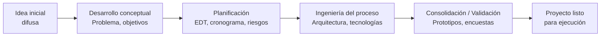
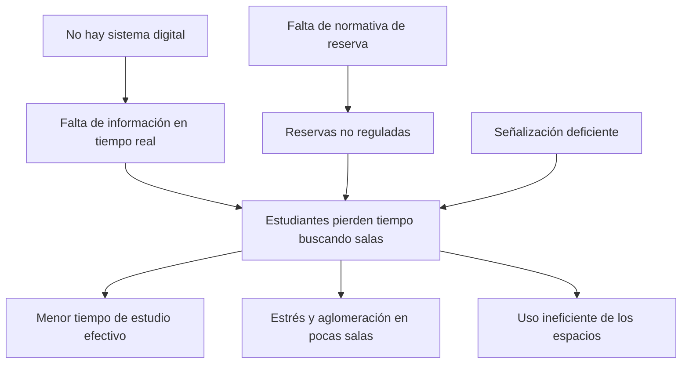
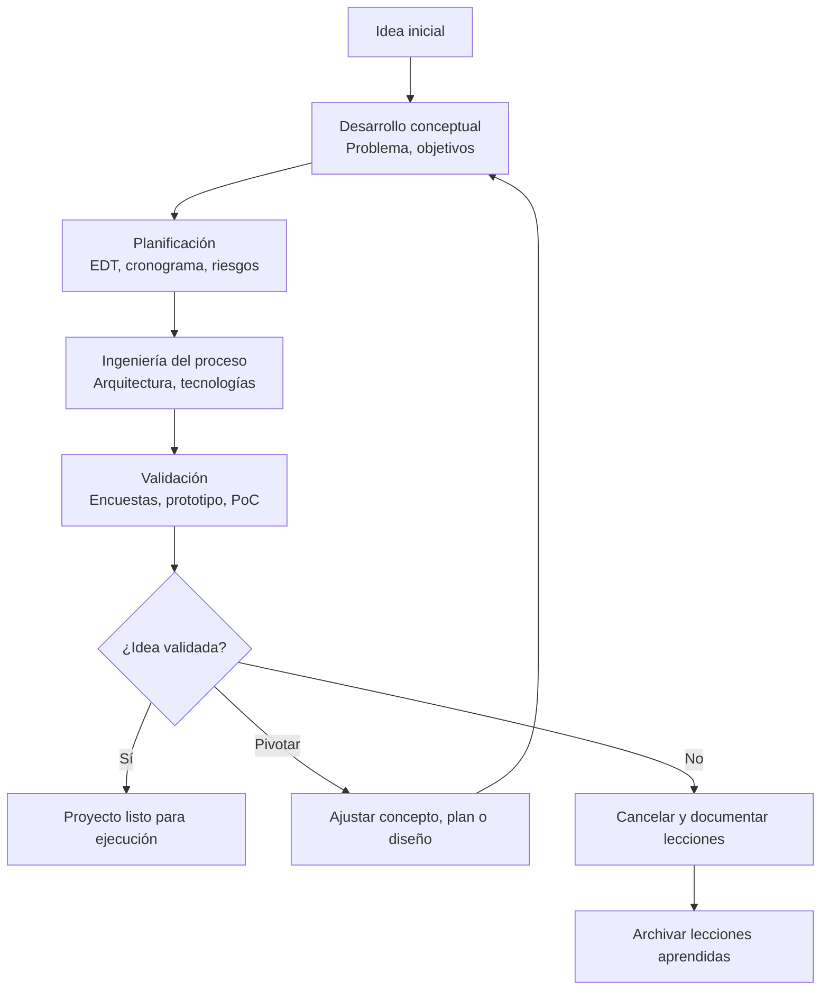

# **Gestión de Proyectos Tecnológicos, Unidad II**

## Índice de Contenido

- [Introducción](#introducción)
- [Desarrollo de Contenidos](#desarrollo-de-contenidos)
  - [Desarrollo conceptual de la idea](#desarrollo-conceptual-de-la-idea)
  - [Planificación del proceso](#planificación-del-proceso)
  - [Ingeniería del Proceso](#ingeniería-del-proceso)
  - [Consolidación del proceso (Validación de la Idea Novedosa)](#consolidación-del-proceso-validación-de-la-idea-novedosa)
- [Autoevaluación](#autoevaluación)
- [Bibliografía y Webgrafía](#bibliografía-y-webgrafía)
- [Glosario](#glosario)

## Introducción

En la Unidad I se establecieron las bases conceptuales de la gestión de proyectos tecnológicos: qué es un proyecto, cómo se relaciona con programas e ideas, la importancia de la formulación, los criterios de evaluación (viabilidad técnica, económica, operativa, legal, temporal, estratégica y ambiental) y el ciclo de vida con espíritu emprendedor. Esos criterios de viabilidad serán la lente a través de la cual validaremos, en esta unidad, si una idea merece convertirse en proyecto. Ahora bien, ¿de qué sirve todo ese andamiaje teórico si no se sabe **cómo identificar** una oportunidad digna de ese nombre? ¿Cómo pasar de una simple ocurrencia ("sería bueno tener una app para…") a una **idea estructurada**, **planificada** y **validada**? Esa transición es el corazón de la Unidad II.

La experiencia muestra que muchos proyectos tecnológicos fracasan no por mala ejecución técnica, sino por una **identificación deficiente del problema** o por abordar una necesidad mal definida. El ingeniero en sistemas de información no solo debe saber programar o administrar bases de datos; debe desarrollar la capacidad de **detectar oportunidades** donde otros ven dificultades, **analizar el contexto** con herramientas metodológicas y **convertir una intuición en un plan viable**. Esta unidad proporciona el marco para lograrlo.

Se abordarán cuatro etapas secuenciales:

1. **Desarrollo conceptual de la idea**: cómo pasar de una noción difusa a un concepto claro, incluyendo la definición del problema, los objetivos preliminares y la identificación de los beneficiarios.
2. **Planificación del proceso**: el arte de descomponer la idea en fases, recursos, plazos y responsables, utilizando herramientas como la EDT, el cronograma y la matriz de riesgos tempranos.
3. **Ingeniería del Proceso**: el diseño detallado de la solución tecnológica (arquitectura, componentes, interfaces, estándares) y su alineación con los requisitos funcionales y no funcionales.
4. **Consolidación del proceso (Validación de la Idea Novedosa)**: el uso de prototipos, pruebas de concepto, encuestas y grupos focales para confirmar (o refutar) que la idea es viable, pertinente y realmente innovadora.

El siguiente diagrama resume el flujo de transformación de una idea en un proyecto validado:



Cada una de estas etapas se explicará con ejemplos concretos, tablas comparativas, diagramas de flujo y ejercicios prácticos. Al finalizar la unidad, el estudiante será capaz de **convertir una simple idea en un anteproyecto tecnológico sólido**, con todos los elementos necesarios para someterlo a los criterios de evaluación vistos en la Unidad I. Como dijo el reconocido autor Peter Drucker: "La mejor manera de predecir el futuro es crearlo", pero crearlo requiere un método, no solo entusiasmo.

## Desarrollo de Contenidos

### Desarrollo conceptual de la idea

Toda idea de proyecto tecnológico nace de una chispa: una incomodidad, una necesidad insatisfecha, una oportunidad de mejora. Sin embargo, esa chispa es amorfa y peligrosa si se salta la etapa de **desarrollo conceptual**. El desarrollo conceptual es el proceso sistemático de **definir, delimitar y estructurar** una idea para convertirla en un concepto claro que pueda ser evaluado y planificado. Incluye la identificación del problema central, la definición de objetivos, la identificación de los involucrados (stakeholders) y la articulación de una propuesta de valor preliminar. Los criterios de viabilidad vistos en la Unidad I (técnica, económica, operativa, legal, temporal, estratégica y ambiental) comienzan a aplicarse ya en esta etapa, pues definen si vale la pena profundizar. A continuación, a través del ejemplo "SalaFinder", se mostrará cómo aplicar una evaluación ex ante rápida para confirmar que la idea es prometedora.

#### De la situación problemática al enunciado del problema

El primer paso es **identificar una situación actual no deseada** que pueda ser mejorada mediante tecnología. No cualquier molestia es relevante; debe cumplir algunos criterios:

- **Significatividad:** afecta a un número considerable de personas o genera un costo importante (tiempo, dinero, seguridad).
- **Factibilidad tecnológica aparente:** existe o puede desarrollarse una solución técnica.
- **Voluntad de cambio:** los afectados están dispuestos a adoptar una nueva solución.

**Herramienta: Árbol de problemas (técnica de marco lógico)**

El árbol de problemas ayuda a descomponer una situación negativa en causas y efectos. Se construye de arriba abajo o de abajo arriba:

- **Tronco:** problema central.
- **Raíces:** causas directas e indirectas.
- **Ramas:** efectos o consecuencias.

**Ejemplo práctico (caso hipotético de una universidad):**

> **Problema central:** Estudiantes desperdician más de 30 minutos diarios buscando salas de estudio disponibles. (Cifra basada en una encuesta rápida a 50 estudiantes donde el 80% reportó perder más de 20 minutos.)



A partir del árbol de problemas, se formula el enunciado del problema de manera clara y acotada:

> *"La ausencia de un sistema digital de reserva y disponibilidad de salas de estudio en la universidad provoca una pérdida de tiempo estimada en 30 minutos diarios por estudiante, afectando a 3000 estudiantes y generando insatisfacción y uso subóptimo del espacio."*

#### Definición de objetivos (versión positiva del problema)

El árbol de objetivos se construye transformando cada causa negativa en un medio positivo y cada efecto negativo en un fin positivo. Para el ejemplo anterior:

- **Objetivo general:** *Implementar un sistema digital de reserva y disponibilidad de salas de estudio que reduzca a menos de 5 minutos el tiempo de búsqueda.*
- **Objetivos específicos:**
  1. Desarrollar una aplicación móvil o web que muestre disponibilidad en tiempo real.
  2. Implementar un módulo de reserva con autenticación de estudiantes.
  3. Capacitar al personal de biblioteca en la gestión del sistema.
  4. Medir la satisfacción de los estudiantes antes y después de la implementación.

**Características SMART** (para cada objetivo específico):
- **S**pecific (específico)
- **M**easurable (medible)
- **A**chievable (alcanzable)
- **R**elevant (relevante)
- **T**ime-bound (con plazo)

Ejemplo aplicado: *"Desarrollar una aplicación móvil funcional para Android e iOS (específico) que permita reservar salas en menos de 1 minuto (medible) durante el segundo semestre de 2026 (plazo), utilizando tecnologías web estándar que los miembros del equipo pueden aprender en dos semanas (alcanzable) y que contribuya a la mejora del rendimiento académico (relevante)."*

#### Identificación de stakeholders (involucrados)

Son todas las personas, grupos u organizaciones que pueden afectar o ser afectados por el proyecto. Para proyectos tecnológicos, los stakeholders típicos incluyen:

| Categoría | Ejemplos | Intereses típicos |
|-----------|----------|--------------------|
| **Usuarios finales** | Estudiantes, profesores, administrativos | Facilidad de uso, disponibilidad, privacidad |
| **Patrocinadores** | Rectoría, dirección de TI, fondos externos | Retorno de inversión, mejora de imagen, eficiencia |
| **Equipo de proyecto** | Desarrolladores, diseñadores, analistas | Tecnología interesante, estabilidad, reconocimiento |
| **Operadores** | Personal de biblioteca, mantenimiento | Bajos costos de operación, integración con rutinas |
| **Reguladores** | Unidad de protección de datos | Cumplimiento legal (Ley 787, etc.) |

**Herramienta: Matriz de poder-interés** (para priorizar la comunicación)

La siguiente tabla clasifica a los stakeholders según su poder (capacidad de influir) y su interés (grado en que el proyecto les afecta):

| | Interés bajo | Interés alto |
|--|--------------|---------------|
| **Poder alto** | Rectoría (mantener satisfecho) | Patrocinador (gestionar cerca) |
| **Poder bajo** | Proveedores externos (monitorear) | Usuarios finales (informar continuamente) |

#### Propuesta de valor preliminar

Es un enunciado conciso que responde a: **¿Qué valor único ofrece nuestro proyecto tecnológico a los usuarios?** Se puede estructurar como:

*"Nuestro proyecto [nombre tentativo] ayuda a [segmento de usuarios] a [resolver problema o necesidad] mediante [tecnología clave] a diferencia de [alternativas existentes], lo que genera [beneficio cuantificable]."*

Para asegurar la novedad, es recomendable buscar soluciones similares en tiendas de aplicaciones, repositorios académicos y preguntar directamente a los usuarios sobre herramientas que ya hayan probado.

Ejemplo: *"SalaFinder ayuda a estudiantes universitarios a encontrar salas de estudio disponibles en menos de 1 minuto mediante una app móvil con mapas en tiempo real, a diferencia de los anuncios en carteleras físicas, lo que reduce el estrés y aumenta el tiempo de estudio efectivo en un 20%."*

#### Evaluación ex ante rápida

Siguiendo los criterios de viabilidad de la Unidad I, se puede realizar una evaluación preliminar del ejemplo:

- **Viabilidad técnica:** Existen frameworks open source (React Native, Leaflet, PostgreSQL) y el equipo puede aprenderlos en pocas semanas. → **Aceptable**.
- **Viabilidad económica:** Costo estimado de desarrollo C$ 64,000; beneficio por ahorro de tiempo valorado en C$ 200,000 anuales (3000 estudiantes × 25 min ahorrados × 200 días × C$ 50/hora). ROI positivo. → **Aceptable**.
- **Viabilidad operativa:** Encuesta rápida muestra 85% de los estudiantes dispuestos a usar la app. → **Aceptable**.
- **Viabilidad legal:** No se almacenan datos sensibles; se requiere política de privacidad básica. → **Aceptable**.

Esta evaluación permite decidir que la idea merece avanzar a la planificación.

#### Entregable clave del desarrollo conceptual

El **Documento de Visión del Proyecto** (una a dos páginas) que contiene:

- Título tentativo
- Problema/necesidad (con datos y su fuente)
- Objetivo general y específicos (SMART)
- Stakeholders principales
- Propuesta de valor
- Criterios de éxito de alto nivel (ej. "el 80% de los usuarios reduce su tiempo de búsqueda a menos de 5 minutos", y "satisfacción del usuario > 4/5 en escala Likert")

Este documento será la base para la siguiente etapa: la planificación del proceso. Además, ya puede ser sometido a una evaluación ex ante ligera usando los criterios de viabilidad de la Unidad I, como se mostró arriba.

#### Ejercicio práctico (con plantilla)

Tome la idea que anotó en la introducción. Complete la siguiente tabla (puede incluir más causas/efectos si lo desea):

| Elemento | Su respuesta |
|----------|--------------|
| Problema central (en una frase, con dato cuantitativo aproximado) | |
| Dos causas principales (o más) | |
| Dos efectos principales (o más) | |
| Objetivo general (SMART) | |
| Un objetivo específico (SMART) | |
| Tres stakeholders clave | |
| Propuesta de valor (estructura sugerida) | |
| Evaluación ex ante rápida (al menos dos criterios) | |

**Ejemplo de respuesta (referencial para la idea "colas en biblioteca"):**

| Elemento | Respuesta ejemplo |
|----------|-------------------|
| Problema central | Los estudiantes pierden más de 30 minutos diarios buscando salas de estudio libres (según encuesta a 50 estudiantes). |
| Causas | Falta de información en tiempo real; reservas no reguladas; señalización deficiente. |
| Efectos | Menor tiempo de estudio; estrés; uso ineficiente del espacio. |
| Objetivo general | Implementar un sistema digital que reduzca el tiempo de búsqueda a menos de 5 minutos al final del semestre. |
| Objetivo específico | Desarrollar una app móvil con disponibilidad en tiempo real para diciembre de 2026. |
| Stakeholders | Estudiantes, bibliotecarios, dirección de TI, rectoría. |
| Propuesta de valor | SalaFinder ayuda a estudiantes a encontrar salas en <1 min mediante mapas en tiempo real, a diferencia de carteleras físicas, ahorrando 25 minutos diarios. |
| Evaluación ex ante rápida | Viabilidad técnica: frameworks open source disponibles. Viabilidad operativa: 85% de aceptación en encuesta. |

**Transición al siguiente tema:** Una vez que tenemos clara la idea conceptual (problema, objetivos, stakeholders, propuesta de valor y una primera evaluación de viabilidad), el siguiente paso natural es planificar cómo ejecutarla. En la **planificación del proceso** convertiremos estos objetivos en tareas concretas, plazos, responsables y riesgos.

### Planificación del proceso

Una vez que hemos desarrollado conceptualmente la idea (problema claro, objetivos SMART, stakeholders identificados y propuesta de valor definida en el **Documento de Visión**), el siguiente paso es **planificar cómo se va a ejecutar**. La planificación del proceso consiste en descomponer el trabajo en tareas manejables, estimar duraciones, asignar recursos, identificar riesgos tempranos y definir un cronograma. No se trata de un plan inamovible, sino de una hoja de ruta que se irá ajustando, pero sin ella el proyecto navega a la deriva. Los criterios de viabilidad de la Unidad I (especialmente el temporal y el económico) se concretan aquí en cifras y fechas. La viabilidad temporal se traduce en el cronograma con hitos claros; la viabilidad económica, en el presupuesto que debe incluir una reserva para imprevistos.

El siguiente diagrama muestra el flujo de actividades de la planificación:

```mermaid
flowchart TD
    A[Documento de Visión] --> B[Descomposición del trabajo (EDT)]
    B --> C[Estimación de duraciones (PERT, juicio experto)]
    C --> D[Construcción del cronograma (Gantt)]
    D --> E[Asignación de recursos y presupuesto]
    E --> F[Identificación de riesgos tempranos]
    F --> G[Plan de Dirección del Proyecto]
    G --> H[Inicio de la ejecución]
```

#### Descomposición del trabajo: EDT (WBS)

La **Estructura de Desglose del Trabajo** (EDT o WBS) es una descomposición jerárquica orientada a entregables. Cada nivel representa un paquete de trabajo más detallado. Para proyectos tecnológicos, la EDT suele tener 2-4 niveles.

**Reglas básicas de la EDT:**
- La suma de los subentregables debe ser igual al entregable principal (regla del 100%).
- Cada elemento debe tener un responsable único.
- El nivel más bajo (paquete de trabajo) debe tener una duración estimada entre 4 y 80 horas (en metodologías tradicionales).

**Ejemplo de EDT para el proyecto "SalaFinder" (sistema de reserva de salas):**

1. Gestión del proyecto
   1.1. Acta de constitución
   1.2. Plan de gestión
   1.3. Informes de avance
   1.4. Gestión de la calidad (métricas, auditorías internas)
   1.5. Gestión de la comunicación (informes a stakeholders)
2. Análisis de requisitos
   2.1. Entrevistas a estudiantes (10)
   2.2. Entrevistas a personal de biblioteca (3)
   2.3. Definición de requisitos funcionales
   2.4. Definición de requisitos no funcionales (rendimiento, seguridad)
3. Diseño
   3.1. Diseño de arquitectura (backend + frontend + base de datos)
   3.2. Prototipos de interfaz (wireframes)
   3.3. Diseño de base de datos (modelo entidad-relación)
4. Construcción
   4.1. Configuración de entorno de desarrollo
   4.2. Desarrollo de API REST (Node.js + Express)
   4.3. Desarrollo de frontend web (React)
   4.4. Desarrollo de app móvil (React Native)
   4.5. Pruebas unitarias y de integración
5. Pruebas y despliegue
   5.1. Pruebas de aceptación con usuarios piloto (20 estudiantes)
   5.2. Pruebas de carga (simulación de 200 usuarios concurrentes)
   5.3. Despliegue en servidor en la nube
   5.4. Capacitación a bibliotecarios
6. Cierre
   6.1. Acta de aceptación
   6.2. Documentación técnica y de usuario
   6.3. Lecciones aprendidas

#### Estimación de duraciones

Se pueden usar técnicas como:
- **Juicio de expertos:** consultar a desarrolladores con experiencia.
- **Estimación por analogía:** comparar con proyectos similares anteriores.
- **PERT** (visto en Unidad I): utiliza tres escenarios (optimista, más probable, pesimista) con la fórmula `(a + 4m + b) / 6`, y la varianza se calcula como `((b - a) / 6)^2` para obtener intervalos de confianza.

**Ejemplo de estimación PERT para algunas actividades de SalaFinder:**

| Actividad | Optimista (días) | Más probable | Pesimista | Duración esperada (te) | Varianza |
|-----------|-----------------|--------------|-----------|------------------------|----------|
| Entrevistas a estudiantes | 2 | 3 | 5 | (2+12+5)/6 = 3.17 | ((5-2)/6)^2 = 0.25 |
| Desarrollo API REST | 5 | 8 | 12 | (5+32+12)/6 = 8.17 | ((12-5)/6)^2 = 1.36 |
| Pruebas de aceptación | 2 | 4 | 6 | (2+16+6)/6 = 4.00 | ((6-2)/6)^2 = 0.44 |

La duración total del proyecto se obtiene sumando las duraciones esperadas de la ruta crítica. Con una desviación estándar total de `√(suma de varianzas)`, se puede calcular un intervalo de confianza del 95% (duración total ± 2×desviación).

#### Cronograma y diagrama de Gantt

El cronograma ordena las actividades en el tiempo, respetando dependencias (por ejemplo, no se puede probar antes de construir). Una herramienta visual común es el **diagrama de Gantt**. A continuación se muestra una representación en texto (leyenda: cada "X" representa medio día de trabajo; "*" indica actividad en ruta crítica):

| Actividad | Sem 1 | Sem 2 | Sem 3 | Sem 4 | Responsable | Dependencias |
|-----------|-------|-------|-------|-------|-------------|--------------|
| * Análisis de requisitos | XXXXX | XX    |       |       | Analista    | - |
| Diseño |       | XXX   | XX    |       | Diseñador   | Análisis |
| * Desarrollo backend |       |       | XXX   | XXX   | Backend     | Diseño |
| Desarrollo frontend |       |       | XXX   | XXX   | Frontend    | Diseño |
| * Pruebas |       |       |       | XX    | Tester      | Backend, Frontend |
| * Despliegue |       |       |       | X     | DevOps      | Pruebas |

*Nota: Herramientas digitales como MS Project, Jira, Trello o GanttProject permiten construir estos diagramas de forma profesional.*

#### Asignación de recursos y presupuesto preliminar

Los recursos incluyen personas (con sus roles y dedicación), herramientas (licencias de software), infraestructura (servidores, equipos de prueba) y servicios externos (API de mapas, SMS). Para estimar costos se utilizan tarifas diarias o mensuales. **Se recomienda añadir un 10-15% de reserva para imprevistos**, así como considerar costos indirectos (energía, internet, gastos administrativos).

**Ejemplo de tabla de recursos (SalaFinder, proyecto de 6 semanas, equipo parcial):**

| Recurso | Cantidad | Costo unitario (C$/hora) | Horas totales | Costo total (C$) |
|---------|----------|---------------------------|---------------|------------------|
| Líder de proyecto | 1 | 250 | 60 | 15,000 |
| Analista | 1 | 200 | 40 | 8,000 |
| Desarrollador backend | 1 | 200 | 80 | 16,000 |
| Desarrollador frontend | 1 | 200 | 80 | 16,000 |
| Tester | 1 | 150 | 30 | 4,500 |
| Servidor cloud (3 meses) | 1 | 1,500/mes | 3 | 4,500 |
| Licencias de software (Jira, Confluence) | 1 | 500/mes | 3 | 1,500 |
| Gastos administrativos (5% de subtotal) | | | | 3,275 |
| **Subtotal** | | | | **68,775** |
| **Reserva para imprevistos (10%)** | | | | **6,878** |
| **Presupuesto total** | | | | **75,653** |

#### Matriz de riesgos tempranos

En la planificación del proceso se deben identificar riesgos que podrían afectar el proyecto y definir acciones de mitigación. Se recomienda establecer un **umbral de aceptación**: riesgos con nivel (Probabilidad × Impacto) mayor a 12 requieren acción inmediata; entre 8 y 12 requieren monitoreo; menor a 8 se aceptan. Las escalas de probabilidad e impacto son: 1 = muy improbable / impacto muy bajo; 2 = improbable / impacto bajo; 3 = moderado; 4 = probable / impacto alto; 5 = casi seguro / impacto catastrófico.

| Riesgo | Prob. (1-5) | Impacto (1-5) | Nivel (P×I) | Mitigación |
|--------|-------------|---------------|-------------|-------------|
| Cambio de requisitos por parte del cliente | 4 | 3 | 12 | Usar metodología ágil con sprints cortos; involucrar al cliente semanalmente. |
| Dificultad técnica en la integración de mapas | 3 | 4 | 12 | Desarrollar un prototipo de integración en la primera semana; tener un plan B (lista de salas sin mapa). |
| Rotación de algún desarrollador | 2 | 5 | 10 | Documentar el código y compartir conocimiento; tener un backup en el equipo. |
| Baja adopción por parte de los estudiantes | 3 | 4 | 12 | Realizar campaña de comunicación y ofrecer incentivos (puntos, sorteos) durante el piloto. |

#### Entregable clave de la planificación del proceso

El **Plan de Dirección del Proyecto (inicial)** que contiene al menos:
- EDT hasta nivel de paquete de trabajo.
- Cronograma de hitos (diagrama de Gantt con dependencias y ruta crítica).
- Presupuesto estimado (incluyendo reserva para imprevistos y costos indirectos).
- Matriz de riesgos con mitigaciones y umbrales.
- Roles y responsabilidades.
- Registro de cambios (para gestionar desviaciones futuras).

Este plan será la línea base contra la cual se medirá el avance durante la ejecución. Cualquier desviación significativa deberá pasar por un control de cambios mediante un registro de solicitudes aprobadas por el comité de proyecto.

#### Ejercicio práctico

Sobre la misma idea que trabajó en el tema anterior, realice las siguientes actividades (puede basarse en el Documento de Visión que elaboró). No es necesario que detalle tanto como el ejemplo; puede tomar las fases principales con menos niveles:

1. **Elabore una EDT** de al menos 10 paquetes de trabajo (agrupando actividades similares).
2. **Estime la duración** de tres actividades críticas usando PERT (optimista, más probable, pesimista). Calcule la duración esperada y la varianza.
3. **Asigne recursos humanos** (roles) y calcule un **costo aproximado** en C$ (invente tarifas razonables). Incluya una reserva del 10% y un rubro de gastos administrativos (5%).
4. **Identifique tres riesgos** (uno técnico, uno operativo y uno externo) con su respectiva mitigación, usando las escalas de probabilidad e impacto definidas.

**Plantilla sugerida para su respuesta:**

| Actividad (de la EDT) | Optimista | Más probable | Pesimista | Duración esperada | Varianza |
|-----------------------|-----------|--------------|-----------|-------------------|----------|
| (ejemplo) | | | | | |

| Riesgo | Prob. (1-5) | Impacto (1-5) | Nivel | Mitigación |
|--------|-------------|---------------|-------|-------------|
| | | | | |

**Transición al siguiente tema:** Con el Plan de Dirección del Proyecto aprobado (EDT, cronograma, presupuesto y matriz de riesgos), la siguiente fase es la **ingeniería del proceso**, donde diseñaremos la arquitectura técnica, las tecnologías específicas y los estándares de calidad que guiarán la construcción.

### Ingeniería del Proceso

Partiendo del Plan de Dirección del Proyecto (especialmente de los requisitos funcionales y no funcionales definidos en la planificación, así como de la EDT y el cronograma), la **ingeniería del proceso** traduce esas necesidades en un diseño técnico detallado. Mientras que la planificación se enfoca en **cuándo** y **con qué recursos**, la ingeniería del proceso aborda **cómo** se construirá técnicamente la solución. Es la fase donde se define la arquitectura, los componentes, las interfaces, los estándares de calidad, las herramientas concretas y el plan de pruebas. En proyectos tecnológicos, la ingeniería del proceso es la traducción de los requisitos a un diseño técnico que pueda ser ejecutado por los desarrolladores. Además, se debe verificar explícitamente la **viabilidad técnica** (¿el equipo puede implementar la arquitectura propuesta?) y la **viabilidad operativa** (¿los usuarios podrán usar la interfaz diseñada?).

#### Arquitectura de la solución

La arquitectura describe la estructura de alto nivel del sistema: sus módulos, cómo se comunican, dónde se ejecutan (cliente-servidor, nube, edge, etc.). Se deben indicar los protocolos de comunicación (síncrono/asíncrono) y el flujo de datos. A continuación se muestra un diagrama de bloques para el ejemplo "SalaFinder".

```mermaid
graph TB
    Usuario[Usuario final (estudiante)]
    subgraph "Cliente"
        A[App móvil React Native]
        B[Web app React]
    end
    subgraph "Servidor"
        C[API Gateway Node.js]
        D[Servicio de autenticación]
        E[Servicio de reservas]
        F[Servicio de mapas]
    end
    subgraph "Datos"
        G[(PostgreSQL)]
        H[(Redis cache)]
    end
    I[Proveedor de mapas<br>(Leaflet / OpenStreetMap)]
    
    Usuario --> A
    Usuario --> B
    A -->|HTTPS/REST| C
    B -->|HTTPS/REST| C
    C -->|REST| D
    C -->|REST| E
    C -->|REST| F
    D -->|SQL| G
    E -->|SQL| G
    E -->|Asíncrono| H
    F -->|HTTPS| I
```

*Leyenda:* Las flechas sólidas indican llamadas síncronas sobre HTTPS; la flecha entre E y H es asíncrona (escritura/lectura de caché).

La arquitectura debe considerar:
- **Escalabilidad:** ¿podrá manejar 100, 1000 o 10000 usuarios concurrentes?
- **Seguridad:** autenticación, autorización, cifrado de datos.
- **Disponibilidad:** tiempo de actividad esperado (99.5%, 99.9%).
- **Mantenibilidad:** modularidad, estándares de código.

#### Definición de componentes y sus interfaces

Cada componente debe tener una descripción funcional, las entradas y salidas esperadas, los protocolos de comunicación y el mecanismo de autenticación.

**Ejemplo de especificación de componente (Servicio de reservas):**

| Atributo | Valor |
|----------|-------|
| Nombre | Reservation Service |
| Responsabilidad | Gestionar reservas de salas (crear, cancelar, consultar) |
| Dependencias | Base de datos PostgreSQL, Redis para caché de disponibilidad |
| Interfaz expuesta | API REST: POST /reservas, DELETE /reservas/{id}, GET /reservas?fecha=... |
| Autenticación | Token JWT vía API Gateway. El token se obtiene de POST /auth con credenciales, expira en 1 hora. Debe enviarse en cabecera `Authorization: Bearer <token>`. |
| Formato de datos | JSON |
| Códigos de respuesta | 200 OK, 400 solicitud inválida, 401 no autenticado, 409 conflicto (sala ya reservada) |

**Ejemplo de especificación OpenAPI (Swagger) para el endpoint POST /reservas:**

```json
{
  "openapi": "3.0.0",
  "paths": {
    "/reservas": {
      "post": {
        "summary": "Crea una nueva reserva",
        "security": [{"bearerAuth": []}],
        "requestBody": {
          "required": true,
          "content": {
            "application/json": {
              "schema": {
                "type": "object",
                "properties": {
                  "sala_id": {"type": "integer"},
                  "fecha_hora_inicio": {"type": "string", "format": "date-time"},
                  "fecha_hora_fin": {"type": "string", "format": "date-time"}
                },
                "required": ["sala_id", "fecha_hora_inicio", "fecha_hora_fin"]
              }
            }
          }
        },
        "responses": {
          "201": {"description": "Reserva creada"},
          "409": {"description": "Conflicto de horario"}
        }
      }
    }
  }
}
```

#### Tecnologías específicas y justificación

La elección tecnológica debe basarse en criterios ponderados (costo, experiencia del equipo, soporte, rendimiento). Se recomienda usar una matriz de decisión. Para el ejemplo "SalaFinder", se utilizó la siguiente matriz (pesos: costo 30%, experiencia del equipo 40%, comunidad/soporte 20%, rendimiento 10%):

| Criterio | Peso | Node.js | Python/Django | Java | Puntuación ponderada (Node.js) |
|----------|------|---------|---------------|------|-------------------------------|
| Costo (menor es mejor) | 30% | 5 | 4 | 2 | 0.3×5 = 1.5 |
| Experiencia del equipo | 40% | 5 | 3 | 1 | 0.4×5 = 2.0 |
| Comunidad/soporte | 20% | 5 | 5 | 5 | 0.2×5 = 1.0 |
| Rendimiento esperado | 10% | 4 | 3 | 5 | 0.1×4 = 0.4 |
| **Total** | 100% | | | | **4.9** |

Node.js obtuvo la mayor puntuación. La tabla final de tecnologías decididas es:

| Componente | Decisión | Justificación |
|------------|----------|----------------|
| Lenguaje backend | Node.js | Mayor experiencia del equipo; buen rendimiento I/O. |
| Base de datos | PostgreSQL | Soporte para consultas geoespaciales; código abierto. |
| Frontend web | React | Curva de aprendizaje baja; reutilización con React Native. |
| Frontend móvil | React Native | Comparte lógica con React; una base de código para iOS/Android. |
| Servicio de mapas | Leaflet + OpenStreetMap | Gratuito, sin límites de uso, comunidad activa. |
| Hospedaje | VPS (Linode) | Costo bajo para piloto; latencia reducida en Centroamérica. |

#### Estándares de calidad y métricas

La ingeniería del proceso debe definir estándares de calidad que guíen el desarrollo y las pruebas. Se recomienda basarse en **ISO/IEC 25010**. A continuación se presentan métricas con condiciones de medición específicas:

| Característica | Subcaracterística | Métrica objetivo | Condición de medición |
|----------------|-------------------|------------------|------------------------|
| Funcionalidad | Corrección | Todas las historias de usuario pasan pruebas de aceptación | Ejecución con 10 casos de prueba por historia en entorno de QA |
| Rendimiento | Tiempo de respuesta | 95% de las peticiones < 2 segundos | Prueba con 100 usuarios concurrentes durante 10 minutos (k6) |
| Usabilidad | Facilidad de aprendizaje | Nuevo usuario puede hacer una reserva en <1 minuto sin ayuda | Prueba con 10 usuarios sin capacitación previa, medir tiempo promedio |
| Seguridad | Integridad | No se pueden reservar salas sin autenticación; datos sensibles cifrados | Pruebas de penetración automatizadas (OWASP ZAP) |
| Mantenibilidad | Cobertura de pruebas | >70% de líneas de código cubiertas por pruebas unitarias | Medición con Jest --coverage |

#### Plan de pruebas (niveles, herramientas, responsables y cronograma)

| Tipo de prueba | Responsable | Herramienta | Momento (semana) | Criterio de aceptación |
|----------------|-------------|-------------|------------------|------------------------|
| Unitarias | Desarrolladores | Jest (backend), React Testing Library (frontend) | Semanas 3-5 | >70% de cobertura, 0 fallos |
| Integración | Desarrollador backend | Supertest, Postman | Semana 5 | Todos los endpoints responden como se especifica |
| Sistema | Tester | Selenium, cypress (opcional) | Semana 6 | Flujo completo: login → buscar sala → reservar → cancelar |
| Aceptación | Tester + usuarios piloto | Entorno de pruebas con 20 usuarios reales | Semana 6 | 90% de las tareas completadas sin errores |
| Rendimiento | DevOps | k6 | Semana 6 | Percentil 95 < 2 segundos, 0 errores con 100 usuarios |
| Seguridad | Tester | OWASP ZAP | Semana 6 | Sin vulnerabilidades críticas o altas |

#### Estándares de codificación y documentación (gestión de deuda técnica)

Para evitar la acumulación de deuda técnica, se definen las siguientes políticas:
- **Guía de estilo:** ESLint con reglas Airbnb (para JavaScript/TypeScript).
- **Revisión de código:** cada pull request requiere al menos una aprobación de otro miembro del equipo.
- **Documentación:** JSDoc para todas las funciones públicas; README actualizado en cada módulo.
- **Pruebas:** las pruebas unitarias deben ejecutarse automáticamente en cada push (GitHub Actions o similar).
- **Deuda técnica:** se mantendrá un backlog de ítems técnicos (refactorizaciones) priorizados en cada sprint.

#### Verificación de viabilidad técnica y operativa dentro de la ingeniería

Antes de aprobar el diseño técnico, se debe responder a la siguiente lista de verificación:

- **Viabilidad técnica:** ¿La versión de Node.js (18 LTS) es compatible con todas las librerías? ¿El hosting VPS permite escalar verticalmente? ¿La base de datos PostgreSQL soporta la carga esperada (estimada en 1000 transacciones por hora)?
- **Viabilidad operativa:** ¿Los wireframes fueron probados con al menos 5 usuarios (estudiantes) y se obtuvo una puntuación de facilidad > 4/5? ¿El personal de biblioteca aceptó el flujo de gestión de reservas?

En el ejemplo, se realizó una prueba rápida de wireframes con 5 estudiantes (todos pudieron reservar en menos de 2 minutos) y una entrevista con 2 bibliotecarios (no mostraron resistencia). Por lo tanto, la viabilidad operativa es aceptable.

#### Entregable clave de la ingeniería del proceso

El **Documento de Diseño Técnico** (o **Especificación de Arquitectura**) que incluye:
- Diagramas de arquitectura (bloques, despliegue) con leyenda de protocolos.
- Definición de componentes e interfaces (incluyendo especificaciones OpenAPI).
- Matriz de decisión tecnológica con criterios ponderados.
- Matriz de calidad con métricas y condiciones de medición.
- Plan de pruebas por niveles con responsables, herramientas y cronograma.
- Estándares de codificación y políticas de revisión.
- Lista de verificación de viabilidad técnica y operativa.

#### Ejercicio práctico

Para su proyecto (basado en la idea que ha venido trabajando), realice las siguientes actividades. Puede usar texto, tablas o diagramas sencillos (dibujados a mano o con herramientas gratuitas como draw.io, Miro o incluso lápiz y papel; describa la arquitectura en palabras si no tiene acceso a gráficos).

1. **Describa la arquitectura de alto nivel** de su solución tecnológica en no más de 10 líneas. Indique los componentes principales, cómo se comunican (protocolo) y dónde se ejecutan. Si lo prefiere, puede dibujar un diagrama y describirlo.
2. **Elija tres tecnologías** (lenguaje, base de datos, framework) y justifíquelas usando al menos dos criterios (costo, experiencia, rendimiento, comunidad). Puede usar una tabla sencilla.
3. **Defina dos métricas de calidad** (una de rendimiento y una de seguridad) con sus condiciones de medición específicas (ej. "con X usuarios, el tiempo de respuesta debe ser < Y segundos").
4. **Proponga un plan de pruebas mínimo** (tres tipos de prueba) con responsable y herramienta sugerida.
5. **Verifique la viabilidad operativa** respondiendo: ¿cómo comprobaría que los usuarios aceptarán la interfaz antes de codificar? (ej. prototipo en papel, encuesta, etc.)

**Plantilla sugerida para su respuesta (puede copiarla en su cuaderno):**

| Elemento | Su respuesta |
|----------|--------------|
| Arquitectura (descripción o diagrama) | |
| Tecnología 1 y justificación | |
| Tecnología 2 y justificación | |
| Tecnología 3 y justificación | |
| Métrica de rendimiento | |
| Métrica de seguridad | |
| Plan de pruebas (3 tipos) | |
| Verificación operativa | |

**Transición al siguiente tema:** Con el diseño técnico completo (arquitectura, tecnologías, calidad, pruebas y estándares de codificación), el siguiente paso es construir un prototipo funcional y validar la idea con usuarios reales en la etapa de **Consolidación del proceso (Validación de la Idea Novedosa)**. Allí comprobaremos si la solución propuesta realmente soluciona el problema y si los usuarios la adoptarían.

### Consolidación del proceso (Validación de la Idea Novedosa)

A partir del **Documento de Diseño Técnico** (generado en la ingeniería del proceso) y del **Plan de Dirección del Proyecto**, la etapa de consolidación consiste en validar que la idea, planificada y diseñada técnicamente, es realmente **novedosa**, **útil** y **factible** antes de invertir grandes recursos en su construcción completa. Muchos proyectos fracasan porque se saltan esta validación y descubren tarde que los usuarios no quieren la solución, que ya existe algo similar o que la tecnología elegida no funciona como se esperaba. La validación debe ser rápida y económica, siguiendo la filosofía de **"fallar rápido y barato"**. Los criterios de viabilidad de la Unidad I (especialmente operativa, técnica y económica) se ponen a prueba aquí con datos reales, no con estimaciones. Por ejemplo, la disposición a pagar obtenida en encuestas se utilizará para recalcular el VAN y ajustar el presupuesto.

#### La idea novedosa: ¿qué significa "novedoso"?

No se requiere que el proyecto sea una invención mundial; basta con que sea **novedoso en el contexto de aplicación**. Puede ser:
- **Innovación incremental:** mejora de una solución existente (más rápida, más barata, con mejor UI).
- **Innovación adaptativa:** traslado de una solución de un dominio a otro (ej. un sistema de turnos de hospital adaptado a ventanillas municipales).
- **Innovación disruptiva:** cambia las reglas del mercado (menos común en proyectos académicos, pero posible).

Para evaluar la novedad, se debe realizar un **análisis del estado del arte** y un **análisis de competencia**. Herramientas: búsqueda en Google Scholar, revisión de patentes, análisis de apps similares en tiendas.

**Matriz de comparación con soluciones existentes (ejemplo SalaFinder):**

| Solución | Ventajas | Desventajas | Nuestra propuesta diferencial |
|----------|----------|-------------|-------------------------------|
| Pizarrón físico (método actual) | Bajo costo | No hay disponibilidad remota, se borra información | App con disponibilidad en tiempo real |
| Aplicación A de otra universidad | Reservas en línea | No tiene mapas; requiere registro manual de salas | Integración con mapas y autodetección de salas libres |
| Hoja de cálculo compartida | Sencilla | Conflictos de concurrencia, sin notificaciones | Reservas atómicas y notificaciones push |

#### Métodos de validación con usuarios reales

No se trata de construir el sistema completo, sino de obtener evidencia con el mínimo esfuerzo. Algunas técnicas:

**1. Encuesta estructurada** (cuantitativa)  
Aplicar a una muestra representativa de usuarios potenciales. Preguntas tipo Likert sobre disposición a usar, frecuencia, características deseadas. Ejemplo:

- "¿Usaría una aplicación para reservar salas de estudio?" (1 = definitivamente no, 5 = definitivamente sí)
- "¿Estaría dispuesto a pagar C$ 20 por mes por la aplicación?"

Umbral de éxito: más del 70% responde 4 o 5 a la primera pregunta.

**Ejemplo numérico de cálculo del umbral:**  
Se encuestó a 30 estudiantes. Resultados: 18 respondieron 4 o 5 (60%), 10 respondieron 3 (33%), 2 respondieron 1 o 2 (7%). El umbral del 70% no se alcanza (solo 60%). Esto indicaría que se debe mejorar la propuesta de valor o pivotar.

**2. Entrevistas en profundidad** (cualitativa)  
Entrevistar a 5-10 usuarios para explorar necesidades no expresadas. Preguntas abiertas: "Cuénteme la última vez que no encontró sala"; "¿Qué le frustra del proceso actual?".

**3. Focus group**  
Reunir a 6-12 usuarios para discutir una propuesta y ver reacciones. Útil para generar ideas de funcionalidades.

**4. Prototipo de baja fidelidad (papel o wireframes interactivos)**  
Mostrar a los usuarios un mockup (por ejemplo, en Figma) y pedirles que realicen tareas como "reserve una sala para mañana a las 10 am". Observar dificultades. Herramientas gratuitas: Figma (plan free), Balsamiq (versión de prueba), o simplemente papel y lápiz.

**5. Prototipo de alta fidelidad (producto mínimo viable, MVP)**  
Desarrollar solo las funcionalidades esenciales (por ejemplo, ver disponibilidad y reservar, sin cancelaciones ni notificaciones) y desplegarlo a un grupo reducido de usuarios piloto (10-20) durante una semana. Medir uso real.

**6. Prueba de concepto (PoC) técnica**  
Construir la parte técnicamente más riesgosa (ej. integración con mapas) para demostrar que es factible, sin desarrollar toda la lógica de negocio. Si la PoC falla, se puede pivotar de tecnología (por ejemplo, cambiar de API de mapas en línea a una librería offline).

#### Consolidación: integración de evidencias y toma de decisión

Una vez aplicados uno o más métodos de validación, se consolida la información en un **Informe de Validación** que contiene:

- Resultados cuantitativos (tablas, gráficos).
- Hallazgos cualitativos (citas textuales de usuarios, observaciones).
- Análisis de la novedad frente a competidores.
- Lecciones aprendidas y cambios propuestos al diseño.
- Decisión: **continuar**, **pivotar** (cambiar de dirección) o **cancelar**.

**Ejemplo de tabla de decisiones de validación (SalaFinder):**

| Aspecto validado | Evidencia | ¿Se cumple? | Acción |
|------------------|-----------|-------------|--------|
| Los estudiantes pierden mucho tiempo buscando salas | Encuesta: 85% dice perder >20 min/día | Sí | Mantener problema central |
| La app con mapas es deseada | 78% responde "definitivamente sí" usaría la app | Sí | Continuar |
| La integración con mapas offline es factible técnicamente | PoC: se integró Leaflet con mapa local | Sí | Continuar |
| Los estudiantes estarían dispuestos a pagar | Solo 12% pagaría C$20/mes | No | Cambiar modelo de negocio: gratuita para estudiantes, costo institucional |

**Plantilla de lecciones aprendidas (en caso de cancelación o pivot):**

| Ítem | Descripción |
|------|-------------|
| ¿Qué se intentó? | Breve descripción del proyecto o funcionalidad validada. |
| ¿Qué salió mal? | Causas del fracaso (ej. baja aceptación, inviabilidad técnica). |
| ¿Qué se aprendió? | Conocimiento obtenido (ej. "los usuarios no confían en el pago móvil"). |
| Recomendaciones para el futuro | Cómo abordar un proyecto similar (ej. "usar autenticación biométrica"). |

#### El "pivot" como resultado de la validación

Un pivot es un cambio estratégico basado en la evidencia. Puede ser:
- **Pivot de segmento de cliente:** dirigirse a otro grupo (ej. en lugar de estudiantes, a profesores).
- **Pivot de funcionalidad:** eliminar o añadir características clave.
- **Pivot de tecnología:** cambiar de plataforma (ej. de móvil a web porque los usuarios no tienen datos móviles). Por ejemplo, si la PoC de integración con un API de mapas en la nube resulta demasiado lenta en condiciones reales de red (latencia >5 segundos), se pivota a una librería offline como Leaflet con mapas precargados.
- **Pivot de modelo de ingresos:** de pago por usuario a freemium o publicidad.

**Caso real simplificado (adaptado):** Un proyecto de app para reportar baches en calles, durante la validación, detectó que los ciudadanos no tomaban fotos porque el tráfico lo impedía. El equipo pivotó hacia un sistema de voz con geolocalización automática, lo que aumentó la adopción.

#### Entregable final de la unidad: documento de consolidación

Al final de la Unidad II, el estudiante/equipo debe presentar un **Informe de Validación de la Idea Novedosa** que integre:
- Problema y objetivos (refinados con la validación).
- Planificación actualizada (EDT, cronograma, costos ajustados).
- Ingeniería del proceso (arquitectura, tecnologías, calidad).
- Evidencias de validación (encuestas, actas de focus group, resultados del prototipo).
- Decisión fundamentada (seguir, pivotar o cancelar) y plan de acción para la siguiente fase (desarrollo).

**Lista de cotejo para evaluar el informe (rúbrica sugerida):**

| Criterio | Ponderación | Cumple (Sí/No) |
|----------|-------------|----------------|
| Define claramente el problema y los objetivos | 10% | |
| Incluye al menos dos métodos de validación (ej. encuesta + prototipo) | 20% | |
| Presenta resultados cuantitativos (tablas, gráficos) | 15% | |
| Presenta hallazgos cualitativos (citas, observaciones) | 15% | |
| Compara la solución con al menos dos alternativas existentes | 10% | |
| Propone una decisión (continuar, pivotar, cancelar) con justificación | 20% | |
| Redacta lecciones aprendidas (aunque el proyecto continúe) | 10% | |

**Flujo de consolidación (desde idea a proyecto validado), con ciclos de retroalimentación:**



#### Ejercicio práctico final

Para su proyecto (basado en la idea que ha venido trabajando), realice las siguientes actividades. **Nota:** Para fines de este ejercicio académico, 10 respuestas en la encuesta son suficientes; en un proyecto real se recomienda al menos 30 para lograr significancia estadística.

1. **Diseñe una breve encuesta** (5 preguntas) dirigida a los usuarios potenciales. Debe incluir al menos una pregunta de escala Likert y una abierta. Puede usar herramientas gratuitas como Google Forms, Typeform o Microsoft Forms.
2. **Aplique la encuesta** a al menos 10 personas (puede ser virtual) y presente los resultados en una tabla resumen (porcentajes o promedios).
3. **Desarrolle un prototipo de baja fidelidad** (puede ser dibujado en papel, o con Figma, MockFlow, o incluso diapositivas). Pida a dos usuarios que realicen una tarea clave (ej. "registrar una reserva") y anote las dificultades observadas.
4. **Escriba una conclusión de una página** sobre si la idea es novedosa y viable, y qué cambios (pivot) haría antes de pasar al desarrollo completo.

**Plantilla sugerida para la encuesta:**

| # | Pregunta | Tipo de respuesta |
|---|----------|-------------------|
| 1 | ¿Con qué frecuencia enfrenta el problema que buscamos resolver? | (Muy a menudo, A menudo, Rara vez, Nunca) |
| 2 | ¿Qué tan útil considera una solución tecnológica como la propuesta? | (1-5, donde 1 = nada útil, 5 = muy útil) |
| 3 | ¿Estaría dispuesto a usar esta herramienta si estuviera disponible gratuitamente? | (Sí / No / Tal vez) |
| 4 | ¿Qué funcionalidad adicional le gustaría ver? | (Abierta) |
| 5 | ¿Recomendaría este proyecto a otros? | (Sí / No / No sé) |

**Transición al cierre de la unidad:** El informe de validación será la entrada principal para la **Unidad III: Formulación, organización y desarrollo de la idea novedosa**, donde se profundizará en costos, estado del arte, know how y la elaboración del proyecto tecnológico completo.

## Autoevaluación

Lea cada pregunta, responda mentalmente y luego consulte las respuestas esperadas al final de esta sección. Las respuestas no se entregan; son para su propio aprendizaje.

---

### 1. Verdadero o falso

**a)** El árbol de problemas tiene en el tronco las causas del problema.

**b)** En la EDT (WBS), cada paquete de trabajo debe tener una duración estimada entre 4 y 80 horas en enfoques tradicionales.

**c)** La viabilidad operativa se valora únicamente con herramientas técnicas, no con encuestas.

**d)** Un prototipo de baja fidelidad puede ser un conjunto de dibujos en papel.

**e)** La consolidación del proceso debe hacerse después de construir el sistema completo.

**f)** La matriz de poder-interés clasifica a los stakeholders según su poder y su interés en el proyecto.

**g)** El método PERT utiliza solo la estimación más probable para calcular duraciones.

**h)** Un pivot implica cancelar el proyecto definitivamente.

**i)** Las pruebas de rendimiento deben realizarse con una carga representativa de usuarios (ej. 100 concurrentes) y medir percentiles.

**j)** El Documento de Visión del Proyecto debe incluir criterios de éxito de alto nivel.

---

### 2. Selección múltiple (una o varias opciones correctas)

**a)** ¿Cuáles de los siguientes son componentes típicos de la EDT de un proyecto tecnológico?  
1. Análisis de requisitos  
2. Árbol de problemas  
3. Construcción  
4. Pruebas y despliegue  
5. Matriz de riesgos  

**b)** ¿Qué técnicas se utilizan para estimar duraciones en la planificación del proceso?  
1. Juicio de expertos  
2. PERT  
3. Análisis FODA  
4. Estimación por analogía  

**c)** ¿Cuál de los siguientes NO es un criterio de calidad según ISO/IEC 25010?  
1. Funcionalidad  
2. Rendimiento  
3. Precio  
4. Seguridad  

**d)** ¿Qué métodos se recomiendan para validar una idea con usuarios reales?  
1. Encuesta estructurada  
2. Focus group  
3. Diagrama de Gantt  
4. Prototipo de baja fidelidad  

**e)** ¿Cuál de las siguientes es una característica de un objetivo SMART?  
1. Específico  
2. Subjetivo  
3. Medible  
4. Alcanzable  

**f)** ¿Qué documento formal autoriza el inicio del proyecto y se elabora en la fase de desarrollo conceptual?  
1. Plan de Dirección del Proyecto  
2. Documento de Visión del Proyecto  
3. Especificación de requisitos  
4. Informe de validación  

**g)** ¿En qué fase del ciclo de vida se define la arquitectura, las tecnologías y los estándares de calidad?  
1. Desarrollo conceptual  
2. Planificación del proceso  
3. Ingeniería del proceso  
4. Consolidación  

**h)** ¿Qué significa "pivotar" en el contexto de la consolidación?  
1. Cancelar el proyecto  
2. Aumentar el presupuesto  
3. Cambiar la estrategia basándose en evidencia  
4. Entregar antes de tiempo  

---

### 3. Complete la frase

**a)** El _________ de problemas ayuda a identificar causas (raíces) y efectos (ramas) de una situación negativa.

**b)** La estructura de desglose del trabajo se conoce por sus siglas _________ (en inglés) o EDT (en español).

**c)** Un _________ de baja fidelidad puede ser un conjunto de wireframes en papel que se prueba con usuarios.

**d)** La _________ del proceso consiste en definir la arquitectura, componentes, tecnologías y estándares de calidad.

**e)** Cuando se decide cambiar de segmento de clientes o de funcionalidades principales basado en la validación, se dice que el proyecto _________.

**f)** La _________ de poder-interés clasifica a los stakeholders según su capacidad de influir y su nivel de afectación.

**g)** En el método PERT, la duración esperada se calcula como (a + 4m + b) / 6, donde 'm' representa la duración _________.

**h)** Las pruebas de _________ verifican el comportamiento del sistema bajo condiciones extremas de carga.

**i)** El _________ mínimo viable (MVP) es una versión con las funcionalidades esenciales para validar la idea con usuarios reales.

**j)** La _________ de calidad ISO/IEC 25010 incluye características como funcionalidad, rendimiento, seguridad y mantenibilidad.

---

### 4. Relacionar columnas

Relacione cada concepto de la columna A con su descripción en la columna B.

| Columna A | Columna B |
|-----------|-----------|
| 1. Árbol de problemas | A. Descomposición jerárquica de entregables |
| 2. EDT (WBS) | B. Gráfico que muestra dependencias y duraciones |
| 3. Diagrama de Gantt | C. Técnica para identificar causas y efectos |
| 4. Prototipo de baja fidelidad | D. Simulación de interfaz con papel o wireframes |
| 5. Pivot | E. Cambio estratégico basado en validación |
| 6. Matriz de poder-interés | F. Clasifica stakeholders por poder e interés |
| 7. PoC (prueba de concepto) | G. Implementación técnica limitada para probar viabilidad |
| 8. Método PERT | H. Estimación con tres escenarios (optimista, más probable, pesimista) |

---

### 5. Caso práctico

Una empresa de logística desea implementar un sistema de ruteo de vehículos basado en inteligencia artificial para optimizar entregas. El equipo de desarrollo tiene experiencia media en IA. El presupuesto estimado es de C$ 1.500.000. Se espera un ahorro anual de C$ 400.000 durante 5 años. Los usuarios (conductores) están acostumbrados a métodos manuales y solo el 40% de los encuestados aceptaría usar el sistema. La ley de protección de datos no aplica. El plazo máximo es 10 meses, pero un análisis PERT preliminar arroja una duración esperada de 12 meses. El proyecto está alineado con el objetivo estratégico de reducir costos operativos.

**Preguntas:**

a) Aplique los criterios eliminatorios (técnica, operativa, temporal, legal). ¿El proyecto debería pasar a la matriz ponderada? Justifique.

b) Si solo consideramos los criterios no eliminatorios (económico y estratégico), ¿recomendaría el proyecto? Use cálculos básicos (VAN con tasa de descuento del 10%).

c) ¿Qué recomendación final daría al patrocinador? Incluya una posible acción de pivot si corresponde.

d) Mencione al menos dos métodos de validación que recomendaría antes de iniciar el desarrollo completo.

---

### 6. Pregunta de desarrollo breve

Explique la diferencia entre **planificación del proceso** e **ingeniería del proceso** en un proyecto tecnológico. Mencione al menos dos entregables de cada una.

---

### 7. Reflexión

Imagine que es el líder técnico de un proyecto de desarrollo de una app móvil para reportar incidencias ciudadanas. Después de realizar un prototipo de baja fidelidad y encuestar a 20 usuarios, descubre que el 80% de los encuestados no tiene smartphone con datos móviles o no sabe usar aplicaciones complejas. ¿Qué haría? Justifique su respuesta usando los conceptos de validación y pivot.

---

### Respuestas esperadas

#### 1. Verdadero o falso
a) Falso. El tronco es el problema central; las raíces son las causas.  
b) Verdadero. Es una buena práctica para asegurar controlabilidad.  
c) Falso. Se valora con encuestas, focus groups y observación directa.  
d) Verdadero. Permite validar flujos sin invertir en código.  
e) Falso. Se hace antes, con prototipos y validación temprana.  
f) Verdadero. Ayuda a priorizar la comunicación.  
g) Falso. Usa tres escenarios: optimista, más probable y pesimista.  
h) Falso. Pivotar significa cambiar la dirección estratégica (segmento, tecnología, modelo de negocio) basándose en evidencia.  
i) Verdadero. Es una buena práctica según ISO 25010.  
j) Verdadero. Por ejemplo, "80% de usuarios reduce tiempo de búsqueda a menos de 5 minutos".

#### 2. Selección múltiple
a) 1, 3 y 4. El árbol de problemas es una herramienta de diagnóstico, no un entregable de la EDT. La matriz de riesgos es parte del plan, no de la EDT.  
b) 1, 2 y 4. El análisis FODA es una herramienta estratégica, no de estimación.  
c) 3. El precio es un criterio económico, no de calidad del software.  
d) 1, 2 y 4. El diagrama de Gantt es una herramienta de planificación, no de validación.  
e) 1, 3 y 4. "Subjetivo" no es parte del acrónimo.  
f) 2. El Documento de Visión (o Project Charter) es el entregable clave del desarrollo conceptual.  
g) 3. La ingeniería del proceso se enfoca en el "cómo" técnico.  
h) 3. El pivot es un cambio dirigido por los resultados de la validación.

#### 3. Complete la frase
a) árbol  
b) WBS (Work Breakdown Structure)  
c) prototipo  
d) ingeniería  
e) pivota  
f) matriz  
g) más probable  
h) rendimiento (o carga)  
i) producto  
j) modelo

#### 4. Relacionar columnas
1-C, 2-A, 3-B, 4-D, 5-E, 6-F, 7-G, 8-H

#### 5. Caso práctico
a) **Criterios eliminatorios:**  
- Técnica: brecha de conocimiento (nivel requerido 4, actual 2) → se puede cerrar con cursos o contratación, no es automáticamente inviable.  
- Operativa: solo 40% de aceptación → **inviable operativamente** (umbral mínimo >50%).  
- Temporal: duración esperada 12 meses > plazo máximo 10 meses → **inviable temporalmente**.  
- Legal: cumple → viable.  
Como la viabilidad operativa y temporal son negativas, el proyecto se rechaza en la etapa eliminatoria. No pasa a la matriz ponderada.

b) No aplica porque ya fue rechazado. A modo de ejercicio: VAN = -1.500.000 + 400.000/1.1 + ... + 400.000/1.1^5 = -1.500.000 + 400.000 × 3.7908 = -1.500.000 + 1.516.320 = 16.320 (muy bajo, apenas positivo). El VAN es casi cero, no justifica el riesgo.

c) Recomendaría **no ejecutar el proyecto** en sus términos actuales. Sugeriría **pivotar**:  
- Reducir el alcance (sistema básico de ruteo sin IA, usando heurísticas simples) para acortar el plazo a 8 meses.  
- Realizar un plan de gestión del cambio con los conductores (capacitación, incentivos) para aumentar la aceptación por encima del 60%.  
- Si el patrocinador no acepta estos cambios, cancelar y documentar lecciones.

d) Métodos de validación recomendados:  
1. **Encuesta estructurada** a al menos 30 conductores para medir disposición real y factores de resistencia.  
2. **Prototipo de baja fidelidad** (simulación de la interfaz de ruteo en papel o Figma) con 5 conductores para observar dificultades y obtener retroalimentación temprana.

#### 6. Pregunta de desarrollo breve
La **planificación del proceso** se enfoca en **cuándo** y **con qué recursos** se harán las tareas; sus entregables incluyen la EDT (WBS), el cronograma (diagrama de Gantt), la matriz de riesgos y el presupuesto.  
La **ingeniería del proceso** se enfoca en **cómo** se construirá técnicamente la solución; sus entregables incluyen el diagrama de arquitectura, la especificación de componentes, la matriz de calidad (ISO 25010) y el plan de pruebas.

#### 7. Reflexión
Respuesta abierta, pero debe incluir:  
- Reconocer que la viabilidad operativa es muy baja (usuarios no pueden o no quieren usar la solución actual).  
- Realizar un **pivot** basado en la evidencia: cambiar de tecnología (ej. usar USSD o SMS en lugar de app) o cambiar de segmento (dirigirse a funcionarios municipales en lugar de ciudadanos).  
- También podría pivotar de funcionalidad: reducir la complejidad a un sistema de voz asistido por operador.  
- Documentar las lecciones aprendidas: "no asumir penetración de smartphones; validar primero los canales de acceso".  
- Si ningún pivot resulta viable, cancelar el proyecto y redirigir recursos.

---

### Sugerencia de revisión

Si obtuvo menos de 10 respuestas correctas (considerando los ítems de opción múltiple y verdadero/falso como un punto cada uno, el caso práctico como tres puntos y la pregunta de desarrollo como dos puntos), revise nuevamente las secciones de:
- Desarrollo conceptual de la idea (árbol de problemas, objetivos SMART, stakeholders).
- Planificación del proceso (EDT, PERT, Gantt, riesgos).
- Ingeniería del proceso (arquitectura, tecnologías, calidad, plan de pruebas).
- Consolidación y validación (métodos de validación, pivot, informe de validación).

Recuerde que la autoevaluación no tiene calificación, pero le permite identificar sus fortalezas y áreas de mejora antes de las evaluaciones sumativas.

## Bibliografía y Webgrafía

### Libros y textos académicos

Baca Urbina, G. (2016). *Evaluación de proyectos* (8ª ed.). McGraw-Hill. [reference:0]

Bernal Torres, C. A. (2010). *Metodología de la investigación: Administración, economía, humanidades y ciencias sociales* (3ª ed.). Pearson Educación. [reference:1]

Gray, C. F., & Larson, E. W. (2021). *Administración de proyectos* (8ª ed.). McGraw-Hill. [reference:2]

Hernández Sampieri, R., Fernández Collado, C., & Baptista Lucio, P. (2014). *Metodología de la investigación* (6ª ed.). McGraw-Hill. [reference:3][reference:4]

Kerzner, H. (2017). *Project management: A systems approach to planning, scheduling, and controlling* (12th ed.). Wiley. (Obra clásica en gestión de proyectos, ampliamente citada en la literatura) [reference:5]

Lledó, P., & Rivarola, G. (2007). *Gestión de proyectos*. Pearson Education. [reference:6]

Project Management Institute. (2021). *Guía del PMBOK®* (7ª ed.). Project Management Institute. [reference:7]

Ries, E. (2012). *El método Lean Startup: Cómo crear empresas de éxito utilizando la innovación continua*. Deusto. (Traducción al español de "The Lean Startup")

Tamayo y Tamayo, M. (2007). *El proceso de la investigación científica* (4ª ed.). Limusa.

### Estándares internacionales y normas técnicas

ISO 21500:2021. (2021). *Project management – Guidelines*. International Organization for Standardization.

ISO 21503:2022. (2022). *Project, programme and portfolio management – Guidance on programme management*. International Organization for Standardization.

ISO/IEC 25010:2011. (2011). *Systems and software engineering – Systems and software Quality Requirements and Evaluation (SQuaRE) – System and software quality models*. International Organization for Standardization. [reference:8]

### Legislación nacional (Nicaragua)

República de Nicaragua. (2012). *Ley N.° 787: Ley de Protección de Datos Personales*. La Gaceta, Diario Oficial.

### Recursos electrónicos

Google Forms. (s.f.). *Crear encuestas y formularios online*. Recuperado el 12 de junio de 2026, de https://www.google.com/forms/about/

Project Management Institute. (2026). *Project management resources*. Recuperado el 12 de junio de 2026, de https://www.pmi.org

---

## Glosario

**Actividad:** Tarea concreta dentro de un proyecto, con duración estimada, recursos asignados y responsable definido. Las actividades se desprenden de la descomposición del trabajo (EDT/WBS).

**Alineamiento estratégico:** Grado en que un proyecto contribuye a los objetivos estratégicos de la organización (misión, visión, planes de desarrollo).

**Árbol de problemas:** Herramienta de diagnóstico que organiza las causas (raíces) y efectos (ramas) de un problema central (tronco). Facilita la identificación de intervenciones.

**Ciclo de vida del proyecto:** Conjunto de fases por las que atraviesa un proyecto desde su inicio hasta su cierre. Las fases genéricas son inicio, planificación, ejecución, monitoreo y control, y cierre.

**Criterios de evaluación:** Parámetros o estándares utilizados para medir la viabilidad, pertinencia y conveniencia de un proyecto. Incluyen dimensiones técnicas, económicas, operativas, legales, temporales, estratégicas y ambientales.

**Criterios eliminatorios (kill criteria):** Condiciones mínimas que un proyecto debe cumplir para ser considerado viable. Si no se alcanzan, el proyecto se rechaza automáticamente.

**Desarrollo conceptual de la idea:** Proceso de definir el problema, los objetivos, los stakeholders y la propuesta de valor de un proyecto antes de planificar su ejecución.

**Documento de Visión del Proyecto:** Entregable de la etapa conceptual que resume en 1-2 páginas el problema, objetivos, stakeholders y propuesta de valor.

**EDT (Estructura de Desglose del Trabajo) / WBS:** Descomposición jerárquica orientada a entregables de todo el trabajo del proyecto. Cada elemento se desglosa hasta paquetes de trabajo manejables.

**Emprendedurismo tecnológico:** Actitud y proceso de identificar oportunidades basadas en tecnología, asumir riesgos calculados y movilizar recursos para generar valor.

**Ingeniería del proceso:** Fase de diseño técnico donde se define la arquitectura, componentes, tecnologías, estándares de calidad y plan de pruebas de la solución tecnológica.

**Intraemprendimiento:** Práctica de actuar como emprendedor dentro de una organización existente, proponiendo y liderando proyectos innovadores sin necesidad de crear una nueva empresa.

**Matriz de poder-interés:** Herramienta que clasifica a los stakeholders según su poder (capacidad de influir) y su interés (grado en que el proyecto les afecta), para priorizar la comunicación.

**Metodología ágil (Scrum, Kanban):** Enfoque de gestión de proyectos tecnológicos basado en iteraciones cortas (sprints), entregas incrementales de valor y adaptación continua.

**MVP (Producto Mínimo Viable):** Versión del producto con las funcionalidades mínimas necesarias para ser usado por primeros clientes y obtener retroalimentación validada.

**PERT (Program Evaluation and Review Technique):** Técnica de estimación de duraciones que utiliza tres escenarios (optimista, más probable, pesimista) para calcular la duración esperada y la varianza.

**Pivot:** Cambio estratégico en la dirección del proyecto basado en la evidencia obtenida durante la validación (ej. cambio de segmento, tecnología, modelo de ingresos).

**Planificación del proceso:** Fase en la que se descompone el trabajo en tareas, se estiman duraciones y recursos, se construye un cronograma y se identifican riesgos tempranos.

**Portafolio:** Conjunto de programas, proyectos y operaciones que no necesariamente están relacionados, pero que compiten por los mismos recursos estratégicos de una organización.

**Programa:** Conjunto de proyectos relacionados que se gestionan de manera coordinada para obtener beneficios que no se lograrían de manera individual.

**Proyecto:** Esfuerzo temporal que se lleva a cabo para crear un producto, servicio o resultado único. Se caracteriza por tener inicio y fin definidos, un objetivo específico y restricciones de tiempo, costo y alcance.

**Proyecto tecnológico:** Proyecto cuyo resultado único es de naturaleza tecnológica: software, infraestructura de red, sistema embebido, aplicación móvil, plataforma cloud, etc.

**Propuesta de valor:** Enunciado conciso que explica qué valor único ofrece el proyecto tecnológico a sus usuarios, diferenciándolo de alternativas existentes.

**Prototipo de baja fidelidad:** Representación simple (papel, wireframes no interactivos) de la interfaz de usuario que permite validar flujos y conceptos sin invertir en desarrollo.

**Prueba de concepto (PoC):** Implementación técnica limitada que demuestra la viabilidad de un componente o tecnología crítica del proyecto.

**SMART:** Acrónimo de Specific (específico), Measurable (medible), Achievable (alcanzable), Relevant (relevante) y Time-bound (con plazo). Características que deben cumplir los objetivos de un proyecto.

**Stakeholders:** Personas, grupos u organizaciones que pueden afectar o ser afectados por el proyecto. También llamados "partes interesadas".

**Validación de la idea:** Proceso de recolección de evidencia (encuestas, prototipos, focus groups) para confirmar que la idea es novedosa, útil y factible antes de iniciar el desarrollo completo.

**Viabilidad económica:** Criterio que mide la rentabilidad financiera del proyecto mediante indicadores como VAN (Valor Actual Neto), TIR (Tasa Interna de Retorno), ROI (Retorno sobre Inversión) y periodo de recuperación (payback).

**Viabilidad legal:** Criterio que verifica el cumplimiento de todas las leyes, regulaciones, licencias y normativas aplicables (protección de datos, propiedad intelectual, contratos, etc.). Es un criterio eliminatorio.

**Viabilidad operativa:** Criterio que evalúa el grado de aceptación y adopción de la solución tecnológica por parte de los usuarios finales y la organización.

**Viabilidad técnica:** Criterio que evalúa si el proyecto puede realizarse con la tecnología, el conocimiento y la infraestructura disponibles (o alcanzables en un plazo razonable).

**Viabilidad temporal:** Criterio que evalúa la capacidad de cumplir con el cronograma y los plazos establecidos, considerando disponibilidad de recursos y dependencias críticas.
