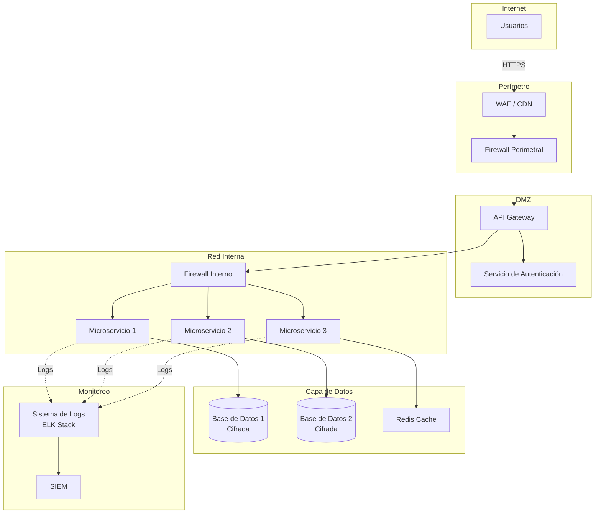
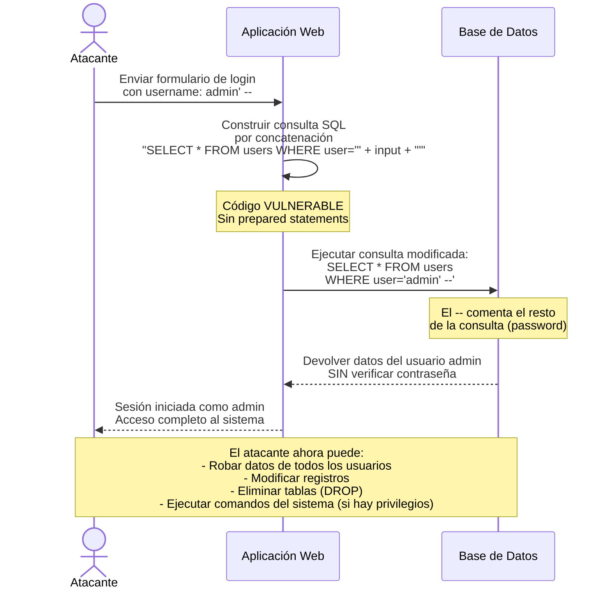

# UNIDAD III: Gestión de la seguridad en la Arquitectura TI

## Introducción

En las unidades anteriores estudiamos los fundamentos de la seguridad de la información (Unidad I) y el gobierno TI como marco estratégico para gestionar la seguridad (Unidad II). Ahora descendemos al nivel táctico-operativo: la **gestión de la seguridad en la Arquitectura TI**. Esta unidad aborda cómo asegurar los componentes fundamentales de la infraestructura tecnológica de una organización: la arquitectura misma, los sistemas de información, las bases de datos y los sistemas operativos.

La **Arquitectura TI** proporciona la estructura y los principios que guían el diseño y la evolución de los sistemas de información. Sin una arquitectura bien definida y segura, las organizaciones construyen soluciones frágiles, difíciles de mantener y vulnerables a ataques. Por su parte, los **sistemas de información** procesan y almacenan datos críticos para el negocio; su seguridad es indispensable para garantizar la confidencialidad, integridad y disponibilidad de la información. Las **bases de datos** concentran grandes volúmenes de datos sensibles y requieren mecanismos específicos de protección (encriptación, control de acceso, prevención de inyección SQL). Finalmente, los **sistemas operativos** constituyen la plataforma base sobre la que se ejecutan todas las aplicaciones; un sistema operativo mal configurado es la puerta de entrada para la mayoría de los ataques.

Al finalizar esta unidad, el estudiante será capaz de diseñar e implementar controles de seguridad en cada capa de la arquitectura TI, aplicando estándares internacionales, buenas prácticas de hardening y principios de seguridad por diseño.

### Subtema 3.1: Arquitectura TI

La **Arquitectura TI** es la estructura conceptual que define la estructura, el comportamiento y la visión de un sistema de información. En el contexto de la seguridad, una arquitectura bien diseñada permite implementar controles de seguridad de manera consistente, escalable y alineada con los objetivos del negocio.

#### Definición y tipos de arquitectura TI

Existen tres niveles principales de arquitectura TI que todo ingeniero en sistemas debe conocer:

| Tipo de arquitectura | Enfoque | Ejemplo | Implicaciones de seguridad |
|----------------------|---------|---------|----------------------------|
| **Arquitectura Empresarial (EA)** | Alinea la TI con los objetivos estratégicos del negocio. Define los procesos, datos, aplicaciones e infraestructura a nivel organizacional. | Marco TOGAF (The Open Group Architecture Framework) aplicado a una empresa de comercio electrónico | Define políticas de seguridad a nivel organizacional; ej. "todos los datos de clientes deben cifrarse en reposo". |
| **Arquitectura de Soluciones** | Define la estructura de un sistema o solución específica, detallando componentes, interacciones y tecnologías. | Arquitectura de microservicios para una plataforma de reservas | Define controles a nivel de cada componente: autenticación entre servicios, cifrado de comunicaciones, etc. |
| **Arquitectura de Infraestructura** | Describe los componentes físicos y virtuales (servidores, redes, almacenamiento) y cómo se interconectan. | Topología de red con segmentación VLAN, firewalls y balanceadores | Define perímetros de seguridad (DMZ), reglas de firewall, segmentación de red. |

#### Frameworks de arquitectura empresarial

Los frameworks proporcionan metodologías estandarizadas para diseñar y gobernar la arquitectura TI. Los más relevantes para la seguridad son:

| Framework | Organización | Enfoque en seguridad | Aplicación práctica |
|-----------|--------------|----------------------|---------------------|
| **TOGAF** (The Open Group Architecture Framework) | The Open Group | Incluye el dominio de "Seguridad" dentro de la arquitectura; su método ADM (Architecture Development Method) integra la seguridad en cada fase. | Una empresa que implementa TOGAF debe definir principios de seguridad en la fase Preliminar y arquitectura de seguridad en la fase C (Arquitectura de Sistemas de Información). |
| **Zachman Framework** | John Zachman | No prescribe cómo hacer la arquitectura, pero proporciona una taxonomía que obliga a considerar la seguridad desde múltiples perspectivas (datos, función, red, personas, tiempo, motivación). | Útil para inventariar y relacionar todos los activos de seguridad de la organización. |
| **SABSA** (Sherwood Applied Business Security Architecture) | SABSA Institute | Framework específico de arquitectura de seguridad. Extiende Zachman con un enfoque en gestión de riesgos y seguridad de negocio. | Ideal para diseñar la arquitectura de seguridad desde cero, integrando controles técnicos, organizativos y legales. |

#### Principios de diseño seguro en la arquitectura TI

Independientemente del framework utilizado, existen principios universales de diseño seguro que deben aplicarse en toda arquitectura TI:

1. **Defensa en profundidad (Defense in Depth):** No confiar en un solo control de seguridad. Superponer múltiples capas de defensa (firewall perimetral, firewall interno, IDS/IPS, autenticación multifactor, cifrado, etc.) para que si una capa falla, la siguiente la contenga.

2. **Privilegio mínimo (Least Privilege):** Cada usuario, proceso o sistema debe tener solo los permisos mínimos necesarios para realizar su función. A nivel de arquitectura, esto implica segmentar redes, restringir comunicaciones entre servicios y aplicar RBAC (Role-Based Access Control).

3. **Seguridad por defecto (Secure by Default):** Las configuraciones predeterminadas deben ser las más seguras posibles. Por ejemplo, un servidor web no debe exponer su versión ni directorios sensibles por defecto.

4. **Separación de funciones (Segregation of Duties):** Las funciones críticas deben dividirse entre diferentes personas o sistemas para evitar conflictos de interés y fraudes. Ejemplo: quien autoriza un cambio en la base de datos no debe ser quien lo ejecuta.

5. **Registro y auditoría (Logging and Auditing):** Toda acción relevante en el sistema debe quedar registrada con suficiente detalle (quién, qué, cuándo, desde dónde) para permitir auditorías forenses.

6. **Cifrado generalizado (Encrypt Everything):** Los datos deben cifrarse en reposo (en bases de datos, discos) y en tránsito (TLS/HTTPS entre servicios).

#### Ejemplo: Aplicación de principios de seguridad en una arquitectura de microservicios

Consideremos una aplicación de comercio electrónico con arquitectura de microservicios. A continuación se muestra cómo aplicar los principios anteriores:

| Principio | Implementación en la arquitectura |
|-----------|-----------------------------------|
| Defensa en profundidad | WAF (Web Application Firewall) → API Gateway → Autenticación JWT → Rate Limiting → Validación de entrada en cada servicio → Base de datos con cifrado |
| Privilegio mínimo | Cada microservicio tiene su propia base de datos y solo puede acceder a ella; los servicios se comunican mediante tokens cortos (Service Mesh) con permisos específicos |
| Seguridad por defecto | Los contenedores se ejecutan sin privilegios de root; las imágenes se escanean en busca de vulnerabilidades antes del despliegue |
| Separación de funciones | El servicio de pedidos no puede acceder directamente a la tabla de pagos; solo a través del servicio de pagos que aplica sus propias reglas |
| Registro y auditoría | Todos los microservicios envían logs a un sistema centralizado (ELK Stack) con correlación de trazabilidad (OpenTelemetry) |
| Cifrado generalizado | TLS mutuo (mTLS) entre servicios; cifrado AES-256 en bases de datos; tokens JWT firmados con RS256 |

#### Diagrama de arquitectura de seguridad (defensa en profundidad)



*Nota: Las líneas sólidas representan flujo de datos; las líneas punteadas representan flujo de logs.*

#### El rol del ingeniero en la arquitectura de seguridad

El Ingeniero en Sistemas de Información debe ser capaz de:

- **Evaluar la arquitectura existente** e identificar vulnerabilidades estructurales (ej. falta de segmentación, inexistencia de DMZ, comunicaciones sin cifrar).
- **Diseñar arquitecturas seguras** aplicando los principios de defensa en profundidad y privilegio mínimo.
- **Seleccionar frameworks** de arquitectura (TOGAF, SABSA) según el contexto de la organización.
- **Documentar la arquitectura** incluyendo decisiones de seguridad, justificación de tecnologías y flujos de datos.
- **Comunicar los riesgos** de la arquitectura actual a los tomadores de decisiones en términos de negocio.

#### Comprobación de aprendizaje

**Ejercicio 3.1.1:** Identifique qué principio de diseño seguro se viola en cada situación:

a) Un servidor de base de datos está directamente accesible desde internet para que los desarrolladores puedan consultarlo desde casa.
b) Todos los empleados tienen acceso de administrador local en sus computadoras.
c) Una aplicación web no utiliza HTTPS porque "es más rápido".
d) No se registran los intentos fallidos de inicio de sesión.

*Respuestas esperadas:* a) Defensa en profundidad (falta DMZ) y privilegio mínimo; b) Privilegio mínimo; c) Cifrado generalizado; d) Registro y auditoría.

---

### Subtema 3.2: Sistemas de Información

Los **sistemas de información** son conjuntos de componentes interrelacionados que recolectan, procesan, almacenan y distribuyen información para apoyar la toma de decisiones y el control en una organización. Desde la perspectiva de seguridad, cada sistema de información debe protegerse de acuerdo con el valor de los datos que maneja y el impacto que tendría una brecha en su confidencialidad, integridad o disponibilidad.

#### Componentes de un sistema de información y su seguridad

| Componente | Descripción | Aspectos de seguridad | Ejemplo de control |
|------------|-------------|----------------------|---------------------|
| **Hardware** | Dispositivos físicos (servidores, estaciones de trabajo, dispositivos de red) | Seguridad física, control de acceso a instalaciones, cifrado de discos | Cercos perimetrales, tarjetas de acceso, BitLocker/LUKS |
| **Software** | Programas, aplicaciones, sistemas operativos | Gestión de parches, hardening, análisis de vulnerabilidades | WSUS, Nessus, OWASP Dependency Check |
| **Datos** | Información almacenada y procesada | Cifrado, clasificación, políticas de retención | DLP, cifrado AES-256, políticas de backup |
| **Procesos** | Procedimientos de negocio y TI | Separación de funciones, autorización formal, auditoría de procesos | Flujo de autorización de cambios, seguridades duales |
| **Personas** | Usuarios, administradores, desarrolladores | Capacitación, concienciación, controles de acceso basados en roles | Programa de phishing simulado, cursos de seguridad |

#### Controles de acceso en sistemas de información

El control de acceso es el mecanismo fundamental para proteger los sistemas de información. Existen tres modelos principales:

| Modelo | Siglas | Descripción | Ventajas | Desventajas | Ejemplo de aplicación |
|--------|--------|-------------|----------|-------------|----------------------|
| **Control de Acceso Basado en Roles** | RBAC | Los permisos se asignan a roles (ej. "Administrador", "Analista", "Consultor") y los usuarios se asignan a roles. | Fácil de administrar; escalable; alineado con la estructura organizacional. | Puede ser rígido si los roles no reflejan necesidades específicas. | Active Directory con grupos de seguridad; cada grupo tiene permisos sobre carpetas compartidas. |
| **Control de Acceso Basado en Atributos** | ABAC | Las decisiones de acceso se basan en atributos del usuario (departamento, cargo, ubicación), del recurso (clasificación, propietario) y del contexto (hora, ubicación). | Muy flexible; soporta políticas complejas (ej. "solo gerentes de ventas pueden acceder a informes de ventas en horario laboral"). | Más complejo de implementar; requiere un motor de políticas (PDP). | AWS IAM con políticas basadas en etiquetas; Google Cloud IAM con condiciones. |
| **Control de Acceso Discrecional** | DAC | El propietario del recurso decide quién puede acceder. Común en sistemas de archivos (permisos UNIX). | Simple y descentralizado. | No escala bien; difícil de auditar; los usuarios pueden otorgar permisos inseguros. | Permisos de archivos en Linux (rwx). |

**Recomendación:** Para sistemas de información corporativos, se recomienda RBAC como base, complementado con ABAC para casos de uso específicos que requieran políticas contextuales. DAC debe evitarse en sistemas críticos.

#### Auditoría de sistemas de información

La auditoría de sistemas de información evalúa si los controles de seguridad son adecuados y si se cumplen las políticas y regulaciones. Existen dos tipos principales:

| Tipo de auditoría | Enfoque | Periodicidad recomendada | Entregable típico |
|-------------------|---------|--------------------------|-------------------|
| **Auditoría interna** | Realizada por el equipo de auditoría de la propia organización. Evalúa el cumplimiento de políticas internas. | Continua (automática) o trimestral | Informe de hallazgos y recomendaciones |
| **Auditoría externa** | Realizada por una firma independiente. Certifica el cumplimiento de estándares (ISO 27001) o regulaciones (Ley 787). | Anual | Certificado de conformidad o informe de no conformidades |

**Ejemplo de checklist de auditoría interna para un sistema de información:**

| Ítem de control | Cumple (Sí/No) | Evidencia | Riesgo si no cumple |
|-----------------|----------------|-----------|---------------------|
| ¿Existe una política de contraseñas (longitud ≥ 8, complejidad)? | | Política publicada en intranet | Acceso no autorizado |
| ¿Las cuentas de administrador tienen MFA habilitado? | | Captura de pantalla de configuración MFA | Toma de control del sistema |
| ¿Se realizan copias de seguridad diarias? | | Logs de backup de los últimos 30 días | Pérdida de datos |
| ¿El sistema registra intentos de acceso fallidos? | | Configuración de logging + logs de 7 días | Falta de evidencia forense |
| ¿Las sesiones inactivas se cierran automáticamente tras 15 minutos? | | Configuración de timeout | Acceso no autorizado por sesión abierta |

#### Seguridad en aplicaciones web (OWASP Top 10)

Las aplicaciones web son uno de los sistemas de información más expuestos. El **OWASP Top 10** es la referencia más utilizada para identificar los riesgos de seguridad más críticos en aplicaciones web. A continuación se presentan los principales riesgos con ejemplos y mitigaciones:

| Riesgo OWASP | Descripción | Ejemplo | Mitigación |
|--------------|-------------|---------|------------|
| **A01: Broken Access Control** | Fallos en la autorización que permiten a un usuario acceder a funcionalidades o datos que no le corresponden. | Un usuario normal accede a `/admin/usuarios` cambiando la URL. | Validar autorización en cada petición (no solo en el menú); usar RBAC/ABAC del lado del servidor. |
| **A02: Cryptographic Failures** | Uso incorrecto de criptografía: cifrado débil, transmisión sin TLS, almacenamiento de contraseñas en texto plano. | Contraseñas almacenadas con MD5 (hash débil) o en texto plano. | Usar bcrypt/argon2 para contraseñas; TLS 1.3 para comunicaciones; AES-256 para datos en reposo. |
| **A03: Injection** | Envío de datos no confiables a un intérprete (SQL, NoSQL, OS, LDAP). | `' OR '1'='1' --` en un campo de login. | Usar consultas parametrizadas (prepared statements); validar y sanitizar entradas; ORM con escape automático. |
| **A04: Insecure Design** | Vulnerabilidades por diseño deficiente, no por errores de implementación. | Un sistema de votación donde un mismo usuario puede votar mil veces porque no hay límite por IP o cuenta. | Modelado de amenazas (STRIDE) en la fase de diseño; realizar análisis de riesgos antes de codificar. |
| **A05: Security Misconfiguration** | Configuraciones inseguras por defecto, directorios listables, cabeceras HTTP incorrectas. | Servidor muestra listado de directorios; se usa `admin/admin` como credenciales por defecto. | Hardening basado en CIS Benchmarks; escaneo automático con herramientas como OpenSCAP. |
| **A06: Vulnerable and Outdated Components** | Uso de librerías, frameworks o componentes con vulnerabilidades conocidas. | Aplicación usa Log4j versión 2.14 (vulnerable a CVE-2021-44228). | Inventario de dependencias; análisis automático con OWASP Dependency Check o Snyk; parchear en ≤ 48 horas para CVSS ≥ 9. |
| **A07: Identification and Authentication Failures** | Fallos en la autenticación: permitir contraseñas débiles, no bloquear tras intentos fallidos, sesiones predecibles. | No hay bloqueo por 5 intentos fallidos; el atacante prueba 10,000 contraseñas en 1 hora. | MFA; políticas de contraseñas robustas; rate limiting; bloqueo temporal tras intentos fallidos. |
| **A08: Software and Data Integrity Failures** | Falta de verificación de integridad en actualizaciones, CI/CD o datos serializados. | Un atacante modifica un paquete npm en el pipeline de CI. | Firmar artefactos; verificar checksums; usar firmas digitales en actualizaciones. |
| **A09: Security Logging and Monitoring Failures** | Ausencia de logs de seguridad o monitoreo insuficiente para detectar ataques. | El equipo de seguridad descubre una brecha 6 meses después porque no había logs. | Registrar eventos de autenticación, cambios de permisos, accesos a datos sensibles; usar SIEM con alertas en tiempo real. |
| **A10: Server-Side Request Forgery (SSRF)** | La aplicación web realiza peticiones a recursos internos que el atacante no puede alcanzar directamente. | El atacante hace que el servidor acceda a `http://169.254.169.254/` (metadata cloud) para obtener credenciales. | Validar y restringir las URLs que la aplicación puede consultar; segmentar la red; no exponer servicios internos. |

#### Ejemplo práctico: Evaluación de seguridad de un sistema de información

**Caso:** Una universidad tiene un sistema de gestión académica (SGA) accesible desde internet. Se realiza una auditoría interna con la siguiente plantilla.

| Componente | Hallazgo | Riesgo | Acción recomendada |
|------------|----------|--------|---------------------|
| Autenticación | No tiene MFA; permite contraseñas de 4 caracteres | Alto | Implementar MFA y política de contraseñas (≥8 caracteres, complejidad) |
| Control de acceso | Un estudiante puede modificar sus notas cambiando el parámetro `id_estudiante` en la URL | Crítico | Implementar autorización por sesión (no confiar en parámetros de URL) |
| Base de datos | Consultas SQL construidas por concatenación de cadenas | Crítico | Migrar a consultas parametrizadas (prepared statements) |
| Logging | No se registran los accesos a las calificaciones | Medio | Implementar auditoría de acceso a datos sensibles |
| Configuración | Servidor web expone la versión de Apache y lista de directorios | Bajo | Ocultar versión del servidor; deshabilitar listado de directorios |
| Cifrado | Las contraseñas se almacenan con SHA-1 (hash débil) | Alto | Migrar a bcrypt con factor de trabajo ≥ 10 |

**Priorización de acciones:** Las acciones críticas (control de acceso y SQL injection) deben resolverse en 48 horas. Las altas (MFA y cifrado de contraseñas) en 2 semanas. Las medias y bajas en el siguiente ciclo de mejora (1 mes).

#### Comprobación de aprendizaje

**Ejercicio 3.2.1:** Para cada situación, indique qué modelo de control de acceso (RBAC, ABAC, DAC) sería más adecuado:

a) Una empresa con 500 empleados en 10 departamentos necesita gestionar acceso a carpetas compartidas. Los roles están bien definidos. → _________
b) Un hospital necesita restringir el acceso a historias clínicas según el rol del médico, la relación con el paciente y el horario. → _________
c) Un desarrollador quiere compartir un archivo temporal con un colega sin pasar por el departamento de TI. → _________

*Respuestas esperadas:* a) RBAC; b) ABAC (por los atributos contextuales); c) DAC (para uso temporal y no crítico).

**Ejercicio 3.2.2:** Identifique al menos tres riesgos OWASP Top 10 en el siguiente escenario:

Una aplicación móvil de delivery permite a los usuarios registrarse con cualquier contraseña (incluso "1234"). Los pedidos se realizan mediante peticiones HTTP sin TLS. La aplicación muestra el precio total en la URL (`/pedido?total=150&id=45`). Un usuario avanzado notó que si cambia el valor de `total`, el sistema acepta el nuevo monto.

*Respuesta esperada:* A02 (Cryptographic Failures – sin TLS), A07 (Identification and Authentication Failures – contraseñas débiles), A01 (Broken Access Control – el usuario puede modificar el total en la URL sin autorización del servidor).

---

### Subtema 3.3: Bases de Datos

Las bases de datos almacenan el activo más valioso de una organización: sus datos. La seguridad de bases de datos abarca la protección de los datos contra accesos no autorizados, modificaciones indebidas, pérdidas y exposiciones accidentales o maliciosas.

#### Principales amenazas a la seguridad de bases de datos

| Amenaza | Descripción | Impacto potencial | Frecuencia relativa |
|---------|-------------|-------------------|---------------------|
| **SQL Injection** | Inserción de código SQL malicioso a través de entradas de usuario | Exposición, modificación o eliminación de toda la base de datos | Muy alta |
| **Acceso no autorizado** | Usuarios o aplicaciones acceden a datos sin los permisos adecuados | Fuga de información sensible | Alta |
| **Pérdida de datos** | Eliminación accidental o maliciosa, desastres naturales, fallos de hardware | Pérdida permanente de información crítica | Media |
| **Exposición de datos en reposo** | Archivos de base de datos robados o discos extraídos sin cifrado | Exposición masiva de datos | Baja (pero impacto catastrófico) |
| **Privilegios excesivos** | Usuarios o aplicaciones tienen más permisos de los necesarios | Ataque interno, movimiento lateral | Alta |
| **Denegación de servicio (DoS)** | Saturar la base de datos con peticiones para que no esté disponible | Indisponibilidad del servicio | Media |

#### SQL Injection: funcionamiento y mitigación

La **inyección SQL** es la amenaza más conocida y peligrosa para las bases de datos. Ocurre cuando una aplicación construye consultas SQL concatenando datos proporcionados por el usuario sin validarlos ni escaparlos. En el contexto nicaragüense, donde muchas PYMES y entidades gubernamentales utilizan sistemas desarrollados internamente sin controles de seguridad adecuados, la SQL Injection sigue siendo una de las principales causas de brechas de datos.

**Diagrama de flujo de un ataque SQL Injection:**



**Ejemplo de ataque:**

Código vulnerable (PHP):
```php
$query = "SELECT * FROM usuarios WHERE username = '" . $_POST['username'] . "' AND password = '" . $_POST['password'] . "'";
```

Si el atacante ingresa como username: `admin' --` y cualquier contraseña, la consulta se convierte en:
```sql
SELECT * FROM usuarios WHERE username = 'admin' --' AND password = 'cualquiera'
```

Los caracteres `--` comentan el resto de la consulta, por lo que la validación de contraseña se omite. El atacante inicia sesión como `admin` sin conocer la contraseña.

**Mitigación: consultas parametrizadas (prepared statements)**

La forma correcta de construir la consulta es separar la estructura SQL de los datos:

**PHP (PDO):**
```php
$stmt = $pdo->prepare("SELECT * FROM usuarios WHERE username = :username AND password = :password");
$stmt->execute(['username' => $_POST['username'], 'password' => $_POST['password']]);
```

**Python (psycopg2):**
```python
cur.execute("SELECT * FROM usuarios WHERE username = %s AND password = %s", (username, password))
```

**Java (JDBC):**
```java
PreparedStatement stmt = conn.prepareStatement("SELECT * FROM usuarios WHERE username = ? AND password = ?");
stmt.setString(1, username);
stmt.setString(2, password);
```

**Verificación de mitigación:** Para confirmar que una aplicación no es vulnerable a SQL Injection, se debe realizar una **prueba de penetración** automatizada (con herramientas como SQLMap o Burp Suite Scanner) y manual (probando entradas como `'`, `"`, `OR 1=1`, `'; DROP TABLE usuarios; --`).

#### Encriptación de datos en bases de datos

El cifrado protege los datos incluso si el archivo de base de datos o el medio de almacenamiento es robado. Existen tres niveles principales de cifrado:

| Nivel de cifrado | Descripción | Ventajas | Desventajas | Cuándo usarlo |
|------------------|-------------|----------|-------------|---------------|
| **En reposo (Transparent Data Encryption – TDE)** | El motor de base de datos cifra automáticamente los datos al escribirlos en disco y los descifra al leerlos. | Transparente para las aplicaciones; sin cambios en el código. | No protege contra accesos no autorizados a través de consultas SQL (solo protege el archivo físico). | Siempre que se almacenen datos sensibles en disco. |
| **A nivel de columna** | Se cifran columnas específicas (ej. números de tarjeta, cédula) usando funciones de cifrado del motor de BD. | Protege datos específicos incluso si el atacante tiene acceso a la BD. | Requiere cambios en el esquema y en las consultas; puede afectar el rendimiento. | Datos altamente sensibles que deben protegerse incluso de administradores de BD. |
| **A nivel de aplicación** | La aplicación cifra los datos antes de enviarlos a la BD y los descifra después de recuperarlos. | La BD nunca ve los datos en texto plano; el administrador de BD no puede accederlos. | Mayor complejidad; las búsquedas sobre datos cifrados son limitadas (no se puede buscar por texto plano). | Datos que requieren el máximo nivel de protección (ej. claves privadas, datos biométricos). |

**Ejemplo de cifrado a nivel de columna en PostgreSQL usando pgcrypto:**

```sql
-- Habilitar la extensión
CREATE EXTENSION IF NOT EXISTS pgcrypto;

-- Insertar con cifrado
INSERT INTO clientes (nombre, cedula_cifrada)
VALUES ('Juan Pérez', pgp_sym_encrypt('123-456789-0123A', 'clave_secreta'));

-- Consultar con descifrado
SELECT nombre, pgp_sym_decrypt(cedula_cifrada, 'clave_secreta') AS cedula
FROM clientes;
```

#### Políticas de respaldo y recuperación (backup y restore)

Una base de datos sin respaldo es una pérdida de datos asegurada. Las políticas de respaldo deben definirse según el **RPO (Recovery Point Objective)** y el **RTO (Recovery Time Objective)**.

| Métrica | Definición | Ejemplo | Implicación |
|---------|------------|---------|-------------|
| **RPO** | Cantidad máxima de datos que la organización está dispuesta a perder (medido en tiempo). | RPO = 1 hora → se pierde a lo sumo 1 hora de datos. | La frecuencia de backup debe ser ≤ 1 hora. |
| **RTO** | Tiempo máximo para recuperar el servicio después de un desastre. | RTO = 4 horas → el sistema debe estar operativo en ≤ 4 horas. | El proceso de restauración debe estar probado y documentado para cumplir con 4 horas. |

**Estrategias de backup:**

| Tipo de backup | Descripción | Velocidad de backup | Velocidad de restore | Espacio requerido |
|----------------|-------------|---------------------|---------------------|-------------------|
| **Completo** | Copia toda la base de datos. Base para los otros tipos. | Lenta | Rápida | Alto |
| **Incremental** | Copia solo los datos cambiados desde el último backup (completo o incremental). | Rápida | Lenta (requiere restaurar el completo + todos los incrementales en orden) | Bajo |
| **Diferencial** | Copia los datos cambiados desde el último backup completo. | Media | Media (requiere restaurar el completo + el último diferencial) | Medio |

**Ejemplo de política de respaldos (para una BD de producción crítica):**

| Frecuencia | Tipo | Retención | Ubicación |
|------------|------|-----------|-----------|
| Cada 6 horas | Diferencial | 7 días | Almacenamiento local (SSD rápido) |
| Diario (12:00 AM) | Completo | 30 días | Almacenamiento en red (NAS) |
| Semanal (domingo) | Completo | 12 meses | Almacenamiento externo (nube/offsite) |

**Regla de oro:** Los respaldos deben probarse periódicamente (al menos una vez al mes) restaurándolos en un entorno de pruebas. Un respaldo que no se prueba no es un respaldo.

#### Ejercicio práctico: Diseño de seguridad para una base de datos

**Escenario:** Una clínica médica desea almacenar historias clínicas electrónicas. Debe cumplir con la Ley 787 de Protección de Datos Personales de Nicaragua.

**Requerimientos de seguridad:**
- Los datos sensibles (diagnósticos, nombres completos) deben estar cifrados.
- Solo médicos autorizados pueden leer las historias clínicas de sus pacientes.
- En caso de desastre, la pérdida máxima de datos debe ser de 30 minutos.
- El servicio debe restablecerse en máximo 2 horas.

**Propuesta de solución:**

| Componente | Solución propuesta | Justificación |
|-------------|-------------------|---------------|
| Cifrado en reposo | TDE (Transparent Data Encryption) en SQL Server o PostgreSQL | Protege los archivos de BD en caso de robo del disco |
| Cifrado de columnas sensibles | pgcrypto (o Always Encrypted en SQL Server) para cifrar diagnóstico y nombre completo | Incluso un administrador de BD no puede leer los datos sin la clave |
| Control de acceso | RBAC con roles: Médico (solo pacientes asignados), Administrativo (solo datos de contacto), Auditor (solo lectura de logs) | Principio de privilegio mínimo |
| Autenticación | Integración con LDAP/AD + MFA para acceder a la aplicación | Protección contra robo de credenciales |
| Respaldo | Backup diferencial cada 30 minutos (RPO = 30 min) + completo diario + completo semanal a la nube | Cumple RPO de 30 min |
| Restauración | Script documentado y probado mensualmente; base de datos en modo recovery full para permitir point-in-time recovery | Cumple RTO de 2 horas |

#### Comprobación de aprendizaje

**Ejercicio 3.3.1:** Clasifique los siguientes datos en orden del nivel de cifrado requerido (1 = solo TDE, 2 = columna, 3 = aplicación):

a) Nombres de empleados en una intranet corporativa.
b) Números de tarjeta de crédito en una pasarela de pagos.
c) Claves privadas RSA utilizadas para firmar documentos digitales.

*Respuestas esperadas:* a) 1 (bajo riesgo); b) 2 o 3 (según el estándar PCI DSS, se requiere cifrado fuerte); c) 3 (máxima protección).

**Ejercicio 3.3.2:** Una empresa tiene un backup completo diario que tarda 6 horas en restaurarse. ¿Qué RTO puede ofrecer como máximo? ¿Es aceptable si el negocio requiere RTO < 2 horas?

*Respuesta:* Como mínimo, el RTO es 6 horas (el tiempo de restauración). No es aceptable porque 6 > 2. Se debe optimizar: usar backup diferencial + FULL más rápido (ej. SSD), o implementar alta disponibilidad (replicación síncrona) para que el failover sea inmediato.

---

### Subtema 3.4: Sistemas Operativos

Los sistemas operativos (SO) son la plataforma base sobre la que se ejecutan las aplicaciones y servicios. Un sistema operativo comprometido pone en riesgo todos los datos y aplicaciones que aloja. La seguridad de sistemas operativos abarca la configuración segura (hardening), la gestión de parches, el monitoreo y la respuesta a incidentes.

#### Hardening de sistemas operativos

El **hardening** es el proceso de asegurar un sistema operativo reduciendo su superficie de ataque: se eliminan servicios innecesarios, se aplican configuraciones seguras, se gestionan parches y se implementan controles de acceso estrictos.

**Principios generales de hardening:**

| Principio | Descripción | Ejemplo concreto |
|-----------|-------------|-------------------|
| **Eliminar servicios innecesarios** | Todo servicio que no sea estrictamente necesario debe desinstalarse o deshabilitarse. | Deshabilitar Telnet, FTP, servicios de impresión si no se usan. |
| **Configuración segura por defecto** | Los parámetros predeterminados inseguros deben modificarse. | Cambiar contraseñas por defecto; deshabilitar login como root vía SSH. |
| **Principio de privilegio mínimo** | Los usuarios y procesos deben ejecutarse con los mínimos privilegios. | Las aplicaciones web no deben ejecutarse como root/admin; usar cuentas de servicio dedicadas. |
| **Parches y actualizaciones** | Mantener el SO actualizado con los últimos parches de seguridad. | Habilitar actualizaciones automáticas de seguridad; probar parches críticos en 48 horas. |
| **Monitoreo y logging** | Registrar eventos relevantes y revisarlos periódicamente. | Configurar auditd en Linux o Advanced Audit Policy en Windows. |
| **Segmentación y aislamiento** | Separar servicios y aplicaciones en contenedores, máquinas virtuales o zonas de red. | Ejecutar cada microservicio en su propio contenedor con recursos limitados. |

#### Hardening en Linux (basado en CIS Benchmarks)

El **Center for Internet Security (CIS)** publica benchmarks detallados para el hardening de sistemas operativos. A continuación, los controles más importantes para Linux (Ubuntu Server 22.04 LTS):

| Control CIS | Descripción | Comando o acción |
|-------------|-------------|------------------|
| **1.1.1** | Configurar particiones separadas para `/tmp`, `/var`, `/home` | Usar LVM o particiones dedicadas; montar `/tmp` con `noexec,nosuid,nodev` |
| **1.5.1** | Configurar el bootloader con contraseña | `grub-mkpasswd-pbkdf2` y agregar `password_pbkdf2` en `/etc/grub.d/40_custom` |
| **3.2.1** | Deshabilitar IP forwarding (a menos que sea un router) | `sysctl -w net.ipv4.ip_forward=0` y en `/etc/sysctl.conf` |
| **4.1.1** | Habilitar auditd para registrar eventos | `apt install auditd; auditctl -e 1` |
| **5.1.1** | Restringir el uso de cron a usuarios autorizados | Crear `/etc/cron.allow` con solo los usuarios que necesitan cron |
| **5.2.1** | Configurar SSH con clave pública y deshabilitar login por contraseña | `PasswordAuthentication no` en `/etc/ssh/sshd_config` |
| **5.4.1** | Establecer política de contraseñas: expiración cada 90 días, longitud ≥ 14 | Editar `/etc/login.defs` y `/etc/pam.d/common-password` |
| **6.1.1** | Verificar que los archivos del sistema tengan permisos correctos | `apt install debsums; debsums -c` (verifica archivos modificados) |

#### Hardening en Windows Server (basado en CIS Benchmarks)

| Control CIS | Descripción | Acción en Windows Server |
|-------------|-------------|-----------------------|
| **1.1.1** | Mantener el sistema actualizado | Configurar Windows Update para recibir parches de seguridad automáticamente (WSUS o Windows Update directo) |
| **2.1.1** | Deshabilitar cuentas locales innecesarias | Deshabilitar Invitado; renombrar Administrador; crear cuentas de servicio con privilegios mínimos |
| **2.2.1** | Configurar política de contraseñas | Longitud mínima ≥ 14; expiración cada 60 días; historial de 24 contraseñas |
| **2.3.1** | Configurar bloqueo de cuenta tras 5 intentos fallidos | Account lockout threshold = 5; lockout duration = 30 minutos |
| **5.1.1** | Deshabilitar servicios innecesarios | Deshabilitar Print Spooler si no se usa; deshabilitar SMBv1 |
| **9.1.1** | Habilitar Windows Defender y mantenerlo actualizado | Configurar Microsoft Defender Antivirus con protección en tiempo real y envío de muestras |
| **10.1.1** | Configurar el firewall de Windows con reglas de entrada restrictivas | Bloquear todo el tráfico entrante excepto puertos necesarios (3389 solo con VPN; 443; 80) |
| **12.1.1** | Configurar logging avanzado | Habilitar auditoría de inicios de sesión, cambios de cuentas, accesos a objetos sensibles |

#### Gestión de parches y vulnerabilidades

La gestión de parches es un proceso continuo que incluye:

| Paso | Descripción | Herramientas | Frecuencia |
|------|-------------|--------------|------------|
| **Inventario** | Identificar todos los sistemas, SO, aplicaciones y versiones. | GLPI, OCS Inventory, Lansweeper | Continuo (diario) |
| **Escaneo de vulnerabilidades** | Detectar vulnerabilidades conocidas (CVE) en los sistemas. | Nessus, OpenVAS, Qualys | Semanal o mensual |
| **Evaluación de riesgo** | Priorizar parches según CVSS (Common Vulnerability Scoring System) y criticidad del activo. | Tablero con CVSS + criticidad del activo | Cada escaneo |
| **Prueba** | Aplicar parches en un entorno de pruebas antes de producción. | Entorno de staging idéntico a producción | Antes de cada parche crítico |
| **Despliegue** | Aplicar parches en producción siguiendo una ventana de mantenimiento. | WSUS, SCCM, Ansible, Puppet | Según criticidad: crítico ≤ 48h, alto ≤ 2 semanas, medio ≤ 1 mes |
| **Verificación** | Confirmar que el parche se aplicó correctamente y que el sistema sigue funcionando. | Escaneo posterior + pruebas funcionales | Inmediatamente después del despliegue |

**Ejemplo de priorización basada en CVSS:**

| Rango CVSS | Clasificación | Acción | SLA |
|------------|---------------|--------|-----|
| 9.0 – 10.0 | Crítico | Parche inmediato; si no hay parche, implementar mitigación temporal (WAF, segmentación) | 24 – 48 horas |
| 7.0 – 8.9 | Alto | Programar parche en la siguiente ventana de mantenimiento | 2 semanas |
| 4.0 – 6.9 | Medio | Incluir en el ciclo normal de parches | 1 mes |
| 0.1 – 3.9 | Bajo | Evaluar si aplica; puede esperar al próximo ciclo | 3 meses |

**Ejemplo de vulnerabilidad crítica reciente (CVE-2021-44228 – Log4Shell):**
- **CVSS:** 10.0 (crítico)
- **Descripción:** Vulnerabilidad en Apache Log4j que permite ejecución remota de código sin autenticación.
- **Mitigación inmediata:** Actualizar a Log4j 2.17.0 o eliminar la clase JndiLookup. Mientras tanto, bloquear a nivel de WAF las peticiones que contengan `${jndi:`.
- **Lección:** Mantener un inventario actualizado de dependencias (especialmente librerías de logging) es fundamental; muchas organizaciones tardaron semanas en saber si usaban Log4j.

#### Monitoreo de seguridad y logging

Un sistema operativo sin monitoreo es ciego ante los ataques. Los principales componentes de monitoreo son:

| Componente | Herramientas (Open Source) | Lo que detecta |
|-------------|----------------------------|----------------|
| **SIEM (Security Information and Event Management)** | Wazuh, ELK Stack (Elasticsearch + Logstash + Kibana), Grafana Loki | Correlación de eventos, alertas en tiempo real, dashboards de seguridad |
| **IDS/IPS (Host-based)** | OSSEC, Wazuh, AIDE (archivos críticos) | Modificaciones no autorizadas de archivos, conexiones sospechosas, intentos de escalada de privilegios |
| **EDR (Endpoint Detection and Response)** | Wazuh (módulo EDR), osquery | Detección de comportamiento anómalo en endpoints, procesos maliciosos, persistencia |
| **Gestión de logs centralizada** | rsyslog + Logstash, Fluentd, Winlogbeat | Recolección unificada de logs de todos los sistemas |

**Ejemplo de configuración de logging en Linux (auditd):**

```bash
# Instalar auditd
apt install auditd

# Regla: monitorear cambios en /etc/passwd y /etc/shadow
auditctl -w /etc/passwd -p wa -k passwd_changes
auditctl -w /etc/shadow -p wa -k shadow_changes

# Regla: monitorear intentos de acceso fallidos (todos los ejecutables de login)
auditctl -w /var/log/auth.log -p r -k auth_log

# Ver logs
ausearch -k passwd_changes
```

**Ejemplo de detección de ataque con Wazuh (escenario real):**

| Evento | Regla Wazuh | Alerta generada | Acción |
|--------|-------------|-----------------|--------|
| 10 intentos fallidos de SSH en 5 minutos | Regla 5710 (Multiple SSH authentication failures) | "Posible ataque de fuerza bruta SSH desde IP 192.168.1.100" | Bloquear IP en firewall automáticamente (Fail2ban o integración con API) |
| Modificación de /etc/shadow | Regla 5501 (File integrity monitoring) | "El archivo /etc/shadow ha sido modificado por usuario nobody" | Investigar inmediatamente; podría ser escalada de privilegios |
| Nuevo servicio instalado | Regla 5302 (New service added) | "Se ha añadido el servicio sshd_trojan en el sistema" | Verificar firma del paquete; si no es legítimo, aislar el sistema |

#### Ejercicio práctico: Plan de hardening para un servidor web

**Escenario:** Su organización va a desplegar un servidor web Ubuntu 22.04 con Apache para alojar una aplicación crítica. Diseñe un plan de hardening mínimo.

**Solución propuesta:**

| Área | Medida de hardening | Verificación | Prioridad |
|------|---------------------|--------------|-----------|
| SO | Deshabilitar root login vía SSH (`PermitRootLogin no`) | `grep PermitRootLogin /etc/ssh/sshd_config` | Alta |
| SO | Cambiar puerto SSH a 2222 (para reducir ruido de ataques automatizados) | Verificar conectividad por puerto 2222 | Media |
| SO | Instalar solo paquetes esenciales (ubuntu-server-minimal) | `dpkg --list` y revisar servicios | Alta |
| SO | Habilitar firewall UFW: permitir solo 80, 443, 2222 | `ufw status` | Alta |
| SO | Configurar auditd para monitorear `/etc/apache2/`, `/var/www/` | `auditctl -l` | Alta |
| SO | Instalar y configurar Fail2ban para SSH y Apache | `fail2ban-client status` | Alta |
| Apache | Ocultar versión del servidor (`ServerTokens Prod`, `ServerSignature Off`) | `curl -I https://dominio.com` | Media |
| Apache | Deshabilitar listado de directorios (`Options -Indexes`) | Navegar a `/directorio-sin-index/` | Alta |
| Apache | Limitar tamaño de peticiones (`LimitRequestBody 10485760`) | Probar con petición > 10 MB | Media |
| Apache | Usar HTTPS con TLS 1.3 solamente | `testssl.sh dominio.com:443` | Alta |
| Aplicación | Ejecutar Apache con usuario www-data (no root) | `ps aux | grep apache` | Crítica |
| Monitoreo | Enviar logs de Apache a SIEM centralizado | Verificar en Kibana/Grafana | Alta |
| Parches | Configurar unattended-upgrades para parches de seguridad automáticos | `dpkg -l unattended-upgrades` | Alta |

#### Casos reales documentados (basados en situaciones reales con nombres adaptados)

**Caso 1: Hardening evitó un ransomware (Nicaragua, 2023 – adaptado de un incidente en una PYME de Managua)**  
Una pequeña empresa de contabilidad tenía un servidor Windows Server 2012 sin parches desde 2020. Un día, un empleado abrió un archivo adjunto de correo que instaló ransomware. El malware intentó cifrar los archivos compartidos, pero como el servidor tenía el firewall de Windows configurado para bloquear todo el tráfico entrante excepto los puertos esenciales, y los usuarios no tenían permisos de escritura en las carpetas compartidas (solo el administrador), el ransomware solo pudo cifrar los archivos locales del empleado. La empresa perdió solo un día de trabajo de un empleado, en lugar de todos sus datos financieros. Lección: el hardening y el principio de privilegio mínimo redujeron drásticamente el impacto.

**Caso 2: SQL Injection que comprometió una base de datos gubernamental (Costa Rica, 2022)**  
Un sistema de consulta de contribuyentes del Ministerio de Hacienda tenía una vulnerabilidad de SQL Injection en el campo de "cédula". Un atacante envió una petición que inyectó `' OR 1=1; SELECT * FROM contribuyentes; --`. El sistema devolvió todos los registros de la base de datos (4 millones de contribuyentes). El ataque se detectó porque el SIEM registró una consulta que devolvió 4 millones de filas en una sola transacción (algo anómalo). Lección: además de usar consultas parametrizadas, es necesario implementar detección de anomalías en el acceso a datos.

**Caso 3: Segmentación de red y defensa en profundidad (Nicaragua, 2024 – adaptado de una implementación en un banco local)**  
Un banco nicaragüense implementó una arquitectura de tres capas con segmentación VLAN y firewall interno después de una auditoría. Seis meses después, un atacante logró comprometer el servidor web mediante una vulnerabilidad en un plugin de WordPress. Sin embargo, al intentar conectarse a la base de datos desde el servidor web, el firewall interno lo bloqueó porque la IP del servidor web no estaba autorizada para acceder al puerto 3306 de la BD. El atacante solo pudo modificar archivos estáticos del sitio web (imágenes y HTML), sin acceder a datos financieros. Lección: la segmentación de red y la defensa en profundidad contienen el daño incluso cuando una capa es comprometida.

#### Comprobación de aprendizaje

**Ejercicio 3.4.1:** Verdadero o falso. Justifique brevemente.

a) El hardening se aplica una sola vez al instalar el sistema operativo.
b) El principio de privilegio mínimo implica que los procesos se ejecuten con la menor cantidad de permisos posible.
c) CIS Benchmarks son estándares de hardening desarrollados por Microsoft.
d) Una vulnerabilidad con CVSS 9.5 debe parchearse en un plazo máximo de 48 horas.
e) Fail2ban es una herramienta que previene ataques de fuerza bruta bloqueando IPs temporalmente.

*Respuestas esperadas:* a) Falso, el hardening es un proceso continuo que debe mantenerse (parches, auditorías periódicas). b) Verdadero. c) Falso, CIS Benchmarks son del Center for Internet Security, una organización independiente. d) Verdadero, CVSS ≥ 9.0 es crítico. e) Verdadero.

**Ejercicio 3.4.2:** Un administrador ejecuta `chmod 777 /etc/shadow` para que una aplicación pueda leer el archivo de contraseñas. ¿Qué principio de seguridad se viola? ¿Qué recomendaría?

*Respuesta esperada:* Se viola el principio de privilegio mínimo y el de configuración segura. `/etc/shadow` debe tener permisos 640 o 600 y solo ser accesible por root. La aplicación debe rediseñarse para no necesitar acceso a `/etc/shadow`; en su lugar, usar PAM o LDAP para autenticación.

---

### Ejemplo integrador: Diseño de un sistema de seguridad integral para una PYME nicaragüense

**Escenario general:** "Distribuidora del Norte, S.A." es una PYME en Estelí, Nicaragua, que distribuye productos agrícolas a 200 clientes en la región. Actualmente maneja sus operaciones con un sistema legacy desarrollado en PHP 5.6 corriendo en un solo servidor Windows Server 2008 R2 que funciona como web server, aplicación y base de datos (MySQL 5.5). No hay firewalls ni segmentación. Los tres empleados administrativos comparten el mismo usuario y contraseña (admin/1234) para acceder al sistema. No hay backups. Recientemente, un consultor de seguridad realizó una evaluación y encontró que el servidor tiene 15 vulnerabilidades críticas (CVSS ≥ 9.0) sin parchear, todas con parches disponibles desde hace más de un año.

**Aplicación de los cuatro subtemas de la Unidad III:**

#### 1. Arquitectura TI (Subtema 3.1)

**Situación actual:** Arquitectura plana (todo en un servidor, sin segmentación, sin DMZ).

**Propuesta de mejora:**

```mermaid
graph TB
    subgraph "Internet"
        A[Clientes y Empleados]
    end
    subgraph "Firewall Perimetral"
        B[Router/Firewall<br/>MikroTik con reglas]
    end
    subgraph "DMZ"
        C[Servidor Web<br/>Apache/Nginx<br/>Ubuntu 22.04 LTS]
    end
    subgraph "Red Interna"
        D[Firewall Interno<br/>(por software)]
        E[Servidor de Aplicaciones<br/>Node.js o PHP 8.2]
    end
    subgraph "Capa de Datos"
        F[Servidor MySQL 8.0<br/>TDE habilitado]
        G[Backup NAS<br/>Local + Offsite]
    end
    subgraph "Administración"
        H[SIEM Wazuh<br/>Monitoreo centralizado]
    end
    
    A -->|HTTPS| B
    B -->|Puertos 80/443| C
    C -->|Proxy reverso| D
    D --> E
    E -->|Puerto 3306<br/>solo desde IP de app| F
    F --> G
    C -.->|Logs| H
    E -.->|Logs| H
    F -.->|Logs| H
```

**Principios aplicados:**
- Defensa en profundidad: firewall perimetral + firewall interno + segmentación.
- Privilegio mínimo: cada servidor solo puede comunicarse con el siguiente en la cadena.
- Cifrado generalizado: HTTPS, TDE en BD.

#### 2. Sistemas de Información (Subtema 3.2)

**Situación actual:** Un solo usuario compartido (admin/1234), sin control de acceso ni auditoría.

**Propuesta de mejora:**

| Componente | Problema actual | Solución propuesta |
|-------------|-----------------|---------------------|
| Autenticación | Usuario y contraseña únicos compartidos | Implementar RBAC con roles: Administrador, Vendedor, Bodeguero, Consultor |
| Contraseñas | admin/1234 | Política: longitud ≥ 12, complejidad, expiración cada 60 días; MFA con Google Authenticator para accesos administrativos |
| Control de acceso | Cualquier usuario puede ver y modificar cualquier dato | Implementar ABAC: un vendedor solo puede ver pedidos de sus clientes asignados; solo administradores pueden modificar precios |
| Auditoría | No hay registros de quién hizo qué | Configurar logging de todas las transacciones críticas (creación de pedidos, modificación de precios, acceso a clientes) |
| OWASP Top 10 | A01 (broken access control), A02 (cryptographic failures), A03 (injection), A07 (authentication failures) | Aplicar las mitigaciones descritas en el subtema 3.2 |

#### 3. Bases de Datos (Subtema 3.3)

**Situación actual:** MySQL 5.5 sin cifrado, sin backups, con inyección SQL potencial.

**Propuesta de mejora:**

| Aspecto | Acción | Detalle técnico |
|---------|--------|-----------------|
| Migración | Actualizar a MySQL 8.0 | Nuevo servidor Ubuntu 22.04 con MySQL 8.0; migrar datos con mysqldump y verificar integridad |
| Cifrado en reposo | Habilitar TDE en MySQL 8.0 | `ALTER INSTANCE ROTATE INNODB MASTER KEY;` y configurar tablespace encryption |
| Cifrado de columna | Cifrar columnas sensibles (cédula de clientes, teléfonos) | Usar AES_ENCRYPT/AES_DECRYPT con clave almacenada en HashiCorp Vault o AWS KMS |
| SQL Injection | Migrar todas las consultas a prepared statements | Revisar el código PHP línea por línea; usar PDO con consultas parametrizadas |
| Backups | Backup completo diario a las 11 PM + incremental cada 4 horas | RPO = 4 horas; RTO objetivo = 2 horas; probar restauración mensualmente |
| Ubicación de backups | Local (NAS) + Offsite (nube: AWS S3 o servidor FTP en另一 ubicación física) | Cumplir con el principio de "3-2-1": 3 copias, 2 medios diferentes, 1 fuera del sitio |

#### 4. Sistemas Operativos (Subtema 3.4)

**Situación actual:** Windows Server 2008 R2 (sin soporte desde 2020), 15 vulnerabilidades críticas sin parchear.

**Propuesta de mejora:**

| Servidor | SO propuesto | Hardening | Parches |
|----------|-------------|-----------|---------|
| Web + App | Ubuntu 22.04 LTS | CIS Benchmark nivel 2; UFW; Fail2ban; auditd | unattended-upgrades para parches de seguridad automáticos; parches críticos en ≤ 24h |
| Base de datos | Ubuntu 22.04 LTS | CIS Benchmark nivel 2; solo puerto 3306 abierto desde IP del servidor de aplicaciones; SSH con clave pública | Misma política que web |
| NAS de backups | Ubuntu 22.04 LTS con RAID 1 | Acceso solo desde red interna (192.168.1.0/24); sin acceso a internet | Misma política |

**Costo estimado de la transformación:**

| Concepto | Costo estimado (C$) |
|----------|---------------------|
| Hardware (2 servidores adicionales o VPS) | C$ 60,000 |
| Horas de consultoría en seguridad (80 horas × C$ 500/h) | C$ 40,000 |
| Horas de desarrollo (migración a prepared statements) | C$ 30,000 |
| Licencias (ninguna, todo open source) | C$ 0 |
| Capacitación al personal (3 empleados × 8 horas) | C$ 12,000 |
| **Total** | **C$ 142,000** |

**Comparación con el costo de una brecha de seguridad:**

| Concepto | Costo estimado (C$) |
|----------|---------------------|
| Multa Ley 787 por exposición de datos personales | Hasta C$ 500,000 |
| Pérdida de clientes por daño reputacional (estimado 20% de 200 clientes × C$ 50,000 anuales) | C$ 2,000,000 |
| Costo de recuperación forense sin backups | C$ 100,000 – C$ 300,000 |
| **Costo potencial de una brecha** | **C$ 600,000 – C$ 2,800,000** |

**Conclusión del ejemplo integrador:** La inversión de C$ 142,000 en seguridad representa entre el 5% y el 24% del costo potencial de una sola brecha. La aplicación combinada de los cuatro subtemas de la Unidad III (arquitectura, sistemas de información, bases de datos y sistemas operativos) permite a "Distribuidora del Norte" pasar de un riesgo crítico a un nivel de riesgo aceptable, protegiendo sus datos, sus clientes y su reputación.

### Conexión con las Unidades I y II

La Unidad III no existe en el vacío; se construye sobre los fundamentos de las unidades anteriores:

| Concepto de Unidad I | Aplicación en Unidad III | Concepto de Unidad II | Aplicación en Unidad III |
|----------------------|--------------------------|-----------------------|--------------------------|
| **Elementos de seguridad** (confidencialidad, integridad, disponibilidad) | El cifrado en BD protege la confidencialidad; los backups garantizan la disponibilidad; el hardening y los controles de acceso preservan la integridad | **Plan de Seguridad** | El diseño de arquitectura segura y las políticas de hardening son parte del plan de seguridad |
| **Estándares y certificaciones** (ISO 27001) | CIS Benchmarks y OWASP Top 10 son estándares concretos para implementar controles técnicos | **Gestión de Riesgos** | La priorización de parches según CVSS y la evaluación de vulnerabilidades son actividades de gestión de riesgos |
| **Visión estratégica de seguridad** | La arquitectura empresarial (TOGAF, SABSA) conecta la seguridad con la estrategia del negocio | **Procesos de Negocio** | Los sistemas de información deben asegurarse según los procesos de negocio que soportan |

Esta conexión muestra que la seguridad no es una actividad aislada, sino una disciplina que integra aspectos estratégicos (Unidad I), tácticos (Unidad II) y operativos (Unidad III).

### Guía práctica de hardening paso a paso para un servidor Ubuntu 22.04 LTS

A continuación se presenta una guía práctica que cualquier ingeniero en sistemas puede seguir para hardening de un servidor Ubuntu:

```bash
# ============================================
# PASO 1: Actualizar el sistema
# ============================================
sudo apt update && sudo apt upgrade -y
sudo apt install unattended-upgrades -y
sudo dpkg-reconfigure --priority=low unattended-upgrades

# ============================================
# PASO 2: Eliminar servicios innecesarios
# ============================================
sudo apt remove --purge telnetd vsftpd apache2* -y  # (si no se necesita)
sudo systemctl disable --now cups bluetooth avahi-daemon

# ============================================
# PASO 3: Configurar firewall (UFW)
# ============================================
sudo ufw default deny incoming
sudo ufw default allow outgoing
sudo ufw allow 2222/tcp  # SSH en puerto no estándar
sudo ufw allow 80/tcp
sudo ufw allow 443/tcp
sudo ufw enable

# ============================================
# PASO 4: Configurar SSH seguro
# ============================================
sudo sed -i 's/#Port 22/Port 2222/' /etc/ssh/sshd_config
sudo sed -i 's/PermitRootLogin yes/PermitRootLogin no/' /etc/ssh/sshd_config
sudo sed -i 's/#PasswordAuthentication yes/PasswordAuthentication no/' /etc/ssh/sshd_config
sudo sed -i 's/#MaxAuthTries 6/MaxAuthTries 3/' /etc/ssh/sshd_config
sudo systemctl restart sshd

# ============================================
# PASO 5: Configurar política de contraseñas
# ============================================
sudo apt install libpam-pwquality -y
# Editar /etc/security/pwquality.conf:
# minlen = 14
# minclass = 4 (mayúsculas, minúsculas, dígitos, símbolos)
# maxrepeat = 3
# Editar /etc/login.defs:
# PASS_MAX_DAYS 90
# PASS_MIN_DAYS 7
# PASS_WARN_AGE 14

# ============================================
# PASO 6: Habilitar auditd (auditoría)
# ============================================
sudo apt install auditd -y
sudo auditctl -e 1  # Habilitar auditoría
# Agregar reglas a /etc/audit/rules.d/audit.rules:
# -w /etc/passwd -p wa -k passwd_changes
# -w /etc/shadow -p wa -k shadow_changes
# -w /etc/ssh/sshd_config -p wa -k ssh_config

# ============================================
# PASO 7: Instalar y configurar Fail2ban
# ============================================
sudo apt install fail2ban -y
sudo cp /etc/fail2ban/jail.conf /etc/fail2ban/jail.local
sudo systemctl enable fail2ban
sudo systemctl start fail2ban

# ============================================
# PASO 8: Configurar sysctl (parámetros del kernel)
# ============================================
# En /etc/sysctl.conf agregar:
# net.ipv4.ip_forward = 0
# net.ipv4.conf.all.accept_source_route = 0
# net.ipv4.conf.all.accept_redirects = 0
# net.ipv4.conf.all.secure_redirects = 0
# kernel.exec-shield = 1
# kernel.randomize_va_space = 2
sudo sysctl -p

# ============================================
# PASO 9: Instalar herramienta de escaneo de vulnerabilidades
# ============================================
sudo apt install clamav rkhunter lynis -y
sudo lynis audit system  # Escanear configuración de seguridad

# ============================================
# PASO 10: Verificar el hardening
# ============================================
# Usar CIS-CAT o Lynis para obtener puntuación
# Objetivo: Lynis score > 80 (hardened)
```

**Verificación post-hardening (checklist):**

| Verificación | Comando | Resultado esperado |
|--------------|---------|-------------------|
| ¿Root login deshabilitado? | `grep PermitRootLogin /etc/ssh/sshd_config` | `PermitRootLogin no` |
| ¿Firewall activo? | `sudo ufw status verbose` | `Status: active` |
| ¿Auditoría habilitada? | `sudo auditctl -s` | `enabled 1` |
| ¿Fail2ban activo? | `sudo fail2ban-client status` | `Status: active` |
| ¿Parches automáticos? | `sudo cat /etc/apt/apt.conf.d/20auto-upgrades` | `APT::Periodic::Update-Package-Lists "1"; APT::Periodic::Unattended-Upgrade "1";` |

---

### Ejercicios complementarios para trabajo en equipo

Estos ejercicios están diseñados para ser resueltos en grupos de 3-4 estudiantes y presentados en clase.

**Ejercicio complementario 1: Auditoría de seguridad de un sistema real**

Seleccione un sistema de información real (puede ser un sitio web, una aplicación móvil o un sistema interno de la universidad) y realice una auditoría básica de seguridad utilizando los siguientes pasos:

1. Identifique los componentes de la arquitectura (hardware, software, datos, procesos, personas).
2. Evalúe al menos 3 controles de acceso (¿hay RBAC? ¿MFA? ¿política de contraseñas?).
3. Verifique si la aplicación es vulnerable a SQL Injection (puede usar herramientas como SQLMap con autorización del propietario del sistema).
4. Analice la configuración de seguridad del servidor web (cabeceras HTTP, TLS, listado de directorios).
5. Proponga un plan de remediación con al menos 5 recomendaciones priorizadas.

**Entregable:** Informe de 3-5 páginas con hallazgos, evidencias (capturas de pantalla) y recomendaciones.

**Ejercicio complementario 2: Diseño de una arquitectura de seguridad**

Para la siguiente situación, diseñe una arquitectura de seguridad de tres capas:

"Un hospital privado en Managua desea implementar un sistema de historias clínicas electrónicas. El sistema debe ser accesible desde el interior del hospital (red cableada) y desde clínicas remotas (vía internet). Debe cumplir con la Ley 787 de Protección de Datos Personales. Almacenará datos altamente sensibles (diagnósticos, resultados de laboratorio, datos genéticos)."

Su diseño debe incluir:
- Diagrama de arquitectura (puede ser en texto o con mermaid).
- Segmentación de red con VLANs y firewalls.
- Mecanismos de autenticación y control de acceso.
- Estrategia de cifrado (en tránsito y en reposo).
- Política de backups con RPO y RTO definidos.
- Plan de hardening para los servidores.
- Estrategia de monitoreo y logging.

**Ejercicio complementario 3: Simulación de respuesta a incidentes**

Su equipo es el equipo de respuesta a incidentes (CSIRT) de una empresa. Reciben una alerta del SIEM: "Se detectaron 500 intentos fallidos de SSH desde una IP externa en los últimos 10 minutos, seguidos de un inicio de sesión exitoso desde la misma IP a las 3:00 AM."

Responda:
1. ¿Cuáles son las primeras 3 acciones que toma en los primeros 15 minutos?
2. ¿Qué evidencias debe recolectar para el análisis forense?
3. ¿Qué controles de seguridad fallaron para permitir este ataque (considere hardening, monitoreo, autenticación)?
4. ¿Qué cambios implementaría para prevenir que esto vuelva a ocurrir?
5. Redacte un informe ejecutivo de una página dirigido al gerente general explicando el incidente, el impacto y las acciones correctivas.

---

## Autoevaluación

Lea cada pregunta, responda mentalmente y luego consulte las respuestas esperadas al final de cada ítem. Las respuestas no se entregan; son para su propio aprendizaje.

### 1. Verdadero o falso

**a)** La arquitectura de seguridad SABSA es un framework específico para diseñar arquitecturas de seguridad, basado en Zachman.

**b)** En el modelo RBAC, los permisos se asignan directamente a cada usuario, sin intermediarios.

**c)** La inyección SQL se mitiga eficazmente usando consultas parametrizadas (prepared statements).

**d)** El TDE (Transparent Data Encryption) protege los datos contra accesos no autorizados a través de consultas SQL.

**e)** El hardening de un sistema operativo se realiza exclusivamente mediante la instalación de parches de seguridad.

**f)** CIS Benchmarks proporcionan guías de hardening para múltiples sistemas operativos y aplicaciones.

**g)** En OWASP Top 10, la inyección SQL se clasifica dentro de A03: Injection.

**h)** El RPO de 1 hora significa que el servicio debe recuperarse en menos de 1 hora tras un desastre.

**i)** Un backup completo diario con RTO de 8 horas no es adecuado si el negocio requiere RTO de 2 horas.

**j)** La defensa en profundidad consiste en confiar en un único control de seguridad muy robusto.

### 2. Selección múltiple (una o varias opciones correctas)

**a)** ¿Cuáles de los siguientes son principios de diseño seguro en arquitectura TI?
1. Defensa en profundidad
2. Privilegio máximo
3. Cifrado generalizado
4. Registro y auditoría

**b)** ¿Qué modelos de control de acceso se basan en roles y atributos respectivamente?
1. DAC y MAC
2. RBAC y ABAC
3. ABAC y DAC
4. RBAC y DAC

**c)** ¿Cuáles de las siguientes son amenazas comunes a la seguridad de bases de datos?
1. SQL Injection
2. Buffer overflow en la interfaz de usuario
3. Acceso no autorizado
4. Pérdida de datos

**d)** ¿Qué niveles de cifrado de base de datos protegen los datos incluso del administrador de la BD?
1. TDE
2. Cifrado a nivel de columna
3. Cifrado a nivel de aplicación
4. Cifrado a nivel de red (TLS)

**e)** ¿Cuáles de los siguientes son componentes del hardening de sistemas operativos?
1. Eliminar servicios innecesarios
2. Aumentar los privilegios de los usuarios
3. Configurar políticas de contraseñas
4. Deshabilitar el logging para ahorrar espacio

**f)** ¿Qué herramienta se utiliza para la detección de vulnerabilidades en sistemas?
1. Nessus
2. Wireshark
3. Nmap
4. OpenVAS

**g)** ¿Cuál es el SLA recomendado para parchear una vulnerabilidad con CVSS 9.5?
1. 24-48 horas
2. 1 mes
3. 3 meses
4. No es necesario parchear

**h)** ¿Qué significa RTO (Recovery Time Objective)?
1. Cantidad máxima de datos que se puede perder
2. Tiempo máximo para recuperar el servicio
3. Frecuencia de los backups
4. Porcentaje de tiempo que el sistema debe estar disponible

### 3. Complete la frase

**a)** La ___________ en profundidad consiste en superponer múltiples capas de seguridad para que si una falla, la siguiente la contenga.

**b)** En el modelo ___________, los permisos se asignan a roles y los usuarios se asignan a esos roles.

**c)** La amenaza ___________ consiste en insertar código SQL malicioso a través de entradas de usuario no validadas.

**d)** El ___________ de datos en reposo protege los archivos de base de datos en caso de robo del medio de almacenamiento.

**e)** El ___________ es el proceso de asegurar un sistema operativo reduciendo su superficie de ataque.

**f)** ___________ es un framework de arquitectura de seguridad basado en Zachman y orientado a la gestión de riesgos.

**g)** El ___________ mide la cantidad máxima de datos que una organización está dispuesta a perder, expresada en tiempo.

**h)** Las guías más utilizadas para el hardening de sistemas operativos son los ___________ del Center for Internet Security.

**i)** Un sistema de detección de intrusiones a nivel de host se conoce como ___________ (siglas en inglés).

**j)** En OWASP Top 10, el riesgo A01 corresponde a ___________ roto.

### 4. Relacionar columnas

Relacione cada concepto de la columna A con su descripción en la columna B.

| Columna A | Columna B |
|-----------|-----------|
| 1. TOGAF | A. Framework de gobierno de arquitectura empresarial |
| 2. SABSA | B. Control de acceso basado en atributos del usuario y contexto |
| 3. OWASP Top 10 | C. Lista de los riesgos de seguridad más críticos en aplicaciones web |
| 4. RBAC | D. Control de acceso basado en roles |
| 5. ABAC | E. Framework de arquitectura de seguridad |
| 6. TDE | F. Cifrado transparente de base de datos a nivel de disco |
| 7. CIS Benchmarks | G. Guías de hardening para sistemas y aplicaciones |
| 8. CVSS | H. Sistema de puntuación de vulnerabilidades (0-10) |
| 9. SIEM | I. Sistema de gestión de eventos e información de seguridad |
| 10. EDR | J. Detección y respuesta en endpoints |

### 5. Caso práctico

Una empresa de servicios financieros está rediseñando su infraestructura tecnológica. Actualmente tiene:

- Un servidor web Apache en Linux que también funciona como base de datos MySQL (todo en el mismo servidor).
- Las aplicaciones web se comunican por HTTP sin cifrar.
- Las contraseñas de los usuarios se almacenan con MD5.
- No hay segmentación de red; todos los servidores están en la misma VLAN.
- No existe un sistema de monitoreo centralizado; los logs se almacenan localmente y se revisan manualmente cada 3 meses.
- Los desarrolladores tienen acceso root a los servidores de producción.
- No hay política de backups; el último respaldo fue hace 6 meses y no se ha probado.

**Preguntas:**

a) Identifique al menos 5 vulnerabilidades de seguridad en la arquitectura actual. Para cada una, indique qué principio de diseño seguro se viola.

b) Proponga un plan de remediación priorizado (corto, mediano y largo plazo) para cada vulnerabilidad identificada.

c) ¿Qué recomendaciones de hardening específicas daría para el servidor web Linux (Apache + MySQL)?

d) Diseñe una arquitectura de seguridad de tres capas (web, aplicación, datos) con segmentación de red y controles en cada capa. Puede usar un diagrama en texto.

### 6. Pregunta de desarrollo breve

Explique la diferencia entre **cifrado en reposo (TDE)**, **cifrado a nivel de columna** y **cifrado a nivel de aplicación** en bases de datos. Mencione al menos una ventaja y una desventaja de cada uno, y un escenario donde cada uno sea la opción más adecuada.

### 7. Reflexión

Imagine que usted es el responsable de seguridad de una universidad que almacena datos personales de 30,000 estudiantes (nombres, cédulas, calificaciones, datos de salud). Recientemente, un estudiante de ingeniería informática descubrió que modificando el parámetro `id_estudiante` en la URL de consulta de calificaciones puede ver las notas de cualquier compañero. La universidad no tiene políticas de seguridad definidas, no hay cifrado en la base de datos y los servidores tienen parches de hace 2 años.

Responda:

a) ¿Qué riesgos del OWASP Top 10 están presentes en el escenario descrito?

b) ¿Qué medidas tomaría en las primeras 48 horas para contener la brecha?

c) ¿Qué plan de mediano plazo (3 meses) propondría para evitar futuras brechas? Incluya medidas de hardening, control de acceso, cifrado y monitoreo.

d) ¿Cómo justificaría la inversión en seguridad ante el rectorado, usando el lenguaje de negocio (riesgo financiero, reputacional, legal)?

### Respuestas esperadas

#### 1. Verdadero o falso

a) Verdadero. SABSA es un framework de arquitectura de seguridad basado en Zachman.
b) Falso. En RBAC los permisos se asignan a roles, no directamente a usuarios.
c) Verdadero. Las consultas parametrizadas separan la estructura SQL de los datos, eliminando la inyección.
d) Falso. TDE protege los datos en el disco, pero no contra consultas SQL autorizadas desde la aplicación. Para eso se necesita cifrado a nivel de columna o aplicación.
e) Falso. El hardening incluye eliminar servicios, configurar seguridad, gestionar parches, implementar monitoreo, etc., no solo parches.
f) Verdadero. CIS Benchmarks cubren SO, bases de datos, navegadores, cloud, etc.
g) Verdadero. A03: Injection incluye SQL, NoSQL, LDAP, OS command injection.
h) Falso. RPO (Recovery Point Objective) mide la pérdida máxima de datos en tiempo; RTO mide el tiempo de recuperación.
i) Verdadero. Si el RTO requerido es 2 horas, un backup que tarda 8 horas en restaurarse no es adecuado.
j) Falso. La defensa en profundidad consiste en usar múltiples capas de seguridad, no una sola.

#### 2. Selección múltiple

a) 1, 3 y 4. El privilegio máximo no es un principio de seguridad; es lo opuesto al privilegio mínimo.
b) 2. RBAC se basa en roles; ABAC se basa en atributos.
c) 1, 3 y 4. Buffer overflow en UI no es una amenaza específica de bases de datos.
d) 3. El cifrado a nivel de aplicación impide que la BD vea los datos en texto plano; el cifrado a nivel de columna también protege de administradores de BD, pero la BD aún maneja las claves.
e) 1 y 3. Aumentar privilegios y deshabilitar logging son contrarios al hardening.
f) 1 y 4. Wireshark es un analizador de protocolos; Nmap es un escáner de puertos.
g) 1. CVSS ≥ 9.0 es crítico; el SLA recomendado es 24-48 horas.
h) 2. El RTO (Recovery Time Objective) es el tiempo máximo para recuperar el servicio.

#### 3. Complete la frase

a) defensa
b) RBAC (Role-Based Access Control)
c) SQL Injection
d) cifrado
e) hardening
f) SABSA
g) RPO (Recovery Point Objective)
h) CIS Benchmarks
i) HIDS (Host-based Intrusion Detection System)
j) control de acceso

#### 4. Relacionar columnas

1-A, 2-E, 3-C, 4-D, 5-B, 6-F, 7-G, 8-H, 9-I, 10-J

#### 5. Caso práctico

**a) Vulnerabilidades identificadas y principios violados:**

| # | Vulnerabilidad | Principio violado |
|---|---|---|
| 1 | Servidor web y BD en el mismo servidor | Defensa en profundidad (falta segmentación); privilegio mínimo |
| 2 | Comunicaciones HTTP sin cifrar | Cifrado generalizado |
| 3 | Contraseñas almacenadas con MD5 | Cifrado generalizado (hash débil) |
| 4 | Sin segmentación de red | Defensa en profundidad |
| 5 | Sin monitoreo centralizado; logs revisados cada 3 meses | Registro y auditoría |
| 6 | Desarrolladores con acceso root a producción | Privilegio mínimo; separación de funciones |
| 7 | Sin backups probados | Registro y auditoría (no hay resiliencia) |

**b) Plan de remediación:**

| Prioridad | Vulnerabilidad | Acción | Plazo |
|-----------|----------------|--------|-------|
| **Corto plazo (48h)** | Desarrolladores root en producción | Revocar acceso root; crear cuentas con permisos mínimos; usar sudo con registros | Inmediato |
| **Corto plazo (48h)** | HTTP sin cifrar | Instalar certificados SSL/TLS; redirigir todo el tráfico a HTTPS; deshabilitar puerto 80 | 24h |
| **Corto plazo (48h)** | Contraseñas MD5 | Forzar reseteo de contraseñas; migrar a bcrypt con factor de trabajo ≥ 12 | 48h |
| **Mediano plazo (2 semanas)** | Servidor web + BD juntos | Migrar BD a un servidor separado en una VLAN distinta; abrir solo puerto 3306 desde el servidor web | 2 semanas |
| **Mediano plazo (2 semanas)** | Sin backups | Configurar backup diario completo + incremental cada 6 horas; probar restauración | 1 semana |
| **Mediano plazo (1 mes)** | Sin segmentación de red | Diseñar VLANs: DMZ (web), aplicación, datos, administración; implementar firewall interno | 1 mes |
| **Largo plazo (3 meses)** | Sin monitoreo | Implementar SIEM (Wazuh o ELK); configurar alertas para eventos críticos; definir equipo de respuesta a incidentes | 3 meses |

**c) Hardening específico para servidor web (Apache + MySQL):**
1. Ejecutar Apache con usuario www-data (no root).
2. Deshabilitar módulos innecesarios: `a2dismod autoindex status info`.
3. Configurar `ServerTokens Prod` y `ServerSignature Off`.
4. TLS 1.3 con certificado válido; redirección forzada a HTTPS.
5. Deshabilitar listado de directorios (`Options -Indexes`).
6. MySQL: cambiar puerto por defecto; deshabilitar acceso remoto a root; usar contraseña fuerte (≥ 20 caracteres).
7. Instalar y configurar Fail2ban para Apache y MySQL.
8. Configurar UFW: permitir solo puertos 80, 443 y SSH (en puerto no estándar).
9. Implementar ModSecurity (WAF a nivel de Apache) con reglas OWASP CRS.
10. Configurar auditd para monitorear cambios en `/etc/apache2/` y `/var/www/`.

**d) Arquitectura de seguridad de tres capas:**

```
[Internet]
    |
[Firewall Perimetral] (solo 80/443)
    |
[DMZ - Capa Web]
    - Servidor Web Apache (hardened)
    - WAF ModSecurity
    - Fail2ban
    |
[Firewall Interno] (solo 3306 desde IP del servidor web)
    |
[VLAN Aplicación - Capa Aplicación]
    - Servidor de Aplicaciones (Node.js/Python)
    - Servicio de Autenticación
    |
[Firewall Interno 2] (solo puerto de BD desde IP del servidor de aplicaciones)
    |
[VLAN Datos - Capa Datos]
    - Servidor MySQL (TDE + cifrado columnas sensibles)
    - Backup automático diario + diferencial
    |
[VLAN Administración]
    - Solo accesible vía VPN + MFA
    - Monitoreo (Wazuh, ELK)
    - Gestión de parches (WSUS/Ansible)
```

#### 6. Pregunta de desarrollo breve

| Nivel de cifrado | Ventaja | Desventaja | Escenario adecuado |
|------------------|---------|-------------|---------------------|
| **TDE (en reposo)** | Transparente para aplicaciones; sin cambios en código. | No protege contra consultas SQL autorizadas. | Protección contra robo físico de discos; cumplimiento de normativas básicas. |
| **A nivel de columna** | Protege datos específicos incluso de administradores de BD (si la clave no está en la BD). | Requiere cambios en esquema; puede afectar rendimiento en búsquedas. | Datos sensibles como números de tarjeta, cédulas, historias clínicas. |
| **A nivel de aplicación** | La BD nunca ve los datos en texto plano; máximo nivel de protección. | Mayor complejidad; no se pueden hacer búsquedas SQL sobre datos cifrados (o se requiere búsqueda determinista, que reduce seguridad). | Datos ultra sensibles: claves privadas, datos biométricos, secretos de API. |

#### 7. Reflexión

**a) Riesgos OWASP Top 10 presentes:**
- A01: Broken Access Control (el parámetro `id_estudiante` permite acceder a datos de otros estudiantes).
- A02: Cryptographic Failures (no hay cifrado en la BD; posiblemente contraseñas débiles).
- A06: Vulnerable and Outdated Components (parches de hace 2 años → múltiples CVE conocidas).
- A07: Identification and Authentication Failures (si no hay MFA, contraseñas débiles).
- A09: Security Logging and Monitoring Failures (si no hay monitoreo, la brecha podría haber pasado desapercibida más tiempo).

**b) Medidas en las primeras 48 horas:**
1. **Contener la brecha:** deshabilitar temporalmente el endpoint vulnerable de consulta de calificaciones hasta que se implemente la validación de autorización por sesión.
2. **Investigación forense inicial:** revisar logs (si existen) para determinar qué estudiantes o personal accedieron a datos no autorizados y desde cuándo.
3. **Notificación legal:** informar al encargado de protección de datos (Ley 787) sobre la brecha, si aplica.
4. **Parche temporal:** implementar validación del lado del servidor que verifique que el `id_estudiante` corresponde al usuario autenticado.
5. **Cambio de contraseñas:** forzar cambio de contraseñas de todos los estudiantes y personal (si se almacenaban con hash débil).

**c) Plan de mediano plazo (3 meses):**
1. **Hardening de servidores:** aplicar CIS Benchmarks a todos los servidores (Linux y Windows).
2. **Migrar a consultas parametrizadas:** revisar todo el código para eliminar concatenación de SQL.
3. **Implementar RBAC:** definir roles (Estudiante, Profesor, Administrativo, Administrador) y asignar permisos.
4. **Cifrado de BD:** implementar TDE + cifrado a nivel de columna para datos sensibles (cédula, datos de salud).
5. **Implementar MFA:** para todos los accesos administrativos y estudiantes (al menos una segunda opción como código por correo).
6. **Implementar SIEM:** Wazuh o ELK para monitoreo centralizado con alertas en tiempo real.
7. **Gestión de parches:** establecer proceso de parcheo con SLA según CVSS.
8. **Segmentación de red:** separar servidores web, aplicación y BD en VLANs.
9. **Política de backups:** configuración de backups diarios + restauración probada mensualmente.
10. **Capacitación:** programa de concienciación en seguridad para todos los empleados y estudiantes.

**d) Justificación de inversión ante el rectorado:**
"Señor rector, la brecha detectada esta semana demuestra que cualquier estudiante con conocimientos básicos de hacking puede acceder a las calificaciones y datos personales de todos sus compañeros. Los riesgos concretos son:

- **Financiero:** multas de hasta C$ 5,000,000 por incumplimiento de la Ley 787 de Protección de Datos Personales.
- **Reputacional:** la universidad podría aparecer en titulares nacionales como 'Universidad X expone datos de 30,000 estudiantes'. La confianza de los padres de familia y futuros estudiantes se vería gravemente afectada.
- **Legal:** posibles demandas de estudiantes afectados por exposición de sus datos personales y de salud.
- **Operativo:** un ataque dirigido podría dejar fuera de servicio el sistema de calificaciones durante semanas, afectando a 30,000 estudiantes y 500 profesores.

La inversión estimada en seguridad (hardening, SIEM, consultoría, capacitación) es de aproximadamente C$ 800,000. En comparación, una sola multa por incumplimiento de la Ley 787 puede ser hasta 6 veces mayor. Además, la Universidad Nacional Héores de San José de las Mulas, comprometida con la calidad educativa y la innovación (Ejes 13 y 11 de la ENE 2024-2026), debe predicar con el ejemplo en la protección de los datos de su comunidad. ¿Qué mensaje enviamos a nuestros estudiantes de Ingeniería en Sistemas si no protegemos ni nuestros propios sistemas?"

---

### Sugerencia de revisión

Si obtuvo menos de **10 respuestas correctas** (considerando los ítems de opción múltiple y verdadero/falso como un punto cada uno, el caso práctico como tres puntos y la pregunta de desarrollo como dos puntos), revise nuevamente las secciones de:
- Arquitectura TI y principios de diseño seguro (subtema 3.1).
- Sistemas de información y control de acceso (subtema 3.2).
- Seguridad en bases de datos (subtema 3.3).
- Hardening de sistemas operativos (subtema 3.4).

Recuerde que la autoevaluación no tiene calificación, pero le permite identificar sus fortalezas y áreas de mejora antes de las evaluaciones sumativas.

## Bibliografía y Webgrafía (formato APA 7)

### Libros y textos académicos

Gray, C. F., & Larson, E. W. (2021). *Administración de proyectos* (8ª ed.). McGraw-Hill.

Kerzner, H. (2017). *Project management: A systems approach to planning, scheduling, and controlling* (12th ed.). Wiley.

Project Management Institute. (2021). *Guía del PMBOK®* (7ª ed.). Project Management Institute.

Ramió, J. (2010). *Seguridad Informática y Criptografía*. CriptoRed.

Stallings, W. (2006). *Cryptography and Network Security* (4th ed.). Prentice Hall.

### Estándares y frameworks de arquitectura

The Open Group. (2022). *TOGAF Standard, Version 9.2*. The Open Group.

SABSA Institute. (2023). *SABSA Framework Overview*. SABSA Institute.

Zachman, J. A. (2008). *The Zachman Framework for Enterprise Architecture*. Zachman International.

### Estándares de seguridad y hardening

Center for Internet Security. (2024). *CIS Benchmarks: Ubuntu Linux 22.04 LTS*. CIS.

Center for Internet Security. (2024). *CIS Benchmarks: Microsoft Windows Server 2022*. CIS.

ISO/IEC 25010:2011. (2011). *Systems and software engineering – Systems and software Quality Requirements and Evaluation (SQuaRE) – System and software quality models*. International Organization for Standardization.

OWASP Foundation. (2021). *OWASP Top 10 – 2021: The ten most critical web application security risks*. OWASP. Recuperado de https://owasp.org/Top10/

### Seguridad en bases de datos

PostgreSQL Global Development Group. (2024). *PostgreSQL Encryption Options*. Recuperado de https://www.postgresql.org/docs/current/encryption-options.html

Microsoft. (2024). *Transparent Data Encryption (TDE)*. Recuperado de https://learn.microsoft.com/en-us/sql/relational-databases/security/encryption/transparent-data-encryption

### Herramientas y recursos técnicos

Wazuh. (2024). *Wazuh – Open Source Security Platform*. Recuperado de https://wazuh.com

Elastic. (2024). *ELK Stack: Elasticsearch, Logstash, Kibana*. Recuperado de https://www.elastic.co

Fail2ban. (2024). *Fail2ban: Ban hosts that cause multiple authentication errors*. Recuperado de https://www.fail2ban.org

### Legislación nacional (Nicaragua)

República de Nicaragua. (2012). *Ley 787: Ley de Protección de Datos Personales*. La Gaceta, Diario Oficial.

### Informes y estudios

Standish Group. (2020). *Chaos report 2020: Beyond infinity*. Standish Group International.

### Recursos electrónicos

INATEC – Instituto Nacional Tecnológico. (s.f.). *Programas de emprendimiento tecnológico*. Recuperado el 5 de junio de 2026, de https://www.inatec.edu.ni

NIST – National Institute of Standards and Technology. (2024). *National Vulnerability Database (NVD)*. Recuperado de https://nvd.nist.gov

---

## Glosario

**ABAC (Attribute-Based Access Control):** Modelo de control de acceso que utiliza atributos del usuario, del recurso y del contexto para tomar decisiones de autorización.

**Arquitectura de seguridad:** Diseño de alto nivel que define los controles, políticas y mecanismos de seguridad en una organización, alineado con la arquitectura TI y los objetivos de negocio.

**Arquitectura Empresarial (EA):** Marco que alinea la TI con los objetivos estratégicos de la organización, definiendo procesos, datos, aplicaciones e infraestructura.

**Auditoría de sistemas:** Proceso de evaluación de los controles, políticas y procedimientos de seguridad de un sistema de información para verificar su cumplimiento y eficacia.

**Backup (copia de seguridad):** Copia de los datos de un sistema que se utiliza para restaurar la información en caso de pérdida o desastre.

**Cifrado a nivel de aplicación:** Técnica de cifrado donde la aplicación cifra los datos antes de enviarlos a la base de datos, asegurando que la BD nunca vea los datos en texto plano.

**Cifrado en reposo (TDE):** Cifrado automático de los datos al escribirlos en disco, transparente para las aplicaciones. Protege contra robos físicos del medio de almacenamiento.

**CIS Benchmarks:** Guías de configuración segura (hardening) publicadas por el Center for Internet Security para una amplia gama de sistemas operativos, aplicaciones y dispositivos.

**Control de acceso:** Mecanismo que regula quién puede acceder a qué recursos y bajo qué condiciones.

**CVSS (Common Vulnerability Scoring System):** Sistema estandarizado de puntuación de vulnerabilidades, con valores de 0 a 10, donde 10 representa el riesgo más crítico.

**DAC (Discretionary Access Control):** Modelo de control de acceso donde el propietario del recurso decide quién puede acceder.

**Defensa en profundidad (Defense in Depth):** Principio de seguridad que consiste en superponer múltiples capas de controles de seguridad para que si una capa falla, la siguiente la contenga.

**EDR (Endpoint Detection and Response):** Solución de seguridad que monitorea los endpoints en busca de comportamientos anómalos y permite responder a incidentes.

**Hardening:** Proceso de asegurar un sistema reduciendo su superficie de ataque mediante la eliminación de servicios innecesarios, aplicación de configuraciones seguras, gestión de parches e implementación de controles de acceso.

**HIDS (Host-based Intrusion Detection System):** Sistema de detección de intrusiones que monitorea la actividad en un host específico (archivos, procesos, conexiones).

**OWASP Top 10:** Lista actualizada periódicamente por la Open Web Application Security Project que identifica los diez riesgos de seguridad más críticos en aplicaciones web.

**Privilegio mínimo (Least Privilege):** Principio de seguridad que establece que cada usuario, proceso o sistema debe tener solo los permisos mínimos necesarios para realizar su función.

**RBAC (Role-Based Access Control):** Modelo de control de acceso donde los permisos se asignan a roles, y los usuarios se asignan a esos roles.

**RPO (Recovery Point Objective):** Cantidad máxima de datos que una organización está dispuesta a perder, medida en tiempo (ej. 1 hora de datos).

**RTO (Recovery Time Objective):** Tiempo máximo permitido para recuperar un servicio después de un desastre o interrupción.

**SABSA (Sherwood Applied Business Security Architecture):** Framework de arquitectura de seguridad que extiende Zachman con un enfoque en gestión de riesgos y seguridad de negocio.

**Segmentación de red:** División de una red en subredes más pequeñas (VLANs) para aislar tráfico, limitar el movimiento lateral de atacantes y aplicar controles de seguridad específicos por zona.

**SIEM (Security Information and Event Management):** Sistema que recolecta, correlaciona y analiza eventos de seguridad de múltiples fuentes para detectar amenazas en tiempo real.

**SQL Injection:** Técnica de ataque que consiste en insertar código SQL malicioso a través de entradas de usuario no validadas, permitiendo al atacante leer, modificar o eliminar datos de la base de datos.

**TDE (Transparent Data Encryption):** Tecnología de cifrado que cifra automáticamente los datos al escribirlos en disco y los descifra al leerlos, sin cambios en las aplicaciones.

**TOGAF (The Open Group Architecture Framework):** Framework de gobierno de arquitectura empresarial que proporciona un método (ADM) para el desarrollo y gestión de arquitecturas empresariales.

**Zero Trust Architecture:** Modelo de seguridad que asume que ningún usuario, dispositivo o red es confiable por defecto, incluso si están dentro del perímetro de la organización. Requiere verificación continua de identidad y autorización para cada acceso.

**Defense in Depth (Defensa en profundidad):** Estrategia de seguridad que utiliza múltiples capas de controles defensivos para proteger los activos de información.

**Prepared Statement (Consulta parametrizada):** Técnica de programación donde la estructura de la consulta SQL se define por separado de los datos, eliminando el riesgo de inyección SQL.

**RBAC (Role-Based Access Control):** Modelo de control de acceso donde los permisos se asignan a roles organizacionales, no a individuos.

**ABAC (Attribute-Based Access Control):** Modelo de control de acceso que utiliza atributos del usuario, recurso, acción y contexto para decidir si se concede el acceso.

**Cifrado simétrico:** Método de cifrado que utiliza la misma clave para cifrar y descifrar la información. Ejemplo: AES-256.

**Cifrado asimétrico:** Método de cifrado que utiliza un par de claves (pública y privada) para cifrar y descifrar. Ejemplo: RSA-4096.

**HIDS (Host-based Intrusion Detection System):** Sistema que monitorea la actividad interna de un host específico para detectar comportamientos sospechosos o maliciosos.

**NIDS (Network-based Intrusion Detection System):** Sistema que monitorea el tráfico de red en busca de patrones de ataque conocidos o comportamiento anómalo.

**WAF (Web Application Firewall):** Solución de seguridad que filtra el tráfico HTTP/HTTPS hacia y desde una aplicación web, protegiendo contra ataques como SQL Injection, XSS y CSRF.

**SBOM (Software Bill of Materials):** Inventario de todos los componentes, librerías y dependencias utilizados en un proyecto de software. Esencial para gestionar vulnerabilidades en la cadena de suministro.

**Parche de seguridad:** Actualización de software diseñada para corregir una vulnerabilidad de seguridad identificada. Los parches críticos (CVSS ≥ 9.0) deben aplicarse en un plazo máximo de 48 horas.

**Vulnerabilidad (CVE):** Debilidad o fallo en un sistema de información que puede ser explotado por un atacante para comprometer la seguridad del sistema. Cada vulnerabilidad pública recibe un identificador CVE (Common Vulnerabilities and Exposures).

**CVSS (Common Vulnerability Scoring System):** Sistema abierto y estandarizado para evaluar la severidad de las vulnerabilidades de seguridad, asignando una puntuación de 0 a 10 basada en métricas como el vector de ataque, la complejidad y el impacto.

**SIEM (Security Information and Event Management):** Sistema que centraliza la recolección, correlación y análisis de logs de seguridad de múltiples fuentes, generando alertas en tiempo real sobre posibles incidentes.

**SOAR (Security Orchestration, Automation and Response):** Plataforma que automatiza la respuesta a incidentes de seguridad, orquestando herramientas y procesos para contener y resolver amenazas de forma automatizada.

**TLS (Transport Layer Security):** Protocolo criptográfico que proporciona comunicaciones seguras a través de una red. Sucesor de SSL. Versión actual recomendada: TLS 1.3.

**DMZ (Demilitarized Zone):** Subred de red que actúa como zona de amortiguamiento entre la red interna (confiable) y la red externa (no confiable, como internet). Alberga servidores que deben ser accesibles desde internet (web, correo, DNS).
