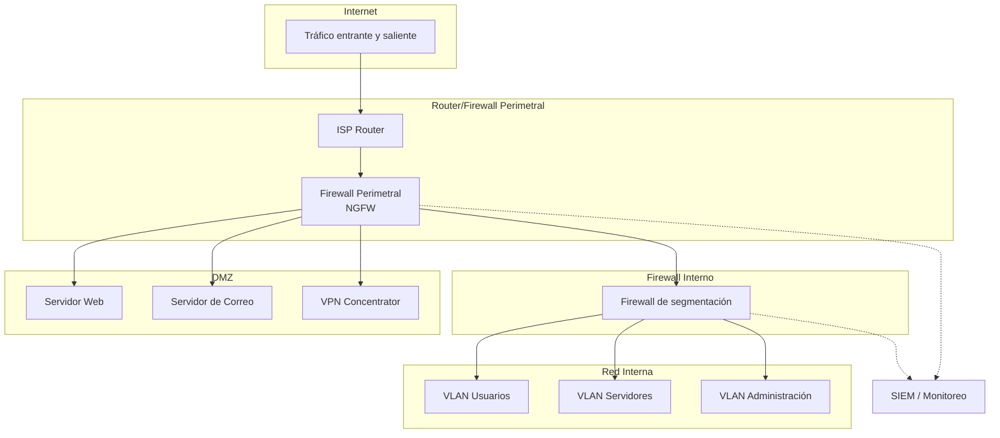
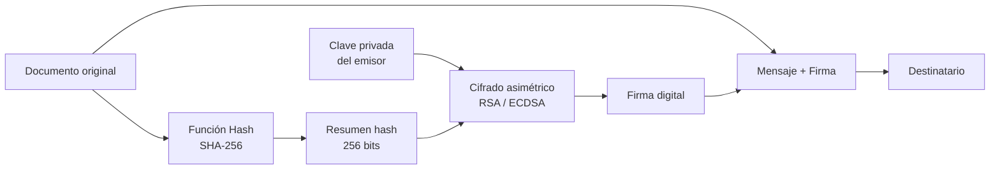
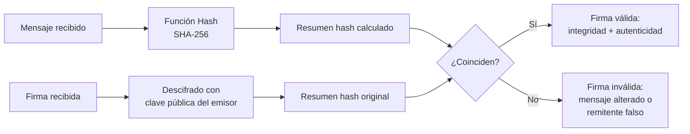
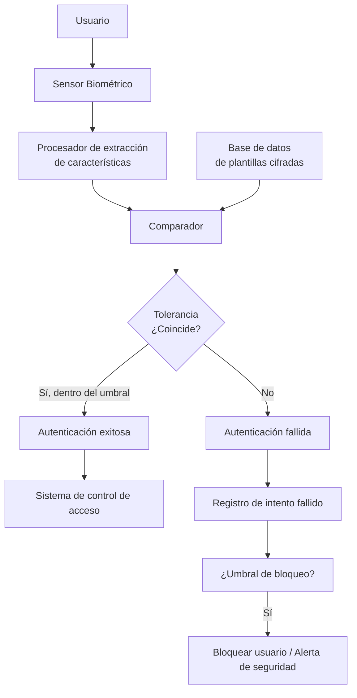
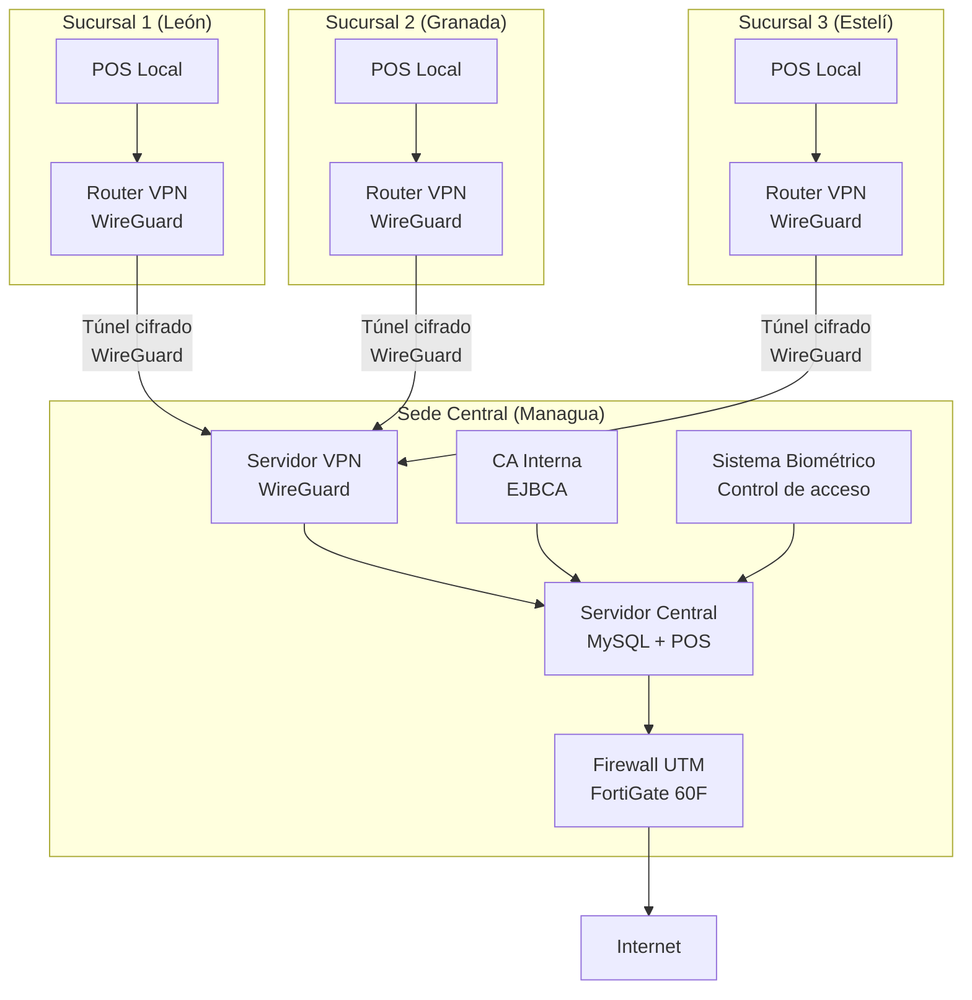
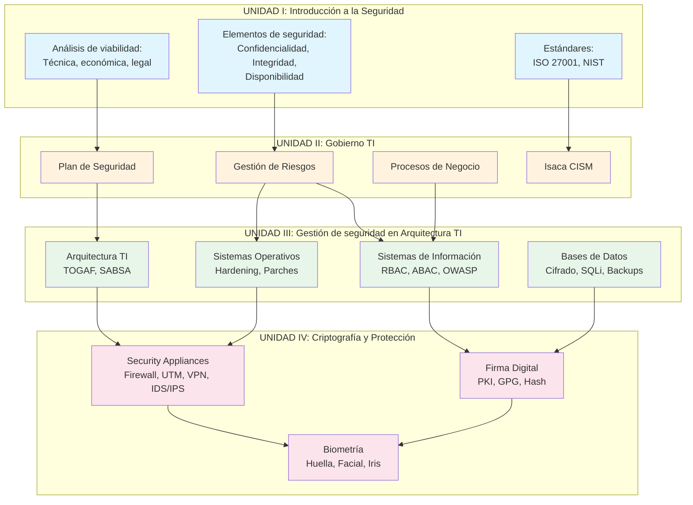

# UNIDAD IV: Criptografía, sistemas de encriptación y protección

## Introducción

En la Unidad III abordamos la gestión de la seguridad en la arquitectura TI, estudiando cómo asegurar sistemas de información, bases de datos y sistemas operativos. Ahora ascendemos a la capa de protección criptográfica y dispositivos de seguridad: la **Unidad IV** se centra en las herramientas tecnológicas que permiten cifrar, autenticar y proteger la información en tránsito y en reposo.

La **criptografía** es la ciencia que estudia las técnicas para ocultar información, asegurando su confidencialidad, integridad y autenticidad. Es la base sobre la que se construyen la mayoría de los controles de seguridad modernos: desde la conexión HTTPS de un navegador hasta la firma digital de un documento legal. Los **Security Appliances** son dispositivos especializados (firewalls, IPS, VPN, UTM) que implementan estos principios en la red para proteger el perímetro y los canales de comunicación. La **firma digital** proporciona autenticidad y no repudio a los documentos electrónicos, permitiendo la transformación digital de procesos que antes requerían papel y presencia física. Finalmente, la **biometría** añade una capa de autenticación basada en características físicas o de comportamiento del usuario, ofreciendo un nivel de seguridad superior a las contraseñas tradicionales.

Al finalizar esta unidad, el estudiante será capaz de seleccionar, configurar y evaluar soluciones criptográficas, dispositivos de seguridad y sistemas biométricos para proteger la información de una organización, cumpliendo con estándares internacionales y la legislación nicaragüense aplicable.

### Subtema 4.1: Security Appliance

Los **Security Appliances** son dispositivos físicos o virtuales diseñados específicamente para funciones de seguridad de red. A diferencia de un servidor genérico al que se le instala software de seguridad, los appliances suelen tener hardware optimizado (procesadores de red ASIC, memoria dedicada) y sistemas operativos endurecidos (hardened) para maximizar el rendimiento y la seguridad.

#### Tipos de Security Appliances

| Tipo | Función principal | Ejemplos comerciales | Alternativas open source |
|------|-------------------|---------------------|--------------------------|
| **Firewall** | Filtrar tráfico de red basado en reglas (IP, puerto, protocolo) | Palo Alto, Fortinet, Cisco ASA | pfSense, OPNsense, iptables/nftables |
| **IDS/IPS** (Intrusion Detection/Prevention System) | Detectar y bloquear tráfico malicioso mediante firmas y análisis de comportamiento | Snort (modo IPS), Suricata, Cisco Firepower | Suricata, Snort, Zeek (antes Bro) |
| **VPN Concentrator** | Establecer y gestionar túneles cifrados para acceso remoto seguro | Cisco AnyConnect, OpenVPN Access Server | OpenVPN, WireGuard, StrongSwan |
| **UTM** (Unified Threat Management) | Integra múltiples funciones en un solo dispositivo: firewall, IPS, antivirus, filtrado web, VPN | FortiGate, Sophos XG, WatchGuard | pfSense + paquetes (Snort, ClamAV, Squid) |
| **WAF** (Web Application Firewall) | Proteger aplicaciones web contra ataques de capa 7 (SQLi, XSS, CSRF) | Cloudflare WAF, F5 BIG-IP ASM, Imperva | ModSecurity + OWASP CRS, NAXSI |
| **DLP** (Data Loss Prevention) | Prevenir la fuga de datos sensibles (detectar y bloquear información confidencial en tránsito) | Symantec DLP, Forcepoint DLP, McAfee DLP | OpenDLP (proyecto open source limitado), MyDLP |
| **Load Balancer** (con seguridad) | Distribuir tráfico entre servidores; algunos incluyen funciones de SSL termination y WAF | F5 BIG-IP LTM, HAProxy (con Lua) | HAProxy, Nginx, Traefik |
| **Mail Security Gateway** | Filtrar correo electrónico (spam, malware, phishing) | Proofpoint, Mimecast, Barracuda | SpamAssassin + Postfix + ClamAV |

#### Firewalls: evolución y tipos

El firewall es el dispositivo de seguridad más básico y fundamental. Ha evolucionado significativamente:

| Generación | Tipo | Características | Limitaciones | Ejemplo |
|------------|------|-----------------|--------------|---------|
| **1ª Gen.** | Filtrado de paquetes (estatal) | Inspecciona cabeceras IP/TCP/UDP; mantiene tabla de conexiones | No inspecciona contenido de la aplicación; vulnerable a IP spoofing | iptables (Linux), ACLs en routers Cisco |
| **2ª Gen.** | Firewall de circuito (Stateful) | Verifica el estado de la conexión (handshake TCP); más seguro que estatal | No entiende protocolos de aplicación; no bloquea malware en HTTP | Check Point FireWall-1 |
| **3ª Gen.** | NGFW (Next-Generation Firewall) | Inspección profunda de paquetes (DPI); identifica aplicaciones (Skype, Netflix); integra IPS, antivirus | Mayor costo; requiere actualizaciones de firmas | Palo Alto Networks, FortiGate |
| **4ª Gen.** | Firewall con Threat Intelligence | Integra inteligencia de amenazas en tiempo real; correlación global; respuesta automática | Dependencia de conectividad a la nube; privacidad de datos | Palo Alto Threat Prevention, FortiGuard |

**Arquitectura típica de firewall en una organización:**



#### Sistemas de Prevención y Detección de Intrusiones (IPS/IDS)

| Sistema | Ubicación en la red | Acción | Ejemplo |
|---------|---------------------|--------|---------|
| **NIDS** (Network-based IDS) | Estrangulamiento de red (puerto SPAN o TAP) | Solo alerta; no bloquea | Zeek, Suricata (modo IDS) |
| **NIPS** (Network-based IPS) | En línea (inline) | Alerta y bloquea tráfico malicioso | Suricata (modo IPS), Cisco Firepower |
| **HIDS** (Host-based IDS) | En cada host | Monitorea archivos, procesos, logs del sistema | OSSEC, Wazuh, AIDE |

**Firmas vs. Anomalías:**

| Método de detección | Descripción | Ventajas | Desventajas | Ejemplo |
|---------------------|-------------|----------|-------------|---------|
| **Basado en firmas** | Compara el tráfico con una base de datos de patrones de ataque conocidos | Baja tasa de falsos positivos; rápido | No detecta ataques nuevos (zero-day) | Snort con reglas VRT |
| **Basado en anomalías** | Establece una línea base de tráfico normal y alerta sobre desviaciones | Puede detectar ataques desconocidos | Alta tasa de falsos positivos; requiere ajuste continuo | Zeek con scripts de detección de anomalías |

**Regla de Snort para detectar un ataque SQL Injection:**

```snort
# Detectar intento de SQL Injection en parámetros GET
alert tcp $EXTERNAL_NET any -> $HTTP_SERVERS $HTTP_PORTS 
(msg:"SQL Injection - 'OR 1=1' en parámetro GET"; 
flow:to_server,established; 
content:"%27%4F%52%20%31%3D%31";  # 'OR%201=1 (URL encoded)
nocase; 
classtype:web-application-attack; 
sid:1000001; 
rev:1;)
```

#### VPN: Red Privada Virtual

La VPN permite extender la red privada a través de una red pública (internet) mediante un túnel cifrado. Es esencial para el teletrabajo y la conexión entre sedes.

**Tipos de VPN:**

| Tipo | Descripción | Protocolos comunes | Caso de uso típico |
|------|-------------|-------------------|---------------------|
| **Site-to-Site** | Conecta dos redes completas (ej. sede central y sucursal) | IPsec (IKEv2), WireGuard | Conexión entre oficinas |
| **Remote Access** | Un usuario individual se conecta a la red corporativa desde su dispositivo | OpenVPN, WireGuard, IPsec (IKEv2), SSL VPN | Teletrabajo, acceso desde casa |
| **SSL VPN** | Acceso vía navegador web sin cliente; usa TLS | OpenVPN (modo SSL), AnyConnect | Acceso rápido desde dispositivos no administrados |

**Comparación de protocolos VPN:**

| Protocolo | Puertos | Velocidad | Seguridad | Facilidad de configuración | Recomendado para |
|-----------|---------|-----------|-----------|---------------------------|------------------|
| **IPsec (IKEv2)** | UDP 500, 4500 | Alta | Muy alta (AES-256 + SHA-256) | Media | Site-to-site corporativo |
| **OpenVPN** | UDP 1194 / TCP 443 | Media-alta | Muy alta (AES-256-GCM) | Alta (configuración mediante archivos .ovpn) | Remote access, entornos mixtos |
| **WireGuard** | UDP 51820 | Muy alta | Alta (ChaCha20 + Poly1305) | Muy alta (pocas líneas de configuración) | Nuevos proyectos, alto rendimiento |
| **SSL VPN** | TCP 443 | Media | Alta (TLS 1.3) | Muy alta (solo navegador) | Acceso rápido y temporal |

**Ejemplo de configuración de WireGuard (servidor):**

```ini
[Interface]
Address = 10.0.0.1/24
PrivateKey = <clave_privada_servidor>
ListenPort = 51820

# Cliente 1 - Juan Pérez
[Peer]
PublicKey = <clave_publica_juan>
AllowedIPs = 10.0.0.2/32

# Cliente 2 - María López
[Peer]
PublicKey = <clave_publica_maria>
AllowedIPs = 10.0.0.3/32
```

**Ejemplo de configuración de WireGuard (cliente):**

```ini
[Interface]
Address = 10.0.0.2/24
PrivateKey = <clave_privada_cliente>
DNS = 10.0.0.1

[Peer]
PublicKey = <clave_publica_servidor>
Endpoint = vpn.empresa.com:51820
AllowedIPs = 10.0.0.0/24, 192.168.1.0/24
PersistentKeepalive = 25
```

#### Gestión Unificada de Amenazas (UTM)

UTM combina múltiples funciones de seguridad en un solo dispositivo. Es especialmente útil para PYMES que no tienen presupuesto para adquirir appliances especializados por separado.

| Función UTM | Descripción | Ejemplo en FortiGate |
|-------------|-------------|-----------------------|
| **Firewall** | Filtrado de paquetes stateful + NGFW | Policy & Objects → Firewall Policy |
| **IPS** | Prevención de intrusiones basada en firmas | Security Profiles → Intrusion Prevention |
| **Antivirus** | Escaneo de malware en el tráfico (HTTP, SMTP, FTP) | Security Profiles → Antivirus |
| **Filtrado web** | Bloqueo de categorías de sitios (malware, pornografía, redes sociales) | Security Profiles → Web Filter |
| **Filtrado DNS** | Bloqueo de dominios maliciosos a nivel DNS | DNS Filter |
| **VPN** | Servidor VPN (IPsec, SSL) | VPN → IPsec / SSL-VPN |
| **DLP básico** | Prevención de fuga de datos con reglas predefinidas | Security Profiles → Data Leak Prevention |
| **Sandboxing** | Ejecución de archivos sospechosos en un entorno aislado | Advanced Threat Protection (ATP) |

**Ventajas de UTM:** menor costo total de propiedad (TCO), gestión centralizada, simplicidad operativa.
**Desventajas:** riesgo de punto único de fallo (si el UTM falla, todas las funciones se pierden), menor rendimiento que appliances especializados, actualizaciones de firmas pueden consumir ancho de banda.

#### Data Loss Prevention (DLP)

DLP es un conjunto de herramientas y procesos que detectan y previenen la fuga de datos sensibles. Existen tres tipos según el estado de los datos:

| Tipo de DLP | Datos en... | Ejemplo de monitoreo | Herramientas |
|-------------|-------------|----------------------|--------------|
| **DLP en reposo** | Almacenamiento (discos, BD, NAS) | Escanear discos en busca de archivos con números de tarjeta de crédito | OpenDLP, Microsoft Purview DLP |
| **DLP en movimiento** | Red (correo, HTTP, FTP, mensajería) | Bloquear un correo que contiene la cédula de un cliente | Symantec DLP, Forcepoint DLP |
| **DLP en uso** | Endpoints (copiar a USB, imprimir) | Bloquear la copia de archivos confidenciales a una memoria USB | Microsoft Purview DLP, Digital Guardian |

#### Tendencias modernas: SASE y Zero Trust Network Access (ZTNA)

La evolución de los Security Appliances ha llevado a modelos más modernos como **SASE (Secure Access Service Edge)** y **ZTNA (Zero Trust Network Access)**. Estos modelos integran seguridad y redes en la nube, proporcionando acceso seguro desde cualquier ubicación.

| Modelo | Descripción | Componentes | Diferencias con UTM tradicional |
|--------|-------------|-------------|----------------------------------|
| **SASE** | Marco de seguridad en la nube que combina funciones de red (SD-WAN) y seguridad (SWG, CASB, ZTNA, FWaaS) | SD-WAN, FWaaS, SWG (Secure Web Gateway), CASB (Cloud Access Security Broker), ZTNA | Se entrega como servicio desde la nube; no requiere hardware local; escalabilidad elástica |
| **ZTNA** | Modelo de confianza cero donde el acceso se concede por sesión, después de verificar identidad y dispositivo, sin importar la ubicación del usuario | Controlador de políticas, broker de conexiones, verificación continua de identidad y dispositivo | El usuario nunca se conecta directamente a la red interna; solo a aplicaciones específicas; reduce drásticamente el movimiento lateral |

**Ejemplo de implementación SASE:** Una empresa con 100 empleados en teletrabajo, en lugar de comprar un UTM para cada sucursal y configurar VPN, contrata un servicio SASE (ej. Cloudflare Zero Trust, Zscaler, Netskope). Cada empleado instala un agente ligero que verifica su identidad y dispositivo; el tráfico se enruta a través de la nube SASE donde se aplican políticas de seguridad (firewall, IPS, filtrado web, DLP). El usuario accede solo a las aplicaciones autorizadas, sin exponer la red interna.

**¿Cuándo recomendar SASE/ZTNA vs. UTM tradicional?**

| Factor | UTM tradicional | SASE / ZTNA |
|--------|-----------------|--------------|
| Ubicación de los usuarios | Mayoría en oficina central | Teletrabajo, movilidad, múltiples sucursales |
| Presupuesto | Inversión inicial alta (CAPEX) | Pago por uso (OPEX) mensual |
| Control | Total sobre el hardware y software | Dependencia del proveedor cloud |
| Latencia | Baja (procesamiento local) | Puede ser mayor (tráfico pasa por la nube) |
| Escalabilidad | Requiere comprar más hardware | Escalable bajo demanda |
| Mantenimiento | Actualizaciones y parches locales | Gestionado por el proveedor |

#### Casos reales documentados (basados en situaciones reales con nombres adaptados)

**Caso 1: Firewall UTM evitó un ataque ransomware en una PYME (Nicaragua, 2024)**  
Una ferretería en Managua implementó un firewall UTM (pfSense + Suricata + ClamAV) después de una capacitación en ciberseguridad. Tres meses después, un empleado abrió un archivo adjunto de correo que contenía malware. El UTM detectó el malware en el tráfico SMTP (gracias a ClamAV) y bloqueó el correo antes de que llegara a la bandeja de entrada del empleado. Semanas después, otras empresas del mismo sector que no tenían UTM sufrieron ataques ransomware. Lección: un UTM bien configurado puede ser la diferencia entre un incidente menor y una crisis mayor.

**Caso 2: Firma digital con GPG evitó una estafa en una cooperativa (Nicaragua, 2023)**  
Una cooperativa de ahorro en Estelí implementó firma digital con GPG para autorizar transferencias electrónicas entre cuentas. Un atacante logró interceptar un correo con una solicitud de transferencia y modificó el número de cuenta destino. Sin embargo, el gerente de la cooperativa verificó la firma digital del documento y detectó que la firma era inválida (el hash no coincidía). La transferencia no se realizó. Lección: la firma digital protege contra ataques de intermediario (man-in-the-middle) en transacciones financieras.

**Caso 3: Biometría mal implementada generó falsos rechazos masivos (Costa Rica, 2022)**  
Un banco costarricense implementó reconocimiento facial para que los clientes accedieran a la banca en línea desde sus smartphones. Sin embargo, no realizaron pruebas con condiciones reales de iluminación en Costa Rica (luz solar directa, interiores con poca luz). El primer día de operación, el 40% de los intentos de autenticación resultaron en falsos rechazos (FRR alto), generando una ola de quejas en redes sociales y llamadas al call center. El banco tuvo que deshabilitar el sistema biométrico temporalmente y ajustar los umbrales de tolerancia. Lección: antes de implementar biometría, es esencial realizar pruebas piloto con usuarios reales en condiciones reales de operación.

#### Comprobación de aprendizaje

**Ejercicio 4.1.1:** Seleccione el Security Appliance más adecuado para cada escenario:

a) Una PYME necesita proteger su red con firewall, antivirus, IPS y filtrado web en un solo dispositivo. → _________
b) Una empresa con 500 empleados en home office necesita una solución de acceso remoto segura y rápida. → _________
c) Un banco necesita proteger su aplicación web contra SQL Injection y XSS. → _________
d) Una organización debe evitar que los empleados envíen información confidencial por correo electrónico. → _________

*Respuestas esperadas:* a) UTM (FortiGate, Sophos XG); b) VPN (WireGuard u OpenVPN); c) WAF (ModSecurity, Cloudflare WAF); d) DLP (Data Loss Prevention).

**Ejercicio 4.1.2:** ¿Cuál es la diferencia principal entre un firewall stateful y un NGFW? ¿Cuándo recomendaría cada uno?

*Respuesta esperada:* Un firewall stateful solo inspecciona cabeceras IP/TCP y mantiene el estado de las conexiones. Un NGFW además realiza inspección profunda de paquetes (DPI), identifica aplicaciones y puede integrar IPS. Recomendaría stateful para un entorno pequeño con recursos limitados; NGFW para entornos corporativos donde se necesita visibilidad de aplicaciones y protección contra amenazas de capa 7.

---

### Subtema 4.2: Firma Digital

La **firma digital** es un mecanismo criptográfico que permite al receptor de un mensaje verificar la identidad del remitente y la integridad del mensaje, además de proporcionar no repudio (el remitente no puede negar haber enviado el mensaje). Para entender la firma digital, primero debemos comprender los fundamentos de la criptografía moderna.

#### Principios de criptografía simétrica y asimétrica

| Característica | Criptografía simétrica | Criptografía asimétrica (clave pública) |
|----------------|----------------------|----------------------------------------|
| **Claves** | Una sola clave compartida (secreta) | Dos claves relacionadas matemáticamente: pública (compartida) y privada (secreta) |
| **Velocidad** | Muy rápida (ideal para cifrar grandes volúmenes) | Lenta (100-1000 veces más lenta que simétrica) |
| **Uso típico** | Cifrado de datos en reposo (discos, BD), tráfico VPN | Intercambio de claves, firma digital, autenticación |
| **Tamaño de clave** | 128-256 bits | 2048-4096 bits (RSA), 256 bits (ECC) |
| **Ejemplos** | AES, ChaCha20, DES (obsoleto), 3DES (obsoleto) | RSA, DSA, ECDSA, Ed25519 |
| **Problema principal** | Distribución segura de la clave compartida | Rendimiento; vulnerabilidad a ataques cuánticos (futuro) |

**Cifrado simétrico (ejemplo con AES-256):**
```
Emisor:  "Hola mundo" → [AES-256 con clave K] → "8F2A...B1C3" → Receptor
Receptor: "8F2A...B1C3" → [AES-256 con clave K] → "Hola mundo"
```

**Cifrado asimétrico (ejemplo con RSA):**
```
Emisor:  "Hola mundo" → [RSA con clave pública del receptor] → "X7Z9...M2N4" → Receptor
Receptor: "X7Z9...M2N4" → [RSA con clave privada del receptor] → "Hola mundo"
```

#### Funciones hash y su papel en la firma digital

Una **función hash** es un algoritmo que toma un mensaje de cualquier longitud y produce una huella digital (resumen) de longitud fija. Las propiedades fundamentales son:

1. **Determinista:** el mismo mensaje siempre produce el mismo hash.
2. **Unidireccional:** no se puede obtener el mensaje original a partir del hash.
3. **Resistente a colisiones:** es computacionalmente imposible encontrar dos mensajes diferentes con el mismo hash.

| Algoritmo hash | Tamaño del resumen | Seguridad actual | Uso recomendado |
|----------------|--------------------|------------------|-----------------|
| **MD5** | 128 bits (32 caracteres hex) | Roto (colisiones demostradas en 2004) | No usar para seguridad; solo verificación de integridad no crítica |
| **SHA-1** | 160 bits (40 caracteres hex) | Vulnerable (colisiones demostradas en 2017 – SHAttered) | No usar; migrar a SHA-256 |
| **SHA-256** | 256 bits (64 caracteres hex) | Seguro (2026) | Firma digital, certificados SSL/TLS, blockchain |
| **SHA-3** | Variable (224, 256, 384, 512 bits) | Seguro (2026) | Alternativa moderna a SHA-2; recomendado para nuevos diseños |

**Ejemplo de hash SHA-256:**
```
Mensaje: "Hola mundo"
Hash SHA-256: b94d27b9934d3e08a52e52d7da7dabfac484efe37a5380ee9088f7ace2efcde9

Mensaje: "Hola mundo."  (con un punto al final)
Hash SHA-256: 6e7c6b8a0c6b7c8d9e0f1a2b3c4d5e6f7a8b9c0d1e2f3a4b5c6d7e8f9a0b1c2
```

*Nota: un solo carácter diferente produce un hash completamente distinto (efecto avalancha).*

#### Funcionamiento de la firma digital

La firma digital combina criptografía asimétrica y funciones hash. El proceso se divide en dos partes:

**Firma (emisor):**



**Verificación (receptor):**



**Explicación textual del proceso:**

1. El emisor calcula el hash del documento (ej. SHA-256).
2. El emisor cifra ese hash con su **clave privada** (solo él la conoce).
3. El resultado es la **firma digital**, que se adjunta al documento.
4. El receptor recibe el documento + la firma.
5. El receptor calcula el hash del documento recibido (SHA-256).
6. El receptor descifra la firma con la **clave pública** del emisor, obteniendo el hash original.
7. Si ambos hashes coinciden, el documento es auténtico (viene del emisor) y no ha sido alterado.

**Propiedades de seguridad:**
- **Autenticidad:** solo el poseedor de la clave privada pudo firmar.
- **Integridad:** si el documento se modifica, el hash no coincidirá.
- **No repudio:** el emisor no puede negar haber firmado (porque solo él tiene su clave privada).

#### Infraestructura de Clave Pública (PKI)

La PKI (Public Key Infrastructure) es el conjunto de políticas, procedimientos, hardware y software necesarios para gestionar certificados digitales y claves públicas. Sus componentes principales son:

| Componente | Función | Ejemplo |
|------------|---------|---------|
| **CA (Certification Authority)** | Entidad confiable que emite y revoca certificados digitales | Let's Encrypt, DigiCert, EJBCA (open source) |
| **RA (Registration Authority)** | Verifica la identidad del solicitante antes de que la CA emita el certificado | Integrada en la CA en implementaciones pequeñas |
| **Certificado digital** | Documento electrónico que vincula una identidad (persona, servidor) con una clave pública, firmado por la CA | X.509 (formato estándar) |
| **CRL (Certificate Revocation List)** | Lista de certificados revocados antes de su fecha de expiración | Publicada por la CA y consultada por los clientes |
| **OCSP (Online Certificate Status Protocol)** | Protocolo en tiempo real para verificar el estado de un certificado (alternativa más rápida que CRL) | `ocsp.digicert.com` |

**Ejemplo de cadena de confianza de un certificado SSL:**

```
[Raíz CA] (ej. ISRG Root X1 - autofirmado, en todos los navegadores)
    ↓ Firma
[CA Intermedia] (ej. R3 de Let's Encrypt)
    ↓ Firma
[Certificado del servidor] (ej. www.miempresa.com)
```

**Formato de un certificado X.509 (campos principales):**

| Campo | Descripción | Ejemplo |
|-------|-------------|---------|
| `Version` | Versión del formato X.509 (1, 2 o 3) | 3 |
| `Serial Number` | Identificador único asignado por la CA | 0x123456789ABCDEF0 |
| `Signature Algorithm` | Algoritmo usado para firmar el certificado | sha256WithRSAEncryption |
| `Issuer` | Entidad que emitió el certificado (CA) | CN = R3, O = Let's Encrypt, C = US |
| `Validity` | Período de validez (notBefore, notAfter) | 2026-01-01 a 2026-12-31 |
| `Subject` | Identidad del titular | CN = www.miempresa.com, O = Mi Empresa S.A., C = NI |
| `Public Key Info` | Algoritmo y clave pública del titular | RSA 2048 bits |
| `Extensions` | Usos permitidos, políticas, SAN (Subject Alternative Names) | DNS Name: www.miempresa.com, DNS Name: miempresa.com |

**Práctica con GPG (GNU Privacy Guard)**

GPG es una implementación libre del estándar OpenPGP. Permite cifrar y firmar archivos y correos electrónicos.

**Paso 1: Generar un par de claves**

```bash
gpg --full-generate-key
# Seleccionar: RSA and RSA (default)
# Tamaño de clave: 4096 bits
# Validez: 1y (1 año)
# Nombre: "Juan Pérez"
# Correo: juan.perez@empresa.com
# Contraseña: (proteger la clave privada)
```

**Paso 2: Exportar la clave pública para compartir**

```bash
gpg --armor --export juan.perez@empresa.com > clave-publica-juan.asc
```

**Paso 3: Firmar un documento**

```bash
gpg --armor --detach-sign documento.pdf
# Genera: documento.pdf.sig (firma digital separada)
```

**Paso 4: Verificar la firma de un documento**

```bash
gpg --verify documento.pdf.sig documento.pdf
# Output: "gpg: Firma buena de 'Juan Pérez <juan.perez@empresa.com>'"
```

**Paso 5: Cifrar un archivo para un destinatario específico (usando su clave pública)**

```bash
gpg --encrypt --armor --recipient maria.lopez@empresa.com informe.pdf
# Genera: informe.pdf.asc (cifrado, solo María puede descifrarlo con su clave privada)
```

**Paso 6: Cifrar y firmar simultáneamente**

```bash
gpg --encrypt --sign --armor --recipient maria.lopez@empresa.com documento.pdf
# Cifra + firma en un solo paso
```

#### Legislación nicaragüense sobre firma digital

En Nicaragua, la **Ley de Firma Electrónica (Ley 729, aprobada en 2010)** reconoce la validez jurídica de la firma electrónica y la firma digital. Puntos clave:

- **Firma Electrónica:** cualquier conjunto de datos electrónicos integrados o asociados a un documento que pueda ser utilizado como medio de identificación del firmante (ej. un escaneo de la firma manuscrita, un código PIN).
- **Firma Digital:** un tipo específico de firma electrónica que utiliza criptografía asimétrica y certificados digitales, ofreciendo mayor seguridad y presunción de autoría.
- **Valor jurídico:** la firma digital tiene la misma validez que la firma manuscrita si se utiliza un certificado digital emitido por una CA acreditada.
- **No repudio:** el documento firmado digitalmente hace prueba plena de su origen y contenido.

**Ejemplo de aplicación práctica en Nicaragua:** Una empresa que desea implementar facturación electrónica con valor fiscal debe utilizar firma digital basada en certificados emitidos por la CA de la Dirección General de Ingresos (DGI). Los contadores y representantes legales deben obtener su certificado digital para firmar electrónicamente las declaraciones de impuestos.

#### Aplicaciones de la firma digital

| Aplicación | Descripción | Impacto en Nicaragua |
|------------|-------------|----------------------|
| **Facturación electrónica** | Firmar digitalmente las facturas para que tengan validez fiscal | DGI exige requisitos técnicos específicos; se usa certificado digital |
| **Firma de contratos** | Firmar contratos a distancia sin necesidad de presencia física | Reduce costos y tiempos en transacciones comerciales |
| **Firma de correos electrónicos** | Usar GPG o S/MIME para firmar correos | Protege contra phishing y suplantación de identidad |
| **Firma de código** | Los desarrolladores firman su código para garantizar que no ha sido alterado | Importante para distribuir software confiable; ej. firmar APK de Android |
| **Documentos notariales** | Algunos notarios ya aceptan documentos firmados digitalmente | En evolución; aún no es masivo |
| **Autenticación en sistemas** | Usar certificados de cliente para autenticación en VPN o aplicaciones web | Alternativa a contraseñas; más seguro pero menos común en Nicaragua |

#### Comprobación de aprendizaje

**Ejercicio 4.2.1:** Complete el siguiente cuadro comparativo entre cifrado simétrico y asimétrico:

| Característica | Simétrico | Asimétrico |
|----------------|-----------|------------|
| Número de claves | Una | _____ |
| Velocidad | _____ | Lenta |
| Uso típico | _____ | Firma digital, intercambio de claves |
| Algoritmo ejemplo | _____ | RSA, ECDSA |

*Respuestas esperadas:* Dos (pública y privada); Rápida; Cifrado de datos en reposo/tránsito; AES.

**Ejercicio 4.2.2:** Si un atacante intercepta un documento firmado digitalmente y lo modifica, ¿qué ocurre cuando el destinatario verifica la firma? ¿Por qué?

*Respuesta esperada:* La verificación fallará. El destinatario calculará el hash del documento modificado, que será diferente del hash original descifrado de la firma. Como no coinciden, el proceso indicará "firma inválida".

**Ejercicio 4.2.3:** Una empresa nicaragüense quiere implementar firma digital en sus contratos de servicios. ¿Qué ley ampara esta práctica? ¿Qué requisitos debe cumplir para que la firma tenga pleno valor jurídico?

*Respuesta esperada:* La Ley 729 (Ley de Firma Electrónica) ampara la firma digital. Para tener pleno valor jurídico, la firma debe utilizar un certificado digital emitido por una CA acreditada, y debe poder demostrarse que la firma corresponde al firmante y que el documento no ha sido alterado después de la firma.

---

### Subtema 4.3: Biometría

La **biometría** es la ciencia que estudia las características físicas o de comportamiento únicas de cada individuo para su identificación o autenticación. En seguridad informática, los sistemas biométricos se utilizan como factor de autenticación (algo que el usuario **es**), complementando los factores tradicionales de conocimiento (algo que el usuario **sabe** – contraseña) y posesión (algo que el usuario **tiene** – token, tarjeta).

#### Tipos de biometría

| Tipo | Categoría | Característica medida | Precisión (EER) | Ejemplos de uso |
|------|-----------|-----------------------|-----------------|-----------------|
| **Huella dactilar** | Física | Patrón de crestas y valles en la yema del dedo | ~2-3% | Desbloqueo de dispositivos móviles, control de acceso físico |
| **Reconocimiento facial** | Física | Geometría del rostro (distancia entre ojos, nariz, boca) | ~1-5% (depende de iluminación) | Desbloqueo de smartphones (Face ID), videovigilancia |
| **Reconocimiento de iris** | Física | Patrón único del iris (anillo coloreado del ojo) | ~0.1-0.5% (muy preciso) | Control de acceso de alta seguridad (aeropuertos, bancos) |
| **Reconocimiento de voz** | Comportamiento | Características de la voz (tono, frecuencia, cadencia) | ~3-5% | Autenticación en call centers, asistentes virtuales |
| **Geometría de la mano** | Física | Forma y tamaño de la mano y los dedos | ~1-2% | Control de acceso físico en instalaciones |
| **Firma manuscrita** | Comportamiento | Dinámica de la firma (velocidad, presión, aceleración) | ~2-5% | Verificación en transacciones bancarias |
| **Reconocimiento de venas** | Física | Patrón de venas de la palma o el dedo | ~0.01-0.1% (muy precisa) | Cajeros automáticos, control de acceso a alta seguridad |
| **Reconocimiento de escritura** | Comportamiento | Patrones de escritura en teclado (dinámica de tecleo) | ~5-10% | Autenticación continua en sistemas web (sin interrumpir al usuario) |

#### Métricas de rendimiento de sistemas biométricos

| Métrica | Siglas | Definición | Valor deseable |
|---------|--------|------------|----------------|
| **False Acceptance Rate** | FAR | Probabilidad de que el sistema acepte a un impostor (falso positivo) | Lo más bajo posible (< 0.1% para alta seguridad) |
| **False Rejection Rate** | FRR | Probabilidad de que el sistema rechace a un usuario legítimo (falso negativo) | Lo más bajo posible (< 1% para no frustrar usuarios) |
| **Equal Error Rate** | EER | Punto donde FAR = FRR. Mientras más bajo, mejor el sistema. | 0.1% – 5% según la tecnología |
| **Failure to Enroll Rate** | FTE | Porcentaje de usuarios que no pueden registrarse en el sistema (ej. huellas muy deterioradas) | < 1% |
| **Template Capacity** | — | Número máximo de plantillas biométricas que el sistema puede almacenar | Según la escala del proyecto |

**Relación entre FAR y FRR (curva ROC):**

```
FRR (%)  ↑
         |                        Curva ROC
         |   A (umbral bajo)
    50%  |   * FAR alto / FRR bajo
         |    \
         |     \   B (umbral óptimo)
    10%  |       * EER = 2%
         |        \
         |         \   C (umbral alto)
     1%  |           * FAR bajo / FRR alto
         |
         +---+--------+--------+----→ FAR (%)
            0.1%      1%       10%
```

*Interpretación:* El umbral de decisión es configurable. Si se requiere máxima seguridad (bajo FAR), se aceptan más falsos rechazos (alto FRR). Si se requiere comodidad para el usuario (bajo FRR), se aceptan más falsos positivos (alto FAR). El punto óptimo es donde ambos errores se equilibran (EER).

#### Ventajas y desventajas de la biometría

| Ventajas | Desventajas |
|----------|-------------|
| **No se puede olvidar:** a diferencia de las contraseñas, el usuario siempre "lleva consigo" su característica biométrica | **No se puede cambiar:** si una huella dactilar es comprometida, no se puede "resetear" como una contraseña |
| **Difícil de falsificar:** las características biométricas son únicas (especialmente iris y venas) | **Privacidad:** los datos biométricos son información personal sensible; su almacenamiento debe cumplir con la Ley 787 |
| **Comodidad:** el usuario no necesita recordar nada; solo presentar su característica | **Precisión dependiente del entorno:** iluminación (rostro), ruido (voz), humedad (huella) afectan la precisión |
| **Autenticación fuerte:** combinada con otro factor (ej. tarjeta + huella) proporciona autenticación multifactor robusta | **Costo:** los sensores biométricos de alta precisión (iris, venas) son costosos |
| **No repudio biométrico:** difícil que un usuario niegue haber accedido si su huella quedó registrada (aunque no es infalible) | **Aceptación del usuario:** algunas personas se resisten por creencias religiosas, higiene o desconfianza |

#### Ataques a sistemas biométricos

| Tipo de ataque | Descripción | Ejemplo | Mitigación |
|----------------|-------------|---------|------------|
| **Presentación (spoofing)** | El atacante presenta una copia de la característica biométrica (huella de gelatina, foto impresa, grabación de voz) | Huella dactilar falsa hecha con gelatina y impresa en 3D | Detección de vida (liveness): medición de pulso, análisis de textura, parpadeo (facial), movimiento aleatorio |
| **Replay** | El atacante intercepta y reenvía la señal biométrica capturada previamente | Capturar el flujo de datos del sensor de huella y reenviarlo | Cifrado de la comunicación entre sensor y procesador; uso de nonces (números aleatorios de un solo uso) |
| **Base de datos de plantillas** | El atacante roba las plantillas biométricas almacenadas en la base de datos | Robo de la base de datos de huellas de un sistema de control de acceso | Almacenar solo hashes de las plantillas (no las plantillas originales); cifrado de la base de datos |
| **Ataque al sensor** | El atacante daña físicamente el sensor biométrico | Rayar el sensor de huella para que siempre acepte | Sensores con detección de manipulación (tamper detection); redundancia de sensores |
| **Ataque de fuerza bruta** | El atacante prueba múltiples variaciones biométricas hasta que una es aceptada | Probar 10,000 huellas sintéticas generadas por IA | Umbral de FAR muy bajo; bloqueo tras N intentos fallidos |

**Caso real de ataque biométrico (adaptado):**
En 2019, investigadores de la empresa de seguridad "CyberArk" demostraron que podían engañar al sensor de huellas de un smartphone Android utilizando una huella falsa impresa en papel conductivo. El ataque funcionaba porque el sensor no tenía detección de vida (no verificaba si la huella pertenecía a un dedo vivo). Lección: la detección de vida (liveness) es esencial en cualquier sistema biométrico de seguridad.

#### Privacidad y aspectos legales (Ley 787)

En Nicaragua, la **Ley 787 de Protección de Datos Personales** clasifica los datos biométricos como **datos sensibles**, lo que implica:

- **Consentimiento explícito:** la organización debe obtener autorización expresa e informada del titular para recolectar y procesar sus datos biométricos.
- **Finalidad determinada:** los datos biométricos solo pueden usarse para el propósito específico para el que fueron recolectados (ej. control de acceso).
- **Almacenamiento seguro:** los datos biométricos deben almacenarse con medidas de seguridad reforzadas (cifrado, control de acceso estricto, auditoría).
- **Notificación de brechas:** si los datos biométricos son comprometidos, la organización debe notificar a los afectados y a la autoridad de protección de datos.
- **Derecho de cancelación:** el titular puede solicitar la eliminación de sus datos biométricos cuando ya no sean necesarios para la finalidad original.

**Recomendaciones para cumplir con la Ley 787 en sistemas biométricos:**

| Requisito legal | Implementación técnica |
|-----------------|----------------------|
| Consentimiento explícito | Pantalla de aceptación con casilla no preseleccionada; texto claro sobre qué datos se recolectan y para qué |
| Almacenamiento seguro | Cifrar las plantillas biométricas con AES-256; almacenar en BD separada con control de acceso restrictivo |
| Minimización de datos | No almacenar la imagen original de la huella, solo la plantilla matemática (minucias) |
| Notificación de brechas | Configurar alertas automáticas en el SIEM para accesos no autorizados a la BD de plantillas |
| Derecho de cancelación | Implementar función de "olvidar usuario" que elimine la plantilla y todos los registros asociados |

#### Integración de biometría con otros sistemas de seguridad

La biometría no debe usarse como único factor de autenticación, sino como parte de una estrategia de **autenticación multifactor (MFA)**:

| Factor | Algo que... | Ejemplo |
|--------|-------------|---------|
| Factor 1 (conocimiento) | Sabes | Contraseña o PIN |
| Factor 2 (posesión) | Tienes | Tarjeta inteligente, token, smartphone |
| Factor 3 (biometría) | Eres | Huella dactilar, reconocimiento facial, iris |

**Ejemplo de MFA con biometría (acceso a un data center crítico):**
1. El empleado ingresa su tarjeta de proximidad (factor 2).
2. Ingresa su PIN de 6 dígitos (factor 1).
3. Coloca su dedo en el lector biométrico (factor 3).
4. Solo si los tres factores son válidos, la puerta se abre.

**Arquitectura de un sistema de autenticación biométrica:**



#### Comprobación de aprendizaje

**Ejercicio 4.3.1:** Relacione el tipo de biometría con su EER típico:

| Biometría | EER |
|-----------|-----|
| 1. Reconocimiento de iris | A. ~3-5% |
| 2. Huella dactilar | B. ~0.1-0.5% |
| 3. Reconocimiento de voz | C. ~5-10% |
| 4. Dinámica de tecleo | D. ~2-3% |

*Respuesta esperada:* 1-B, 2-D, 3-A, 4-C.

**Ejercicio 4.3.2:** Un hospital desea implementar autenticación biométrica para que los médicos accedan a las historias clínicas electrónicas. ¿Qué tipo de biometría recomendaría y por qué? ¿Qué consideraciones legales debe tener en cuenta según la Ley 787?

*Respuesta esperada:* Recomendaría biometría de huella dactilar combinada con MFA (tarjeta + huella) o reconocimiento de iris (si el presupuesto lo permite y se requiere alta seguridad). Consideraciones legales: obtener consentimiento explícito de los médicos, almacenar solo la plantilla (no la imagen original), cifrar la base de datos de plantillas, permitir la cancelación de los datos cuando el médico ya no trabaje en el hospital.

### Ejemplo integrador: Implementación de un sistema de seguridad integral con criptografía y biometría para una empresa nicaragüense

**Escenario:** "Farmacias del Pacífico, S.A." es una cadena de 15 farmacias en Nicaragua que desea modernizar su seguridad. Actualmente, las farmacias utilizan un sistema POS (punto de venta) legacy que se conecta a un servidor central en Managua a través de internet sin cifrar. Los empleados usan usuario y contraseña compartidos. El dueño quiere implementar:

1. Una VPN para conectar todas las sucursales de forma segura.
2. Firma digital en las facturas electrónicas (requisito de la DGI).
3. Autenticación biométrica para acceder al sistema de inventario de medicamentos controlados.
4. Un firewall UTM en la sede central.

**Solución propuesta integrando toda la Unidad IV:**

| Componente | Subtema | Solución propuesta | Justificación técnica |
|------------|---------|-------------------|----------------------|
| **VPN site-to-site** | 4.1 | WireGuard entre cada sucursal y la sede central | Rápido, fácil de configurar, seguro (ChaCha20), bajo consumo de recursos |
| **Firewall UTM** | 4.1 | FortiGate 60F (o pfSense + paquetes) en la sede central | Protección unificada: firewall, IPS, antivirus, filtrado web, VPN |
| **Firma digital para facturas** | 4.2 | GPG con certificados RSA 4096 bits | Open source, compatible con estándares, bajo costo |
| **PKI interna** | 4.2 | CA con EJBCA para emitir certificados a empleados | Control total sobre la infraestructura; emisión y revocación centralizada |
| **Autenticación biométrica** | 4.3 | Lector de huella dactilar (con detección de vida) para acceso a medicamentos controlados | Bajo costo, precisión aceptable (EER ~2%), detección de vida incorporada |
| **MFA completo** | 4.3 | Contraseña (conocimiento) + token en smartphone (posesión) + huella (biometría) para accesos administrativos | Autenticación multifactor robusta para cuentas privilegiadas |

**Arquitectura de red propuesta:**



**Cronograma de implementación:**

| Semana | Actividad | Responsable |
|--------|-----------|-------------|
| 1 | Instalación y configuración del Firewall UTM en sede central | Ingeniero de redes |
| 2 | Configuración de WireGuard en sede central y sucursales piloto (León) | Ingeniero de redes |
| 3 | Instalación de WireGuard en sucursales restantes | Técnico de campo |
| 4 | Implementación de CA interna con EJBCA y emisión de certificados | Administrador de seguridad |
| 5 | Configuración de GPG para firma digital de facturas | Desarrollador + Contador |
| 6 | Instalación de lectores biométricos en las 3 farmacias más grandes | Técnico de campo |
| 7 | Capacitación al personal (20 empleados × 2 horas) | Consultor de seguridad |
| 8 | Pruebas de integración y ajustes finales | Equipo completo |

**Costo estimado:**

| Concepto | Costo (C$) |
|----------|------------|
| Firewall FortiGate 60F | C$ 35,000 |
| 15 routers MikroTik con WireGuard (C$ 2,500 c/u) | C$ 37,500 |
| 3 lectores biométricos con detección de vida (C$ 8,000 c/u) | C$ 24,000 |
| Servidor para CA + VPN (VPS en Managua, 1 año) | C$ 18,000 |
| Horas de consultoría en seguridad (80 h × C$ 500/h) | C$ 40,000 |
| Capacitación al personal | C$ 10,000 |
| **Total** | **C$ 164,500** |

**Beneficios esperados:**
- Facturación electrónica con validez fiscal (cumplimiento DGI).
- Comunicación cifrada entre sucursales (protección contra interceptación).
- Control de acceso biométrico a medicamentos controlados (cumplimiento regulatorio).
- Reducción de riesgo de brechas de seguridad en un 80% estimado.
- Cumplimiento con la Ley 787 de Protección de Datos Personales.

### Guía práctica: Configuración de WireGuard VPN paso a paso

A continuación se presenta una guía práctica para configurar una VPN site-to-site entre dos oficinas usando WireGuard en Ubuntu 22.04 LTS.

**Escenario:** La sede central (Managua) tiene IP pública `200.10.20.30` y la sucursal (León) tiene IP pública `200.10.40.50`. Queremos que ambas redes locales (192.168.1.0/24 en Managua y 192.168.2.0/24 en León) se comuniquen de forma cifrada.

#### Paso 1: Instalar WireGuard en ambos servidores

```bash
# En ambos servidores (Managua y León)
sudo apt update && sudo apt install wireguard -y

# Generar par de claves en cada servidor
wg genkey | sudo tee /etc/wireguard/private.key
sudo chmod 600 /etc/wireguard/private.key
sudo cat /etc/wireguard/private.key | wg pubkey | sudo tee /etc/wireguard/public.key
```

#### Paso 2: Configurar el servidor central (Managua)

Crear `/etc/wireguard/wg0.conf`:

```ini
[Interface]
Address = 10.0.0.1/24
PrivateKey = <clave_privada_managua>
ListenPort = 51820

# Regla de iptables para NAT (permitir que la sucursal acceda a la red 192.168.1.0/24)
PostUp = iptables -A FORWARD -i wg0 -j ACCEPT; iptables -t nat -A POSTROUTING -o eth0 -j MASQUERADE
PostDown = iptables -D FORWARD -i wg0 -j ACCEPT; iptables -t nat -D POSTROUTING -o eth0 -j MASQUERADE

# Sucursal León
[Peer]
PublicKey = <clave_publica_leon>
AllowedIPs = 10.0.0.2/32, 192.168.2.0/24
```

#### Paso 3: Configurar el cliente (León)

Crear `/etc/wireguard/wg0.conf`:

```ini
[Interface]
Address = 10.0.0.2/24
PrivateKey = <clave_privada_leon>

# Regla para enrutar tráfico a la red de Managua a través del túnel
PostUp = ip route add 192.168.1.0/24 via 10.0.0.1 dev wg0
PostDown = ip route del 192.168.1.0/24 via 10.0.0.1 dev wg0

# Sede Central Managua
[Peer]
PublicKey = <clave_publica_managua>
Endpoint = 200.10.20.30:51820
AllowedIPs = 10.0.0.1/32, 192.168.1.0/24
PersistentKeepalive = 25
```

#### Paso 4: Habilitar IP forwarding en ambos servidores

```bash
sudo sed -i 's/#net.ipv4.ip_forward=1/net.ipv4.ip_forward=1/' /etc/sysctl.conf
sudo sysctl -p
```

#### Paso 5: Iniciar WireGuard y verificar

```bash
# En ambos servidores
sudo systemctl enable wg-quick@wg0
sudo systemctl start wg-quick@wg0

# Verificar estado
sudo wg show
# Debería mostrar:
# interface: wg0
#   public key: <...>
#   private key: (hidden)
#   listening port: 51820
# peer: <clave_publica_otro>
#   endpoint: 200.10.X.X:51820
#   allowed ips: 10.0.0.X/32, 192.168.X.0/24
#   latest handshake: 5 seconds ago  ← COMPROBAR QUE HAY HANDSHAKE
#   transfer: 1.5 KiB received, 2.3 KiB sent

# Probar conectividad
ping 10.0.0.1  # Desde León → debe responder
ping 10.0.0.2  # Desde Managua → debe responder
```

#### Paso 6: Configurar el firewall

```bash
# En ambos servidores
sudo ufw allow 51820/udp  # Puerto de WireGuard
sudo ufw reload
```

**Verificación final:** Desde un equipo en la red de León (192.168.2.100), hacer ping a un equipo en la red de Managua (192.168.1.100). Si responde, la VPN funciona correctamente.

### Amenazas a la criptografía: la computación cuántica

Un tema emergente que todo ingeniero en sistemas debe conocer es el impacto de la **computación cuántica** en la criptografía actual. Los algoritmos cuánticos (como el algoritmo de Shor) podrían romper la criptografía asimétrica actual (RSA, ECDSA, Diffie-Hellman) en minutos, al poder factorizar números grandes de manera eficiente.

| Algoritmo criptográfico | Vulnerable a cuántica | Alternativa post-cuántica | Estatus del estándar |
|------------------------|----------------------|---------------------------|----------------------|
| **RSA** (2048-4096 bits) | Sí (algoritmo de Shor) | Crystals-Kyber (intercambio de claves), Crystals-Dilithium (firma) | NIST estandarizó en 2024 |
| **ECDSA / ECDH** | Sí (algoritmo de Shor) | FALCON, SPHINCS+ (firma) | NIST estandarizó en 2024 |
| **AES-256** | Parcialmente (algoritmo de Grover reduce la seguridad efectiva a 128 bits) | AES-256 sigue siendo seguro (duplicar tamaño de clave) | Seguro con claves ≥ 256 bits |
| **SHA-256 / SHA-3** | Parcialmente (Grover reduce la seguridad efectiva) | SHA-512 o SHA-3 con salida de 512 bits | Seguro con salida ≥ 384 bits |
| **ChaCha20** | Parcialmente (Grover) | Misma clave de 256 bits proporciona 128 bits de seguridad cuántica | Seguro por ahora |

**Implicaciones para el ingeniero en sistemas:**

- Los sistemas que utilizan RSA o ECDSA para firma digital y cifrado deberán migrar a algoritmos post-cuánticos en los próximos 5-10 años.
- La PKI actual (certificados X.509) tendrá que ser reemplazada por certificados post-cuánticos.
- Los datos que se cifran hoy con RSA podrían ser descifrados en el futuro si un atacante los almacena ahora ("harvest now, decrypt later").
- WireGuard (que utiliza Curve25519) también necesitará migrar a Curve25519 híbrido con Kyber.

**Acción recomendada:** Mantenerse actualizado sobre los estándares NIST post-cuánticos y planificar la migración en los sistemas de largo plazo (especialmente aquellos que manejan datos con vigencia > 10 años).

#### Comprobación de aprendizaje adicional

**Ejercicio 4.2.4 (Computación cuántica):** Una empresa de seguros almacena pólizas de vida con vigencia de 20 años, firmadas digitalmente con RSA-2048. ¿Debería preocuparse por la computación cuántica? ¿Qué recomendaría?

*Respuesta esperada:* Sí, debería preocuparse. Si un atacante almacena las pólizas firmadas hoy, dentro de 10-15 años podría romper RSA-2048 con una computadora cuántica lo suficientemente grande y falsificar pólizas o alterar las existentes. Recomendación: (a) migrar a firmas post-cuánticas (Crystals-Dilithium) en los próximos 2-3 años, (b) implementar un esquema híbrido (RSA + algoritmo post-cuántico) durante el período de transición.

### Conexión con unidades anteriores

| Concepto de Unidad I | Aplicación en Unidad IV | Concepto de Unidad II | Aplicación en Unidad IV | Concepto de Unidad III | Aplicación en Unidad IV |
|----------------------|-------------------------|-----------------------|-------------------------|------------------------|-------------------------|
| **Elementos de seguridad** | La criptografía garantiza confidencialidad (cifrado), integridad (hash) y autenticidad (firma digital) | **Plan de Seguridad** | La selección de security appliances debe estar alineada con el plan de seguridad de la organización | **Hardening de SO** | Los security appliances deben ejecutarse sobre SO hardening (por ejemplo, el firewall pfSense sobre FreeBSD hardening) |
| **Estándares y certificaciones** | OWASP, PKI, X.509 son estándares que guían la implementación criptográfica | **Gestión de Riesgos** | La elección entre tipos de VPN o biometría debe basarse en una evaluación de riesgos | **Arquitectura TI** | Los security appliances se integran en la arquitectura de red; la PKI es parte de la arquitectura de seguridad |
| **Análisis de viabilidad** | La viabilidad económica de implementar biometría o un UTM debe evaluarse con VAN/TIR | **Procesos de Negocio** | La firma digital optimiza procesos que antes requerían papel y firma manuscrita | **Seguridad en BD** | El cifrado de BD se complementa con el cifrado en tránsito (VPN) y la autenticación biométrica de usuarios |

---

### Ejercicios complementarios para trabajo en equipo

Estos ejercicios están diseñados para ser resueltos en grupos de 3-4 estudiantes y presentados en clase.

**Ejercicio complementario 1: Evaluación de Security Appliances para una PYME**

Una PYME de 50 empleados en Managua necesita renovar su infraestructura de seguridad. Actualmente tiene un router básico que hace las veces de firewall, sin protección contra malware ni filtrado web. El presupuesto es limitado (máximo C$ 50,000). No tienen personal de TI dedicado.

Investigue y compare al menos dos opciones de UTM (una comercial y una open source) y presente una recomendación que incluya:
1. Costo total estimado (hardware + licencias + mantenimiento anual).
2. Funcionalidades incluidas (firewall, IPS, antivirus, filtrado web, VPN).
3. Facilidad de configuración y mantenimiento (puntaje del 1 al 5).
4. Recomendación final justificada.

**Entregable:** Cuadro comparativo + informe de 2 páginas.

**Ejercicio complementario 2: Implementación de PKI para una organización**

Su equipo ha sido contratado para implementar una PKI interna para una empresa de 200 empleados que necesita emitir certificados digitales para:
- Autenticación de empleados en la VPN.
- Firma de documentos internos (contratos, autorizaciones).
- Cifrado de correos electrónicos entre empleados.

Diseñe una solución PKI que incluya:
1. Topología de PKI (CA raíz, CA intermedias, tipo de certificados).
2. Herramientas open source recomendadas (EJBCA, OpenSSL, XCA).
3. Política de certificados (vigencia, renovación, revocación).
4. Procedimiento de solicitud y emisión de certificados.
5. Integración con los sistemas existentes (Active Directory, servidor de correo, VPN).
6. Plan de contingencia (qué hacer si la CA raíz se compromete).

**Entregable:** Documento de diseño PKI de 5-8 páginas.

**Ejercicio complementario 3: Estudio de caso - Ataque a un sistema biométrico**

Investigue un caso real de ataque a un sistema biométrico (puede buscar en internet con palabras clave como "biometric spoofing attack case study 2023 2024"). Prepare una presentación de 10 minutos que cubra:

1. Descripción del sistema atacado (tipo de biometría, contexto de uso).
2. Técnica de ataque utilizada (spoofing, replay, robo de plantillas).
3. Impacto del ataque (financiero, reputacional, legal).
4. Mitigaciones que podrían haber prevenido el ataque (detección de vida, MFA, cifrado).
5. Lecciones aprendidas y recomendaciones para implementaciones futuras.

**Entregable:** Presentación (PPT o PDF) de 10-15 diapositivas + resumen ejecutivo de 1 página.

### Mapa de integración de las cuatro unidades

Para cerrar la asignatura, presentamos un mapa conceptual que integra los conceptos clave de las cuatro unidades, mostrando cómo se relacionan entre sí:



*Interpretación del mapa:* La Unidad I proporciona los fundamentos y criterios de evaluación. La Unidad II establece el gobierno y los procesos. La Unidad III desciende al nivel técnico de arquitectura y sistemas. La Unidad IV aplica las herramientas criptográficas y dispositivos de protección. Todas las unidades se interconectan para formar una visión integral de la seguridad en proyectos tecnológicos.

---

## Autoevaluación

Lea cada pregunta, responda mentalmente y luego consulte las respuestas esperadas al final de cada ítem. Las respuestas no se entregan; son para su propio aprendizaje.

### 1. Verdadero o falso

**a)** Un firewall NGFW (Next-Generation Firewall) puede identificar aplicaciones específicas como Skype o Netflix mediante inspección profunda de paquetes.

**b)** La criptografía simétrica utiliza una clave pública y una clave privada.

**c)** La función hash SHA-256 produce un resumen de 512 bits.

**d)** La firma digital proporciona autenticidad, integridad y no repudio.

**e)** En GPG, la clave privada se comparte con los destinatarios para que puedan verificar las firmas.

**f)** La biometría de iris tiene un EER más bajo (mejor precisión) que la huella dactilar.

**g)** Un ataque de spoofing biométrico consiste en presentar una copia falsa de la característica biométrica.

**h)** El protocolo WireGuard utiliza el puerto UDP 1194 por defecto.

**i)** La Ley 787 de Nicaragua clasifica los datos biométricos como datos sensibles.

**j)** Un UTM (Unified Threat Management) combifica múltiples funciones de seguridad en un solo dispositivo.

### 2. Selección múltiple (una o varias opciones correctas)

**a)** ¿Cuáles de los siguientes son Security Appliances?
1. Firewall
2. Sistema Operativo
3. IDS/IPS
4. WAF

**b)** ¿Qué algoritmos de cifrado asimétrico son ampliamente utilizados en la actualidad?
1. AES
2. RSA
3. ChaCha20
4. ECDSA

**c)** ¿Cuáles de las siguientes son propiedades de una función hash criptográfica segura?
1. Reversible (se puede obtener el mensaje original)
2. Determinista (misma entrada → misma salida)
3. Resistente a colisiones
4. Produce una salida de longitud variable

**d)** ¿Qué métrica biométrica mide el punto donde FAR = FRR?
1. FAR
2. FRR
3. EER
4. FTE

**e)** ¿Cuáles de los siguientes son ataques comunes a sistemas biométricos?
1. Spoofing (presentación de copias falsas)
2. Ataque de diccionario
3. Replay de señales biométricas
4. Robo de plantillas de la base de datos

**f)** ¿Qué protocolo VPN es recomendado para nuevos proyectos por su simplicidad y alto rendimiento?
1. IPsec (IKEv2)
2. OpenVPN
3. WireGuard
4. PPTP

**g)** ¿Cuál es la principal ventaja de la criptografía asimétrica sobre la simétrica?
1. Mayor velocidad de cifrado
2. No requiere compartir una clave secreta previamente
3. Utiliza claves más cortas
4. Es más fácil de implementar

**h)** ¿Cuál de las siguientes afirmaciones sobre la firma digital es correcta?
1. La firma se crea cifrando el documento completo con la clave privada.
2. La firma se crea cifrando el hash del documento con la clave privada.
3. La firma se crea cifrando el hash del documento con la clave pública.
4. La firma se verifica descifrando con la clave privada del receptor.

### 3. Complete la frase

**a)** Un ___________ es un dispositivo que filtra el tráfico de red basado en reglas de IP, puerto y protocolo.

**b)** La ___________ de datos (DLP) previene la fuga de información confidencial.

**c)** En criptografía simétrica, la misma ___________ se utiliza para cifrar y descifrar.

**d)** El algoritmo hash recomendado actualmente para firma digital es ___________.

**e)** El proceso de ___________ consiste en cifrar el hash de un documento con la clave privada del emisor.

**f)** La ___________ es una infraestructura que gestiona certificados digitales y claves públicas.

**g)** El ___________ (EER) es el punto donde la tasa de falsa aceptación iguala a la tasa de falso rechazo.

**h)** Una ___________ (VPN) extiende la red privada a través de una red pública mediante un túnel cifrado.

**i)** En GPG, el comando para exportar la clave pública en formato legible es `gpg --___________ --export`.

**j)** La Ley ___________ de Nicaragua regula la firma electrónica y digital.

### 4. Relacionar columnas

Relacione cada concepto de la columna A con su descripción en la columna B.

| Columna A | Columna B |
|-----------|-----------|
| 1. Firewall NGFW | A. Cifrado de datos con una sola clave compartida |
| 2. IDS/IPS | B. Red privada virtual que cifra el tráfico entre sedes |
| 3. VPN | C. Firewall con inspección profunda de paquetes e identificación de aplicaciones |
| 4. Criptografía simétrica | D. Detección y prevención de intrusiones en la red |
| 5. Criptografía asimétrica | E. Autenticación basada en huella dactilar, rostro o iris |
| 6. Función hash | F. Cifrado con par de claves (pública y privada) |
| 7. Firma digital | G. Algoritmo que produce un resumen de longitud fija a partir de un mensaje |
| 8. PKI | H. Mecanismo que proporciona autenticidad, integridad y no repudio |
| 9. Biometría | I. Infraestructura de clave pública para gestión de certificados |
| 10. WAF | J. Protección de aplicaciones web contra ataques de capa 7 |

### 5. Caso práctico

Una empresa de logística en Nicaragua desea implementar un sistema de seguridad para su nueva plataforma de seguimiento de envíos en tiempo real. Los conductores utilizarán una aplicación móvil para registrar las entregas, y los clientes podrán consultar el estado de sus envíos a través de un portal web. La empresa maneja datos sensibles: nombres completos, direcciones, cédulas de los clientes y detalles de los paquetes.

La empresa cuenta con un presupuesto de C$ 200,000 para seguridad. El equipo de TI tiene experiencia básica en redes (configuración de routers) pero no en criptografía ni biometría. Se requiere que la solución sea operativa en 6 semanas.

**Requerimientos específicos:**

1. Los conductores deben autenticarse de forma segura en la app móvil. Actualmente usan usuario/contraseña y ha habido casos de suplantación.
2. Las comunicaciones entre la app, el portal web y el servidor central deben ser cifradas.
3. Los informes de entrega (documentos PDF) deben firmarse digitalmente para que los clientes confíen en su autenticidad.
4. La sucursal principal y dos bodegas remotas deben estar conectadas de forma segura a la sede central.
5. El servidor central debe estar protegido contra ataques externos (firewall, IPS, antivirus).

**Preguntas:**

a) Proponga una solución integrada que aborde cada requerimiento usando los conceptos de la Unidad IV. Para cada solución, indique el subtema correspondiente (4.1, 4.2 o 4.3).

b) Diseñe un presupuesto detallado que no exceda C$ 200,000. Incluya hardware, software (open source donde sea posible) y horas de consultoría.

c) ¿Recomendaría incluir autenticación biométrica para los conductores? Justifique su respuesta considerando el presupuesto, el nivel de seguridad requerido y el contexto nicaragüense.

d) Proponga un cronograma de implementación de 6 semanas, indicando hitos clave y responsables.

### 6. Pregunta de desarrollo breve

Explique paso a paso cómo funciona la firma digital de un documento, desde que el emisor lo firma hasta que el receptor verifica la firma. Incluya los conceptos de función hash, cifrado asimétrico y PKI. ¿Qué garantías de seguridad ofrece cada paso?

### 7. Reflexión

Imagine que usted es el consultor de seguridad contratado por una clínica médica en Managua que desea implementar un sistema de autenticación biométrica para el acceso a las historias clínicas electrónicas. El director de la clínica le dice: "Queremos usar solo reconocimiento facial porque es más moderno y los médicos no tendrán que recordar contraseñas. No necesitamos contraseñas adicionales."

Responda:

a) ¿Qué riesgos de seguridad identifica en esta propuesta? (Considere ataques de spoofing, precisión del reconocimiento facial, privacidad de datos biométricos)

b) ¿Qué recomendaciones haría al director para mejorar la seguridad sin sacrificar la comodidad? (Considere MFA, tipos de biometría, cumplimiento con Ley 787)

c) ¿Cómo justificaría la inversión adicional en un sistema MFA ante el director, usando argumentos de negocio (riesgo financiero, reputacional, legal)?

d) Proponga una arquitectura de autenticación que cumpla con los requisitos de seguridad y usabilidad.

### Respuestas esperadas

#### 1. Verdadero o falso

a) Verdadero. El NGFW realiza DPI (Deep Packet Inspection) que permite identificar aplicaciones.
b) Falso. La criptografía simétrica usa una sola clave (compartida). La asimétrica usa par de claves.
c) Falso. SHA-256 produce 256 bits, no 512. SHA-512 produce 512 bits.
d) Verdadero. La firma digital proporciona autenticidad (verifica al emisor), integridad (detecta modificaciones) y no repudio (el emisor no puede negar).
e) Falso. La clave privada nunca se comparte. La clave pública es la que se comparte para verificar firmas.
f) Verdadero. El EER del iris (~0.1-0.5%) es menor que el de la huella dactilar (~2-3%).
g) Verdadero. El spoofing biométrico consiste en presentar una copia falsa (huella de gelatina, foto, grabación).
h) Falso. WireGuard usa UDP 51820 por defecto. OpenVPN usa UDP 1194.
i) Verdadero. La Ley 787 clasifica los datos biométricos como datos sensibles, sujetos a protección especial.
j) Verdadero. UTM unifica firewall, IPS, antivirus, filtrado web y VPN en un solo dispositivo.

#### 2. Selección múltiple

a) 1, 3 y 4. Un sistema operativo no es un security appliance.
b) 2 y 4. AES y ChaCha20 son algoritmos de cifrado simétrico, no asimétrico.
c) 2 y 3. Las funciones hash no son reversibles (unidireccionales) y producen salida de longitud fija.
d) 3. EER (Equal Error Rate) es el punto donde FAR = FRR.
e) 1, 3 y 4. El ataque de diccionario es contra contraseñas, no contra sistemas biométricos.
f) 3. WireGuard es el más recomendado para nuevos proyectos por su simplicidad, rendimiento y seguridad moderna.
g) 2. La principal ventaja es que no requiere compartir una clave secreta previamente.
h) 2. La firma digital se crea cifrando el hash del documento con la clave privada del emisor.

#### 3. Complete la frase

a) firewall
b) prevención de fuga
c) clave (o llave)
d) SHA-256 (o SHA-3)
e) firma digital
f) PKI (Infraestructura de Clave Pública)
g) Equal Error Rate
h) VPN (Red Privada Virtual)
i) armor
j) 729

#### 4. Relacionar columnas

1-C, 2-D, 3-B, 4-A, 5-F, 6-G, 7-H, 8-I, 9-E, 10-J

#### 5. Caso práctico

**a) Solución integrada:**

| Requerimiento | Solución | Subtema | Detalle técnico |
|---------------|----------|---------|-----------------|
| 1. Autenticación de conductores | MFA: contraseña + token TOTP en app (Google Authenticator) | 4.1, 4.3 | La app genera un código TOTP que cambia cada 30 segundos; se valida contra el servidor |
| 2. Comunicaciones cifradas | HTTPS con TLS 1.3 para app y portal web | 4.2 | Certificado SSL de Let's Encrypt (gratuito); configurar redirección forzada a HTTPS |
| 3. Firmar digitalmente informes de entrega | GPG con claves RSA 4096 bits | 4.2 | El servidor firma automáticamente cada PDF al generarse; los clientes pueden verificar la firma descargando la clave pública desde el portal |
| 4. Conectar sucursales de forma segura | VPN site-to-site con WireGuard | 4.1 | Cada bodega tiene un router con WireGuard que se conecta al servidor VPN en la sede central |
| 5. Proteger servidor central | UTM (pfSense + Suricata + ClamAV) | 4.1 | pfSense como firewall + VPN; Suricata como IPS; ClamAV como antivirus |

**b) Presupuesto:**

| Concepto | Costo (C$) |
|----------|------------|
| Servidor para sede central (reutilizar o VPS a C$ 2,000/mes × 6 meses) | C$ 12,000 |
| 2 routers MikroTik para bodegas (C$ 2,500 c/u) | C$ 5,000 |
| Certificado SSL Let's Encrypt | C$ 0 (gratuito) |
| pfSense + Suricata + ClamAV | C$ 0 (open source) |
| Configuración de WireGuard (consultoría 20 h × C$ 500/h) | C$ 10,000 |
| Configuración de GPG y firma digital (consultoría 16 h × C$ 500/h) | C$ 8,000 |
| Capacitación a conductores y personal (8 h × C$ 400/h) | C$ 3,200 |
| Desarrollo: integración de TOTP en app móvil | C$ 60,000 |
| Desarrollo: firma digital automática de PDFs | C$ 40,000 |
| Imprevistos (10%) | C$ 13,820 |
| **Total** | **C$ 152,020** |

*Nota:* El presupuesto está por debajo de C$ 200,000, dejando margen para contingencias.

**c) ¿Biometría para conductores?**
No recomendaría biometría en esta fase por las siguientes razones:
- **Presupuesto:** los lectores biométricos con detección de vida para 15 conductores cuestan aproximadamente C$ 8,000 c/u = C$ 120,000 adicionales, lo que excede el presupuesto disponible después de las demás implementaciones.
- **Complejidad:** el equipo de TI tiene experiencia básica; implementar y mantener un sistema biométrico requiere conocimientos especializados.
- **Contexto:** los conductores trabajan en exteriores (sol, lluvia, suciedad), lo que afecta la precisión de los sensores de huella y rostro.
- **Alternativa más costo-efectiva:** MFA con TOTP (token en la app del teléfono) proporciona un nivel de seguridad suficiente a un costo mucho menor.

**Recomendación:** implementar MFA con TOTP ahora, y evaluar la inclusión de biometría en una segunda fase (año 2) cuando haya más presupuesto y madurez del equipo.

**d) Cronograma de 6 semanas:**

| Semana | Hitos | Responsable |
|--------|-------|-------------|
| Semana 1 | Configuración del servidor central (SO, firewall, hardening) | Consultor + TI |
| Semana 2 | Instalación y configuración de pfSense + Suricata + WireGuard en sede central | Consultor |
| Semana 3 | Instalación de WireGuard en bodegas remotas; configuración de VPN site-to-site | Consultor + Técnico de campo |
| Semana 4 | Configuración de HTTPS (Let's Encrypt); integración de TOTP en app móvil | Desarrollador |
| Semana 5 | Implementación de firma digital con GPG en PDFs; pruebas de integración | Desarrollador + Consultor |
| Semana 6 | Capacitación a conductores y personal; pruebas de aceptación; puesta en producción | Consultor + TI |

#### 6. Pregunta de desarrollo breve

**Proceso de firma digital paso a paso:**

**Fase 1: Firma (emisor)**
1. El emisor toma el documento original (ej. un contrato en PDF).
2. Calcula el hash del documento usando un algoritmo seguro (SHA-256). El hash es un resumen de 256 bits (64 caracteres hex) que identifica de forma única el contenido del documento. Cualquier modificación del documento produce un hash completamente diferente (efecto avalancha).
3. El emisor cifra ese hash con su **clave privada** (que solo él conoce y está protegida por una contraseña). El resultado cifrado es la **firma digital**.
4. La firma digital se adjunta al documento original (firma adjunta) o se envía como un archivo separado (firma separada, ej. documento.pdf.sig).
5. El emisor envía al receptor: documento original + firma digital + clave pública del emisor.

**Fase 2: Verificación (receptor)**
1. El receptor recibe el documento, la firma y la clave pública del emisor.
2. Calcula el hash del documento recibido usando el mismo algoritmo (SHA-256).
3. Descifra la firma digital usando la **clave pública** del emisor. El resultado es el hash original que el emisor calculó.
4. Compara ambos hashes:
   - **Si coinciden:** la firma es válida. Esto significa que: (a) el documento no ha sido modificado (integridad), (b) el documento fue firmado por el poseedor de la clave privada (autenticidad), y (c) el emisor no puede negar haberlo firmado (no repudio).
   - **Si no coinciden:** la firma es inválida. El documento fue alterado después de la firma, o la firma no corresponde al emisor.

**Garantías de seguridad:**
- **Hash (SHA-256):** garantiza integridad. Si el documento cambia, el hash cambia.
- **Cifrado asimétrico (RSA/ECDSA):** garantiza autenticidad y no repudio. Solo el poseedor de la clave privada pudo cifrar el hash.
- **PKI:** garantiza que la clave pública realmente pertenece al emisor (a través de un certificado digital emitido por una CA confiable).

#### 7. Reflexión

**a) Riesgos de seguridad:**
- **Spoofing facial:** el reconocimiento facial sin detección de vida puede ser engañado con una foto impresa o un video en una pantalla. Un atacante podría tomar una foto del médico de su perfil de redes sociales y usarla para acceder.
- **Precisión en condiciones reales:** la iluminación variable, el uso de mascarillas quirúrgicas (común en clínicas), el cansancio o el envejecimiento pueden aumentar el FRR (falsos rechazos), frustrando a los médicos.
- **Sin MFA:** si el sistema usa solo reconocimiento facial, un atacante que logre engañar al sensor (con una foto, por ejemplo) obtendría acceso completo a las historias clínicas. No hay una segunda capa de defensa.
- **Privacidad de datos biométricos:** las imágenes faciales son datos sensibles según la Ley 787. Si la base de datos de rostros es robada, los médicos no pueden "cambiar su cara" como cambiarían una contraseña.
- **No repudio débil:** el médico podría argumentar que "alguien usó mi foto" para acceder, debilitando la auditoría.

**b) Recomendaciones:**
- **Implementar MFA:** usar reconocimiento facial como segundo factor, pero mantener la contraseña como primer factor. Así, si el facial falla (mala iluminación, mascarilla), el médico aún puede autenticarse con su contraseña, y el facial proporciona una capa adicional.
- **Usar detección de vida:** el sistema debe verificar que el rostro es real (parpadeo aleatorio, movimiento de cabeza, análisis de textura de la piel). Esto eleva el costo pero es esencial para la seguridad.
- **Considerar biometría multimodal:** combinar reconocimiento facial con huella dactilar para mayor precisión y redundancia. Si un factor falla, el otro está disponible.
- **Almacenar solo plantillas:** no guardar las imágenes faciales originales, solo las plantillas matemáticas (vectores de características). Cifrar la base de datos de plantillas con AES-256.
- **Cumplir con Ley 787:** obtener consentimiento explícito de los médicos, informarles sobre el almacenamiento y procesamiento de sus datos biométricos, y permitir la cancelación cuando ya no trabajen en la clínica.

**c) Justificación de inversión ante el director:**
"Director, entender que el reconocimiento facial parece más moderno y cómodo. Sin embargo, los riesgos son concretos:

- **Riesgo financiero:** si un atacante accede a las historias clínicas usando una foto impresa de un médico, la clínica enfrenta multas de hasta C$ 500,000 por incumplimiento de la Ley 787. Una demanda de un paciente por exposición de sus datos de salud puede superar C$ 1,000,000.
- **Riesgo reputacional:** 'Clínica X expone historias clínicas por usar solo reconocimiento facial' sería un titular devastador. La confianza de los pacientes se perdería durante años.
- **Riesgo legal:** la Ley 787 exige medidas de seguridad proporcionales al riesgo. Usar solo un factor biométrico sin detección de vida podría considerarse negligencia.
- **Costo de la mejora:** implementar MFA (contraseña + facial con detección de vida) cuesta aproximadamente C$ 60,000 adicionales (licencias de SDK de detección de vida, actualización de sensores). En comparación, el costo de una sola brecha es al menos 10 veces mayor.

Invertir en MFA no es un gasto, es un seguro contra pérdidas mucho mayores."

**d) Arquitectura de autenticación propuesta:**

```
[Factor 1: Conocimiento]
    Médico ingresa su usuario y contraseña (política: ≥12 caracteres, MFA habilitado para cambios de contraseña)
        ↓ (si contraseña correcta)
[Factor 2: Biometría facial con detección de vida]
    Cámara captura el rostro; el SDK verifica que es una persona real (parpadeo, movimiento)
        ↓ (si ambos factores son válidos)
[Acceso concedido a historias clínicas]
    - Registro de auditoría: médico X accedió a historia del paciente Y a las HH:MM
    - Si el facial falla (mala luz, mascarilla): permitir acceso con contraseña + token TOTP (app en el teléfono)
    
[Almacenamiento de plantillas]
    - Solo plantillas matemáticas (no imágenes originales)
    - Cifrado AES-256 en reposo
    - Auditoría de acceso a la base de datos de plantillas
```

### Sugerencia de revisión

Si obtuvo menos de **10 respuestas correctas** (considerando los ítems de opción múltiple y verdadero/falso como un punto cada uno, el caso práctico como tres puntos y la pregunta de desarrollo como dos puntos), revise nuevamente las secciones de:
- Security Appliances (subtema 4.1): firewalls, UTM, VPN, IDS/IPS.
- Criptografía y firma digital (subtema 4.2): simétrica vs. asimétrica, hash, PKI, GPG.
- Biometría (subtema 4.3): tipos, métricas, ataques, legislación.

Recuerde que la autoevaluación no tiene calificación, pero le permite identificar sus fortalezas y áreas de mejora antes de las evaluaciones sumativas.

## Bibliografía y Webgrafía (formato APA 7)

### Libros y textos académicos

Katz, J., & Lindell, Y. (2014). *Introduction to Modern Cryptography* (2nd ed.). Chapman & Hall/CRC.

Paar, C., & Pelzl, J. (2010). *Understanding Cryptography: A Textbook for Students and Practitioners*. Springer.

Ramió, J. (2010). *Seguridad Informática y Criptografía*. CriptoRed.

Stallings, W. (2017). *Cryptography and Network Security: Principles and Practice* (7th ed.). Pearson.

Schneier, B. (2015). *Applied Cryptography: Protocols, Algorithms and Source Code in C* (20th Anniversary ed.). Wiley.

### Security Appliances y redes

Fortinet. (2024). *FortiGate Administration Guide*. Fortinet, Inc.

pfSense. (2024). *pfSense Documentation*. Netgate. Recuperado de https://docs.netgate.com/pfsense/en/latest/

Suricata. (2024). *Suricata User Guide*. Open Information Security Foundation. Recuperado de https://suricata.readthedocs.io/

WireGuard. (2024). *WireGuard Documentation*. Recuperado de https://www.wireguard.com/

### Criptografía y firma digital

GnuPG. (2024). *The GNU Privacy Guard Manual*. Free Software Foundation. Recuperado de https://gnupg.org/documentation/manuals.html

OpenSSL. (2024). *OpenSSL Documentation*. Recuperado de https://www.openssl.org/docs/

OWASP Foundation. (2021). *OWASP Top 10 – 2021*. OWASP. Recuperado de https://owasp.org/Top10/

### Biometría

Jain, A. K., Flynn, P., & Ross, A. A. (Eds.). (2008). *Handbook of Biometrics*. Springer.

ISO/IEC 19795-1:2006. (2006). *Information technology – Biometric performance testing and reporting – Part 1: Principles and framework*. International Organization for Standardization.

National Institute of Standards and Technology. (2024). *NIST Biometric Evaluation Framework*. Recuperado de https://www.nist.gov/programs-projects/biometrics

### Legislación nicaragüense

República de Nicaragua. (2010). *Ley 729: Ley de Firma Electrónica*. La Gaceta, Diario Oficial.

República de Nicaragua. (2012). *Ley 787: Ley de Protección de Datos Personales*. La Gaceta, Diario Oficial.

### Estándares internacionales

ISO/IEC 27001:2022. (2022). *Information security, cybersecurity and privacy protection – Information security management systems – Requirements*. International Organization for Standardization.

ISO 21500:2021. (2021). *Project management – Guidelines*. International Organization for Standardization.

The Open Group. (2022). *TOGAF Standard, Version 9.2*. The Open Group.

### Recursos electrónicos

INATEC – Instituto Nacional Tecnológico. (s.f.). *Programas de emprendimiento tecnológico*. Recuperado el 5 de junio de 2026, de https://www.inatec.edu.ni

Let's Encrypt. (2024). *Documentación de Let's Encrypt*. Recuperado de https://letsencrypt.org/es/docs/

OWASP Foundation. (2024). *OWASP Cheat Sheet Series*. Recuperado de https://cheatsheetseries.owasp.org/

---

## Glosario

**Autenticación multifactor (MFA):** Método de autenticación que requiere dos o más factores independientes (conocimiento, posesión, biometría) para verificar la identidad de un usuario.

**Biometría:** Ciencia que estudia las características físicas o de comportamiento únicas de cada individuo para su identificación o autenticación.

**CA (Certificate Authority):** Entidad confiable que emite y gestiona certificados digitales, verificando la identidad de los solicitantes.

**Certificado digital X.509:** Documento electrónico firmado por una CA que vincula una identidad (persona, servidor) con una clave pública.

**Cifrado asimétrico:** Sistema criptográfico que utiliza un par de claves (pública y privada) relacionadas matemáticamente. Se usa para firma digital e intercambio de claves.

**Cifrado simétrico:** Sistema criptográfico que utiliza la misma clave para cifrar y descifrar. Rápido y eficiente para grandes volúmenes de datos.

**Criptografía:** Ciencia que estudia las técnicas para ocultar información, garantizando confidencialidad, integridad, autenticidad y no repudio.

**DLP (Data Loss Prevention):** Conjunto de herramientas y procesos que detectan y previenen la fuga de datos sensibles en reposo, en movimiento y en uso.

**Detección de vida (Liveness Detection):** Mecanismo que verifica que la característica biométrica presentada pertenece a una persona viva, no a una copia o reproducción.

**EER (Equal Error Rate):** Punto en el que la tasa de falsa aceptación (FAR) iguala a la tasa de falso rechazo (FRR). Mientras más bajo, mejor el sistema biométrico.

**FAR (False Acceptance Rate):** Probabilidad de que un sistema biométrico acepte a un impostor. También llamado tasa de falsos positivos.

**FRR (False Rejection Rate):** Probabilidad de que un sistema biométrico rechace a un usuario legítimo. También llamado tasa de falsos negativos.

**Firewall:** Dispositivo de seguridad que filtra el tráfico de red basado en reglas predefinidas.

**Firma digital:** Mecanismo criptográfico que proporciona autenticidad, integridad y no repudio a documentos electrónicos, mediante el cifrado del hash del documento con la clave privada del firmante.

**Función hash:** Algoritmo unidireccional que produce un resumen de longitud fija a partir de un mensaje de cualquier tamaño. Propiedades: determinista, resistente a colisiones, unidireccional.

**GPG (GNU Privacy Guard):** Implementación libre del estándar OpenPGP para cifrado y firma de datos y comunicaciones.

**IDS/IPS (Intrusion Detection/Prevention System):** Sistema que monitorea el tráfico de red o la actividad del host en busca de actividad maliciosa. IDS solo alerta; IPS bloquea.

**NGFW (Next-Generation Firewall):** Firewall que integra inspección profunda de paquetes (DPI), identificación de aplicaciones, IPS y otras funciones avanzadas de seguridad.

**No repudio:** Propiedad de seguridad que impide que una entidad niegue haber participado en una transacción o comunicación.

**PKI (Public Key Infrastructure):** Infraestructura que gestiona certificados digitales, claves públicas y privadas, incluyendo CA, RA, CRL y OCSP.

**Security Appliance:** Dispositivo físico o virtual diseñado específicamente para funciones de seguridad de red, con hardware y software optimizados.

**TLS (Transport Layer Security):** Protocolo criptográfico que proporciona comunicaciones seguras a través de una red. Versión actual recomendada: TLS 1.3.

**UTM (Unified Threat Management):** Dispositivo que integra múltiples funciones de seguridad (firewall, IPS, antivirus, filtrado web, VPN) en un solo equipo.

**VPN (Virtual Private Network):** Red privada virtual que extiende una red privada a través de una red pública mediante un túnel cifrado.

**WAF (Web Application Firewall):** Dispositivo o software que filtra, monitorea y bloquea el tráfico HTTP/HTTPS malicioso hacia una aplicación web.

**WireGuard:** Protocolo VPN moderno, rápido y seguro, que utiliza criptografía moderna (ChaCha20, Poly1305, Curve25519). Considerado el estándar actual para nuevas implementaciones VPN.

**X.509:** Estándar de infraestructura de clave pública que define el formato de los certificados digitales.

**Criptografía post-cuántica:** Rama de la criptografía que desarrolla algoritmos resistentes a ataques de computadoras cuánticas. NIST estandarizó Crystals-Kyber (intercambio de claves) y Crystals-Dilithium (firma digital) en 2024.

**CRL (Certificate Revocation List):** Lista de certificados digitales que han sido revocados por la CA antes de su fecha de expiración natural. Debe ser consultada por los clientes antes de confiar en un certificado.

**Curve25519:** Curva elíptica utilizada en protocolos modernos como WireGuard y Signal para intercambio de claves. Ofrece seguridad de 128 bits con claves de solo 32 bytes.

**Detección de vida activa:** Método de detección de vida que requiere la cooperación del usuario (parpadear, girar la cabeza, decir una frase aleatoria). Más seguro que la detección de vida pasiva (que solo analiza características estáticas).

**Detección de vida pasiva:** Método que analiza características de la imagen (textura de la piel, profundidad, reflejos) para determinar si el rostro es real, sin requerir acción del usuario.

**Firmware:** Software de bajo nivel grabado en la memoria de un security appliance que controla su hardware. Las vulnerabilidades de firmware pueden comprometer todo el dispositivo.

**FWaaS (Firewall as a Service):** Firewall entregado como servicio en la nube, común en arquitecturas SASE. No requiere hardware local y se escala bajo demanda.

**Hash salado (Salted Hash):** Técnica que agrega un valor aleatorio (salt) a la entrada de una función hash para evitar ataques de tablas rainbow. Esencial para almacenar contraseñas de forma segura.

**HSTS (HTTP Strict Transport Security):** Política de seguridad que obliga a los navegadores a comunicarse solo mediante HTTPS con un sitio web, eliminando la posibilidad de ataques de degradación (downgrade attack).

**IKEv2 (Internet Key Exchange version 2):** Protocolo de intercambio de claves utilizado en IPsec para establecer túneles VPN. Soporta movilidad (MOBIKE) para cambiar de red sin interrumpir la VPN.

**Key stretching:** Técnica que aumenta el costo computacional de derivar una clave a partir de una contraseña, dificultando ataques de fuerza bruta. Ejemplos: bcrypt, PBKDF2, Argon2.

**Nonce (Number used once):** Número aleatorio o pseudoaleatorio que se utiliza una sola vez en protocolos criptográficos para prevenir ataques de replay.

**OCSP (Online Certificate Status Protocol):** Protocolo en tiempo real para verificar el estado de un certificado digital (vigente, revocado, desconocido). Alternativa más eficiente que las CRLs.

**OCSP Stapling:** Técnica donde el servidor web obtiene una respuesta OCSP firmada por la CA y la envía al cliente durante el handshake TLS, evitando que el cliente tenga que consultar al OCSP directamente (mejora rendimiento y privacidad).

**Perfect Forward Secrecy (PFS):** Propiedad de los protocolos de intercambio de claves que asegura que, si una clave privada a largo plazo se compromete, las sesiones pasadas no pueden descifrarse. WireGuard y TLS 1.3 implementan PFS.

**Ransomware:** Tipo de malware que cifra los archivos de la víctima y exige un rescate (generalmente en criptomonedas) para descifrarlos. Los security appliances con IPS y antivirus pueden detectar y bloquear ransomware en la red.

**SASE (Secure Access Service Edge):** Marco de seguridad en la nube que combina SD-WAN con funciones de seguridad (FWaaS, SWG, CASB, ZTNA). Reemplaza los appliances tradicionales en entornos con teletrabajo masivo.

**SD-WAN (Software-Defined Wide Area Network):** Tecnología de red que separa el plano de control del plano de datos, permitiendo gestionar el tráfico WAN de forma centralizada y optimizar el rendimiento de aplicaciones críticas.

**SHA-1 (Secure Hash Algorithm 1):** Algoritmo hash de 160 bits considerado inseguro desde 2017 (colisiones demostradas). No debe usarse para firma digital ni certificados SSL.

**SWG (Secure Web Gateway):** Solución de seguridad que filtra el tráfico HTTP/HTTPS para bloquear sitios maliciosos, prevenir la descarga de malware y aplicar políticas de uso aceptable. Componente clave de SASE.

**TOTP (Time-based One-Time Password):** Algoritmo que genera contraseñas de un solo uso basadas en la hora actual y una clave secreta compartida. Comúnmente usado como segundo factor de autenticación (ej. Google Authenticator).

**TLS handshake:** Proceso de negociación entre cliente y servidor para establecer una conexión TLS segura. Incluye intercambio de certificados, negociación de algoritmos criptográficos y establecimiento de claves de sesión.

**VPN split tunneling:** Configuración de VPN donde solo el tráfico destinado a la red corporativa viaja por el túnel VPN; el resto del tráfico (internet general) va directamente. Mejora rendimiento y reduce carga en la VPN.

**Zero-day vulnerability:** Vulnerabilidad desconocida para el fabricante y sin parche disponible en el momento de su descubrimiento. Los IDS/IPS basados en firmas no detectan zero-days; se requieren sistemas basados en anomalías.
